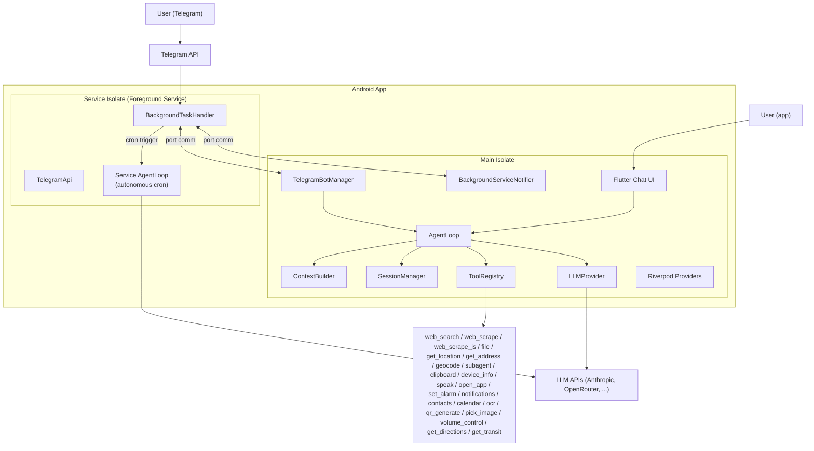
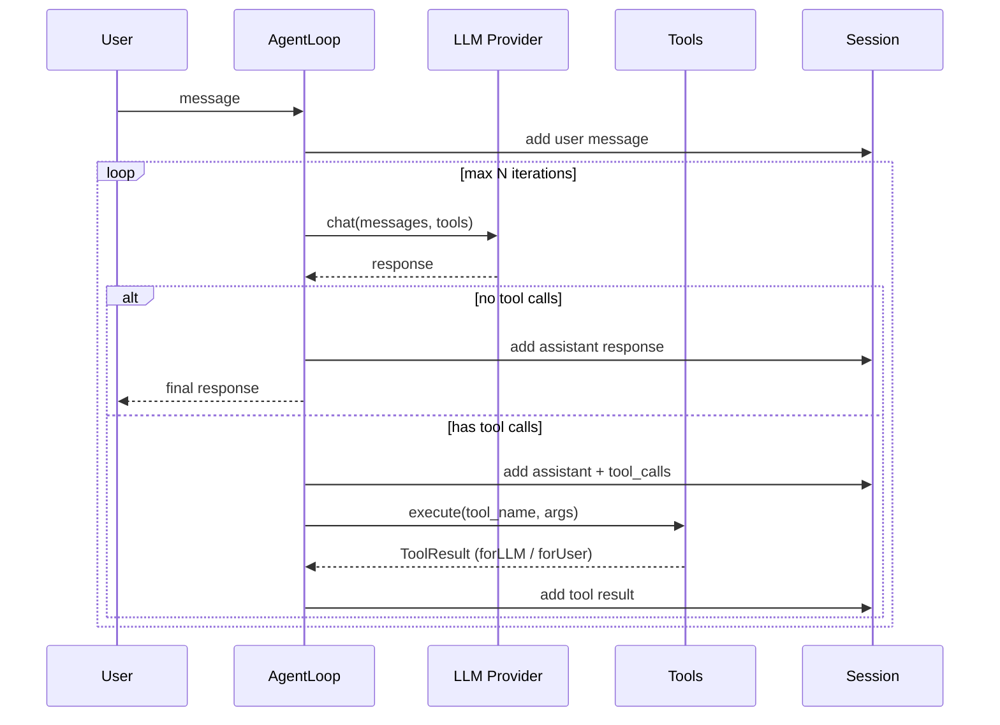
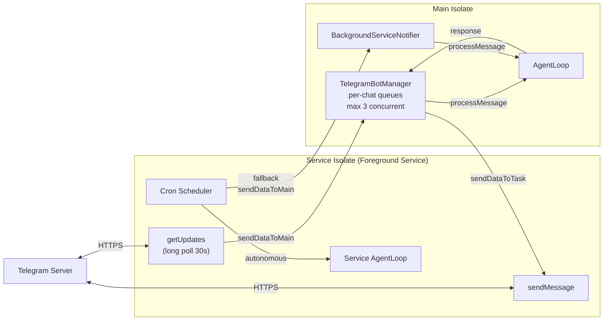

# DroidClaw

> Personal AI assistant on Android — agent loop + tool calling + dual Chat & Telegram interface


---

## What is DroidClaw?

DroidClaw is a personal AI assistant that runs **entirely on an Android phone**, with no external server.

- **Agent-based**: agentic LLM loop + iterative tool calling
- **Multi-provider**: Anthropic (Claude), OpenRouter, OpenAI, Groq, Google Gemini
- **Dual interface**: built-in Flutter chat **+ Telegram bot**
- **On-device only**: everything runs on the phone — LLM API calls, tool execution, session management

---

## Origin — From PicoClaw to DroidClaw

DroidClaw is a port of [PicoClaw](https://github.com/sipeed/picoclaw), a Go-based AI assistant (~16K lines) designed to run as a CLI/gateway on lightweight Linux hardware.

### What Was Kept

- **Agent Loop**: the agentic loop (LLM -> tool calls -> iteration)
- **LLM Providers**: multi-provider abstraction (Anthropic, OpenAI, OpenRouter, Groq, Gemini)
- **Tools**: web_search (Brave), web_scrape (HTTP+Markdown), web_scrape_js (WebView), file (sandboxed), get_location (GPS), get_address (reverse geocoding), geocode (address to GPS via ORS), subagent, message, clipboard, device_info, speak (TTS), open_app (URL/intent launcher), set_alarm, notifications (local notifications/reminders), contacts (read-only), calendar (read/write), ocr (on-device text extraction), qr_generate (QR code images), pick_image (gallery/camera), volume_control (audio levels), get_directions (ORS routing), get_transit (SNCF + IDFM public transit)
- **Sessions**: conversation history with Hive persistence
- **Memory**: long-term MEMORY.md + daily notes
- **Skills**: three-tier loading (builtin -> global -> workspace)
- **Summarization**: automatic summarization of long conversations

### What Was Removed

- Shell/exec tools (no shell execution on Android)
- I2C/SPI/USB monitoring (Linux hardware only)
- HTTP health server (no server on mobile)
- Gateway/CLI (replaced by Flutter UI)

### What Was Added

- **Flutter chat UI**: main interface with Markdown rendering, real-time tool indicators, conversation history
- **Telegram bot via Android foreground service**: a DroidClaw innovation. PicoClaw had a server-side Telegram channel (webhook). DroidClaw runs polling **directly on the Android phone** via a foreground service with long polling, with no external server whatsoever. This is a fundamental architecture shift.
- **Scheduled Prompts (Cron)**: define recurring prompts that execute automatically (fixed interval or specific times of day, with day-of-week filtering). Each cron can use a fresh session or continue in the same thread. Managed via Settings > Scheduled Prompts.
- **Autonomous cron execution**: the foreground service isolate initializes its own AgentLoop (`ServiceAgentFactory`) and executes crons at exact scheduled time — even when Android kills the main app overnight. Falls back to a pending trigger queue if the service AgentLoop isn't available.
- **Reverse Geocoding**: `get_address` tool chains with `get_location` to resolve GPS coordinates into a street address (Nominatim/OpenStreetMap, no API key needed).

---

## Architecture

### Overview



### Agent Loop



### Dual-Isolate Architecture



---

## Project Structure

```
lib/
├── main.dart                    # Entry point, init Hive + SharedPrefs
├── app.dart                     # MaterialApp, routing, Material 3 theme
│
├── core/                        # Business logic (no Flutter UI imports)
│   ├── agent/                   # Agent loop, context builder, memory, ServiceAgentFactory
│   ├── config/                  # AppConfig, ConfigStorage, CronConfig
│   ├── providers/               # LLM abstraction (Anthropic, HTTP, factory)
│   ├── services/                # BackgroundTaskHandler (foreground service isolate)
│   ├── session/                 # Conversation persistence (Hive)
│   ├── skills/                  # Three-tier loader and installer
│   └── tools/                   # Tool interface + 23 implementations
│
├── features/                    # Screens and platform features
│   ├── chat/                    # Main screen, message bubbles, history
│   ├── onboarding/              # First-launch setup
│   ├── settings/                # Provider, tools, skills, cron, Telegram
│   ├── telegram/                # Bot API, bot manager, rate limiter
│   └── voice/                   # Voice input (STT via Groq Whisper)
│
├── providers/                   # Riverpod: app, chat, background service, Telegram
├── data/local/                  # Unified StorageService
└── shared/                      # Constants
```

**72 Dart files** in total.

---

## Dual Interface — Chat + Telegram

### Why Two Interfaces?

- **Flutter chat**: direct on-device interaction with Markdown rendering, real-time tool indicators, and session history
- **Telegram bot**: remote access from any device (PC, tablet, another phone), even when the Android phone is in a pocket or turned off. The user sends a message on Telegram, the phone processes it in the background and replies.

Both interfaces use the **same AgentLoop**. Telegram uses separate session keys (`telegram_<chat_id>`) so conversations don't mix. Other users (family, team) can also talk to the bot if the whitelist allows it.

### Why Telegram and Not WhatsApp?

Three concrete reasons:

1. **No public API**: WhatsApp Business API requires Meta verification, a hosted server, and webhook endpoints (HTTPS with a public IP). An Android phone behind NAT/4G cannot receive webhooks.

2. **Long polling doesn't exist**: WhatsApp has no equivalent to Telegram's `getUpdates`. It's webhook-only.

3. **Complexity vs. value**: WhatsApp Business Cloud API requires OAuth registration, webhook validation, message templates, and a server to receive callbacks. This negates the principle of a 100% on-device app.

Telegram won because: simple HTTP long polling (works behind any NAT), no server needed, open Bot API, free, and widely used.

---

## Android Constraints and Technical Choices

### No Server on Android

Android cannot reliably host an HTTP server:

- No fixed public IP (NAT, cellular networks, dynamic IPs)
- Android aggressively kills background processes
- Even foreground services have restrictions (Android 12+ limits, `dataSync` 6h cap on Android 15)

**Solution**: long polling (client-initiated HTTP requests) instead of webhooks (server-side). The phone asks Telegram "any new messages?" every 30 seconds — no inbound port, no server, works behind any NAT.

```
Webhook model (impossible):       Long polling model (DroidClaw):
Telegram -> phone:8443            Phone -> Telegram API
(blocked by NAT/firewall)         (works from anywhere)
```

### Foreground Service: `remoteMessaging|location` Not `dataSync`

- `dataSync` has a **6-hour execution limit per 24h** on Android 15+
- `remoteMessaging|location` has **no time limit** — `remoteMessaging` for Telegram polling, `location` for GPS access from background crons
- The foreground service displays a persistent notification ("DroidClaw Bot - Active")
- The service survives backgrounding and app kill

---

## Key Technical Patterns

### Dual ToolResult (Pattern from the Go Codebase)

```dart
class ToolResult {
  final String forLLM;   // Context for the model (complete data)
  final String forUser;  // UI display (formatted, truncated)
}
```

The LLM receives the raw data it needs to reason. The user sees a clean, formatted version.

### Automatic Summarization

Triggered when: **20+ messages** OR **estimated tokens > 75% of maxTokens**.
Keeps the last 4 messages intact, summarizes the rest via an LLM call, prepends as system context.
Prevents context window overflow in long conversations.

### Sealed Event Stream

```dart
sealed class AgentEvent {}
class ThinkingEvent extends AgentEvent { ... }
class ToolCallEvent extends AgentEvent { ... }
class ToolResultEvent extends AgentEvent { ... }
class ResponseEvent extends AgentEvent { ... }
```

Both interfaces (chat UI and Telegram) consume the same `Stream<AgentEvent>`. The chat UI renders each event in real time. Telegram only sends the final `ResponseEvent`.

### Scheduled Prompts (Cron)

```dart
class CronDefinition {
  final String name;
  final String prompt;
  final CronSchedule schedule;      // interval or timeOfDay
  final SessionStrategy sessionStrategy; // newEach or sameThread
}
```

Users define recurring prompts from Settings > Scheduled Prompts. Each cron runs on its configured schedule (fixed interval with min 15 minutes, or specific times of day with optional day-of-week filtering). The agent processes the prompt like a normal user message.

**Autonomous execution**: the service isolate initializes its own AgentLoop via `ServiceAgentFactory` — no main app needed. API keys are cached in SharedPreferences (read from `FlutterSecureStorage` on main isolate, since service isolate can't use `FlutterSecureStorage`). If the service AgentLoop init fails, crons fall back to a persistent pending queue that replays when the app is opened.

**Tool availability depends on execution context**:

| Tool | App running (main isolate) | Cron autonomous (service isolate) |
|------|:---:|:---:|
| `web_search` | Yes | Yes |
| `web_scrape` | Yes | Yes |
| `web_scrape_js` | Yes | **No** — requires WebView (Flutter Activity) |
| `file` | Yes | Yes |
| `get_location` | Yes | Yes — permission must be pre-granted from app |
| `get_address` | Yes | Yes — pure HTTP (Nominatim) |
| `geocode` | Yes | Yes — pure HTTP (OpenRouteService) |
| `subagent` | Yes | **No** — complex lifecycle |
| `message` | Yes | **No** — no UI in service isolate |
| `clipboard` | Yes | **No** — read requires foreground (Android 10+) |
| `device_info` | Yes | Yes |
| `speak` | Yes | **No** — audio focus, no user context |
| `open_app` | Yes | **No** — launches Activity, jarring from background |
| `set_alarm` | Yes | **No** — opens Clock app, jarring from background |
| `notifications` | Yes | **No** — initialization requires Activity context |
| `contacts` | Yes | **No** — ContentProvider unreliable from background |
| `calendar` | Yes | **No** — ContentProvider unreliable from background |
| `ocr` | Yes | Yes — ML Kit via platform channels |
| `qr_generate` | Yes | Yes — dart:ui rendering on FlutterEngine |
| `pick_image` | Yes | **No** — image picker UI needs Activity |
| `volume_control` | Yes | **No** — MethodChannel on Activity engine only |
| `get_directions` | Yes | Yes — pure HTTP (OpenRouteService API) |
| `get_transit` | Yes | Yes — pure HTTP (SNCF + PRIM APIs) |

The service isolate runs on a separate FlutterEngine with platform channel access (via `GeneratedPluginRegistrant`). It can use `web_search`, `web_scrape`, `file`, `get_location`, `get_address`, `geocode`, `device_info`, `ocr`, `qr_generate`, `get_directions`, and `get_transit`. WebView-based tools, UI-dependent tools, permission-requiring tools (contacts, calendar, notifications), and tools with real-world side effects (TTS, app launches, alarms) are excluded. `get_location` requires that the user has granted location permission from the app at least once. When Android kills the app overnight and a cron triggers at 3 AM, the service isolate executes it autonomously. If the service AgentLoop init fails, crons fall back to a persistent pending queue that replays when the app is opened.

---

## Tools

The agent has access to 23 tools. The LLM decides autonomously when to call each tool based on the conversation context. Each tool returns a `ToolResult.dual()` — full data for the LLM, clean summary for the user.

Users can **enable or disable** individual tools from Settings > Tools > Manage Tools.

| Tool | Name | Description |
|------|------|-------------|
| **Web Search** | `web_search` | Searches the web via the Brave Search API. Returns titles, URLs, and snippets. Requires a Brave API key configured in settings. |
| **Web Scrape** | `web_scrape` | Lightweight HTTP scraper. Fetches a page via HTTP GET, parses the HTML DOM with `package:html`, converts to structured Markdown via `html2md` (preserves headings, links, lists). Max 15K chars. Fast, low resources. If the result is empty, the page likely requires JavaScript. |
| **Web Scrape (JS)** | `web_scrape_js` | Heavy WebView scraper. Loads the page in a headless `flutter_inappwebview` that executes JavaScript, waits for rendering, then extracts the DOM and converts to Markdown. For SPAs, React/Vue apps, and dynamic sites. Images disabled, 30s timeout, WebView disposed after use. |
| **File** | `file` | Sandboxed file operations within the app workspace: `read_file`, `write_file`, `list_dir`. Path validation prevents directory traversal outside the sandbox. |
| **GPS Location** | `get_location` | Returns the device's current GPS coordinates (latitude, longitude, accuracy, altitude). Uses Android's `FusedLocationProviderClient` via the `geolocator` package, with automatic fallback from GPS to network location. Handles permission requests and service availability checks. |
| **Reverse Geocoding** | `get_address` | Converts GPS coordinates (latitude, longitude) into a human-readable street address using the Nominatim (OpenStreetMap) reverse geocoding API. Free, no API key required. The LLM chains this with `get_location`: first get GPS coords, then resolve to an address. |
| **Geocode** | `geocode` | Converts a text address or place name into GPS coordinates (latitude, longitude) using the OpenRouteService Geocoding API. Returns up to N matching results with confidence scores. The LLM chains this with `get_directions` or `get_transit`: first geocode the address, then route to the destination. Reuses the same ORS API key as `get_directions`. |
| **Sub-agent** | `subagent` | Spawns a sub-task with a fresh session. The main agent delegates a focused task to a sub-agent, which processes it independently and returns the result. The sub-agent session is cleaned up after completion. |
| **Message** | `message` | Internal tool for sending messages directly to the user interface. Always enabled (not toggleable). Returns a silent result — the LLM sees no output, but the user sees the message. |
| **Clipboard** | `clipboard` | Read or write the device clipboard. The agent reads clipboard content when the user asks, or writes formatted text for the user to paste elsewhere. |
| **Device Info** | `device_info` | Returns battery level and charging status, network connectivity type (WiFi/cellular), device manufacturer, model, and Android version. Useful for context-aware responses. |
| **Text to Speech** | `speak` | Speaks text aloud using the device's built-in TTS engine. Supports language selection. Fire-and-forget: the agent continues while audio plays. Max 5000 chars. Disabled by default. |
| **Open App / URL** | `open_app` | Opens URLs and apps on the device: web pages (`https:`), phone dialer (`tel:`), email (`mailto:`), SMS (`sms:`), maps (`geo:`). Uses `url_launcher` with scheme allowlist for safety. Disabled by default. |
| **Alarm / Timer** | `set_alarm` | Sets alarms or timers via the system Clock app using Android intents (`SET_ALARM`, `SET_TIMER`). The Clock app opens for user confirmation. Disabled by default. |
| **Notifications** | `notifications` | Create instant or scheduled local notifications. Operations: `show` (instant), `schedule` (at a future time with timezone-aware scheduling), `cancel` (by id), `list` (pending). Uses separate notification channels for instant vs scheduled. Disabled by default. |
| **Contacts** | `contacts` | Read-only access to device contacts. Search by name, phone number, or email (client-side filtering). Returns minimal data (name + phones + emails) to protect privacy. Requires READ_CONTACTS permission (requested at first use). Disabled by default. |
| **Calendar** | `calendar` | Read and create calendar events. Operations: `list_calendars` (find calendar IDs), `get_events` (date range query), `create_event` (with title, location, description). Requires READ_CALENDAR + WRITE_CALENDAR permissions. Disabled by default. |
| **OCR** | `ocr` | Extract text from images using on-device Google ML Kit text recognition (Latin script). The image must already exist in the workspace (use `pick_image` or `file` tool first). Returns structured text with block count. |
| **QR Code** | `qr_generate` | Generate QR code PNG images from text, URLs, WiFi configs, or contact info. Saves a 512x512 PNG to the workspace. Max 4296 characters. |
| **Image Picker** | `pick_image` | Open the system image picker to select a photo from the gallery or take a new photo with the camera. The image is copied to the workspace `images/` directory for further processing (e.g. OCR). Requires CAMERA permission for camera source. Disabled by default. |
| **Volume Control** | `volume_control` | Read and adjust device volume levels for alarm, media, ringtone, and notification streams. Reports ringer mode (normal/vibrate/silent). Use before `set_alarm` to verify alarm volume is audible. Supports human-readable levels (mute/low/medium/high/max). First custom MethodChannel to Android AudioManager. |
| **Directions** | `get_directions` | Route calculation between two GPS coordinates via OpenRouteService API v2. Supports car, bike, road bike, mountain bike, walk, hike, and wheelchair profiles. Returns distance, duration, elevation gain/loss, and turn-by-turn instructions. Also supports isochrone calculation (reachable area within a time budget). Requires a free ORS API key. |
| **Public Transit** | `get_transit` | Find public transit routes in France. Auto-routes between two APIs: **PRIM/IDFM** for Ile-de-France (Metro, RER, Bus, Tram, Transilien) and **SNCF** for national trains (TGV, TER, Intercites). Returns top 3 journey options with departure/arrival times, transfers, CO2 emissions, and section-by-section itinerary. Supports departure/arrival time constraints and wheelchair-accessible routes. Both APIs use Navitia technology with shared response parsing. |

### Dual Scraping Strategy

The LLM is guided by the tool descriptions to use a two-step approach:
1. **Try `web_scrape` first** — fast, lightweight, works for most static sites
2. **Fall back to `web_scrape_js`** — only when `web_scrape` returns empty (JS-rendered SPA)

Both tools share a common `htmlToMarkdown()` utility that strips noise elements (`<nav>`, `<footer>`, `<aside>`, `<script>`, `<style>`) and produces clean Markdown with ATX headings and fenced code blocks.

### Tool Registration Flow

```
AppConfig.tools.disabledTools (persisted in SharedPreferences)
    ↓
toolRegistryProvider (rebuilds on config change)
    ↓ only registers enabled tools
ToolRegistry
    ↓
ContextBuilder (system prompt lists available tools)
AgentLoop (sends tool definitions to LLM, executes tool calls)
```

---

## Getting Started

### Prerequisites

- Flutter 3.38+
- Android SDK (API 24+)

### Build

```bash
flutter pub get
flutter analyze
flutter build apk --release --split-per-abi
```

### Install

```bash
adb install build/app/outputs/flutter-apk/app-arm64-v8a-release.apk
```

### First Launch

1. Onboarding: choose your LLM provider (OpenRouter, Anthropic, OpenAI, Groq, Gemini)
2. Enter the API key
3. Test the connection
4. Start chatting

---

## API Keys

DroidClaw requires API keys for the LLM provider and for some tools. All keys are stored securely on the device (FlutterSecureStorage). No key is ever sent to a third-party server.

### Required (LLM Provider)

You need **one** LLM provider key to use DroidClaw:

| Provider | Free Tier | Guide |
|----------|-----------|-------|
| **OpenRouter** (recommended) | Free models available, pay-as-you-go | [Get key](docs/api-keys/openrouter.md) |
| **Anthropic** (Claude) | $5 trial credit | [Get key](docs/api-keys/anthropic.md) |
| **OpenAI** (GPT) | $5 trial credit | [Get key](docs/api-keys/openai.md) |
| **Groq** (Llama, Mixtral) | Generous free tier | [Get key](docs/api-keys/groq.md) |
| **Google Gemini** | 15 req/min free | [Get key](docs/api-keys/gemini.md) |

### Optional (Tools)

These keys unlock specific tools. The agent works without them, but the corresponding tools will be unavailable.

| Service | Tool | Free Tier | Guide |
|---------|------|-----------|-------|
| **Brave Search** | `web_search` | 2,000 queries/month | [Get key](docs/api-keys/brave-search.md) |
| **OpenRouteService** | `get_directions`, `geocode` | 2,000 req/day | [Get key](docs/api-keys/openrouteservice.md) |
| **SNCF** | `get_transit` (national trains) | 5,000 req/day | [Get key](docs/api-keys/sncf.md) |
| **PRIM / IDFM** | `get_transit` (Ile-de-France) | 1,000 req/day | [Get key](docs/api-keys/prim-idfm.md) |

### Optional (Channels)

| Service | Purpose | Guide |
|---------|---------|-------|
| **Telegram Bot** | Remote access via Telegram | [Get token](docs/api-keys/telegram.md) |

### No Key Required

These tools work out of the box, no configuration needed: `web_scrape`, `web_scrape_js`, `file`, `get_location`, `get_address`, `subagent`, `message`, `clipboard`, `device_info`, `speak`, `open_app`, `set_alarm`, `notifications`, `contacts`, `calendar`, `ocr`, `qr_generate`, `pick_image`, `volume_control`.

---

## Stats

| | |
|---|---|
| **Dart files** | 72 |
| **Analysis issues** | 0 |
| **APK size (arm64)** | 34.6 MB |
| **Native code** | Kotlin (AudioChannelPlugin — volume control) |
| **minSdkVersion** | 24 (Android 7.0) |
| **targetSdkVersion** | 34 (Android 14) |

## Why ARaccoon?

<p align="center">
  
</p>

DroidClaw is pronounced **"ARaccoon"** — The Raccoon. This is the name shown in the Android launcher and the project's mascot.

### The Raccoon as a Metaphor for the AI Agent

- **The claws**: raccoons are famous for their extremely dexterous front paws, capable of manipulating objects, picking locks, and rummaging everywhere. They are the perfect embodiment of **iterative tool calling** — the agent that calls web_search, parses the results, follows up with web_scrape, extracts the info, and loops until it finds the answer.

- **Intelligence and resourcefulness**: clever, adaptable, they always find a solution. Exactly what an AI agent does when it loops, fails, adjusts its strategy, and eventually solves the problem.

- **The nocturnal and discreet side**: active at night, a bit "bandit-like" (in the cute sense). This evokes the **off-grid** nature of the application — everything runs locally on the phone, no data is sent to a central server, total privacy.


