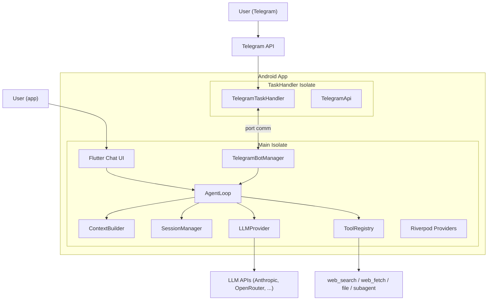
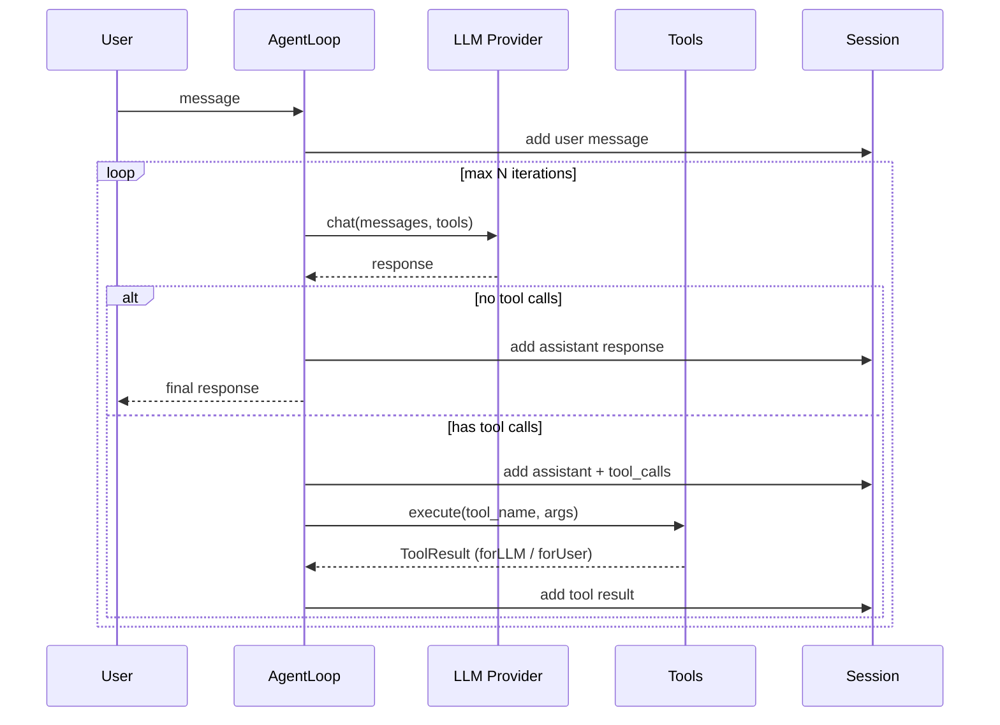
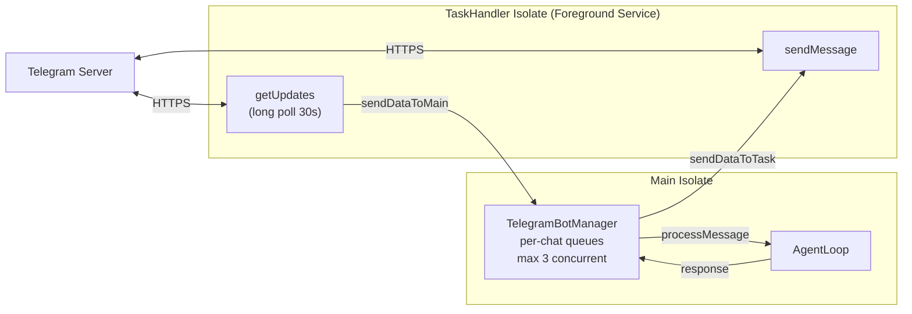

# DroidClaw

> Assistant IA personnel sur Android — agent loop + tool calling + double interface Chat & Telegram


---

## Qu'est-ce que DroidClaw ?

DroidClaw est un assistant IA personnel qui tourne **entièrement sur un téléphone Android**, sans serveur externe.

- **Agent-based** : boucle agentique LLM + tool calling itératif
- **Multi-provider** : Anthropic (Claude), OpenRouter, OpenAI, Groq
- **Deux interfaces** : chat Flutter intégré **+ bot Telegram**
- **On-device only** : tout tourne sur le téléphone — LLM API calls, tool execution, session management

---

## Origine — De PicoClaw à DroidClaw

DroidClaw est un port de [PicoClaw](https://github.com/sipeed/picoclaw), un assistant IA en Go (~16K lignes) conçu pour tourner en CLI/gateway sur du hardware Linux léger.

### Ce qui a été conservé

- **Agent Loop** : la boucle agentique (LLM → tool calls → itération)
- **Providers LLM** : abstraction multi-fournisseurs (Anthropic, OpenAI, OpenRouter, Groq)
- **Outils** : web_search (Brave/DuckDuckGo), web_fetch, file (sandboxed), subagent, message
- **Sessions** : historique de conversation avec persistence Hive
- **Mémoire** : MEMORY.md long-terme + daily notes
- **Skills** : chargement trois-tier (builtin → global → workspace)
- **Summarization** : résumé automatique des conversations longues

### Ce qui a été supprimé

- Shell/exec tools (pas d'exécution shell sur Android)
- I2C/SPI/USB monitoring (hardware Linux only)
- HTTP health server (pas de serveur sur mobile)
- Gateway/CLI (remplacé par l'UI Flutter)

### Ce qui a été ajouté

- **Flutter chat UI** : interface principale avec rendu Markdown, indicateurs d'outils en temps réel
- **Bot Telegram via Android foreground service** : innovation DroidClaw. PicoClaw avait un channel Telegram côté serveur (webhook). DroidClaw fait tourner le polling **directement sur le téléphone Android** via un foreground service avec long polling, sans aucun serveur externe. C'est un changement d'architecture fondamental.

---

## Architecture

### Vue d'ensemble



### Boucle agentique



### Architecture Telegram dual-isolate



---

## Structure du projet

```
lib/
├── main.dart                    # Point d'entree, init Hive + SharedPrefs
├── app.dart                     # MaterialApp, routing, theme Material 3
│
├── core/                        # Logique metier (pas d'import Flutter UI)
│   ├── agent/                   # Agent loop, context builder, memory
│   ├── config/                  # AppConfig, ConfigStorage
│   ├── providers/               # Abstraction LLM (Anthropic, HTTP, factory)
│   ├── session/                 # Persistence des conversations (Hive)
│   ├── skills/                  # Loader trois-tier et installeur
│   └── tools/                   # Interface Tool + implementations
│
├── features/                    # Ecrans et fonctionnalites plateforme
│   ├── chat/                    # Ecran principal + composants
│   ├── onboarding/              # Setup au premier lancement
│   ├── settings/                # Config provider, skills, Telegram
│   ├── telegram/                # Bot API, task handler, bot manager
│   └── voice/                   # Input vocal (STT via Groq Whisper)
│
├── providers/                   # State management Riverpod
├── data/local/                  # StorageService unifie
└── shared/                      # Constants
```

**43 fichiers Dart** au total.

---

## Double interface — Chat + Telegram

### Pourquoi deux interfaces ?

- **Chat Flutter** : interaction directe sur l'appareil, avec rendu Markdown, indicateur d'outils en cours, et historique de session
- **Bot Telegram** : acces a distance, depuis n'importe quel appareil (PC, tablette, autre telephone), meme quand le telephone Android est dans une poche ou eteint. L'utilisateur envoie un message sur Telegram, le telephone le traite en arriere-plan et repond.

Les deux interfaces utilisent le **meme AgentLoop**. Telegram utilise des session keys separees (`telegram_<chat_id>`) pour que les conversations ne se melangent pas. D'autres utilisateurs (famille, equipe) peuvent aussi parler au bot si le whitelist le permet.

### Pourquoi Telegram et pas WhatsApp ?

Trois raisons concretes :

1. **Pas d'API publique** : WhatsApp Business API necessite une verification Meta, un serveur heberge, et des endpoints webhook (HTTPS avec IP publique). Un telephone Android derriere NAT/4G ne peut pas recevoir de webhooks.

2. **Le long polling n'existe pas** : WhatsApp n'a pas d'equivalent au `getUpdates` de Telegram. C'est webhook-only.

3. **Complexite vs. valeur** : WhatsApp Business Cloud API demande un enregistrement OAuth, une validation de webhook, des message templates, et un serveur pour recevoir les callbacks. Ca annule le principe d'une app 100% on-device.

Telegram a gagne parce que : long polling HTTP simple (fonctionne derriere n'importe quel NAT), pas de serveur necessaire, Bot API ouverte, gratuit, et largement utilise.

---

## Contraintes Android et choix techniques

### Pas de serveur sur Android

Android ne peut pas heberger de serveur HTTP fiable :

- Pas d'IP publique fixe (NAT, reseaux cellulaires, IPs dynamiques)
- Android tue agressivement les processus en arriere-plan
- Meme les foreground services ont des restrictions (limites Android 12+, cap `dataSync` de 6h sur Android 15)

**Solution** : long polling (requetes HTTP initiees par le client) au lieu de webhooks (cote serveur). Le telephone demande a Telegram "des nouveaux messages ?" toutes les 30 secondes — pas de port entrant, pas de serveur, fonctionne derriere n'importe quel NAT.

```
Modele webhook (impossible) :     Modele long polling (DroidClaw) :
Telegram -> telephone:8443        Telephone -> Telegram API
(bloque par NAT/firewall)         (fonctionne de partout)
```

### Foreground Service : `remoteMessaging` et non `dataSync`

- `dataSync` a une **limite de 6 heures d'execution par 24h** sur Android 15+
- `remoteMessaging` n'a **aucune limite de temps** — concu pour les apps de messagerie
- Le foreground service affiche une notification persistante ("DroidClaw Bot - Active")
- Le service survit a la mise en arriere-plan et au kill de l'app

---

## Patterns techniques cles

### Dual ToolResult (pattern du codebase Go)

```dart
class ToolResult {
  final String forLLM;   // Contexte pour le modele (donnees completes)
  final String forUser;  // Affichage UI (formate, tronque)
}
```

Le LLM recoit les donnees brutes dont il a besoin pour raisonner. L'utilisateur voit une version propre et formatee.

### Summarization automatique

Declenchee quand : **20+ messages** OU **tokens estimes > 75% de maxTokens**.
Garde les 4 derniers messages intacts, resume le reste via appel LLM, prepend en contexte systeme.
Empeche le debordement de la fenetre de contexte dans les conversations longues.

### Sealed Event Stream

```dart
sealed class AgentEvent {}
class ThinkingEvent extends AgentEvent { ... }
class ToolCallEvent extends AgentEvent { ... }
class ToolResultEvent extends AgentEvent { ... }
class ResponseEvent extends AgentEvent { ... }
```

Les deux interfaces (chat UI et Telegram) consomment le meme `Stream<AgentEvent>`. Le chat UI rend chaque event en temps reel. Telegram n'envoie que le `ResponseEvent` final.

---

## Getting Started

### Prerequis

- Flutter 3.38+
- Android SDK (API 24+)

### Build

```bash
flutter pub get
flutter analyze
flutter build apk --release --split-per-abi
```

### Install

```bash
adb install build/app/outputs/flutter-apk/app-arm64-v8a-release.apk
```

### Premier lancement

1. Onboarding : choisir le provider LLM (OpenRouter, Anthropic, OpenAI, Groq)
2. Entrer la cle API
3. Tester la connexion
4. Commencer a chatter

### Configurer Telegram (optionnel)

1. Ouvrir Telegram et chercher @BotFather
2. Envoyer `/newbot` et suivre les instructions
3. Copier le token du bot
4. Dans DroidClaw : Settings → Telegram Bot → coller le token → Test → Enable

---

## Stats

| | |
|---|---|
| **Fichiers Dart** | 43 |
| **Issues d'analyse** | 0 |
| **Taille APK (arm64)** | 18.8 MB |
| **Code natif** | Aucun (pure Dart/Flutter) |
| **minSdkVersion** | 24 (Android 7.0) |
| **targetSdkVersion** | 34 (Android 14) |
