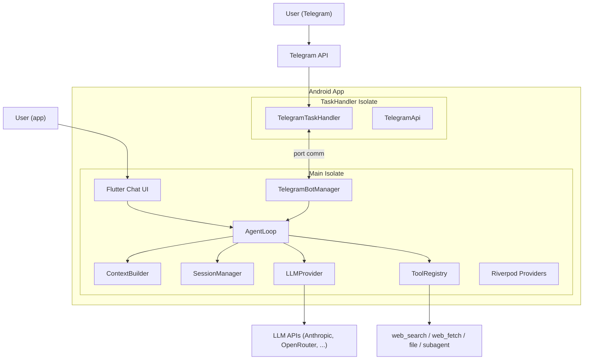
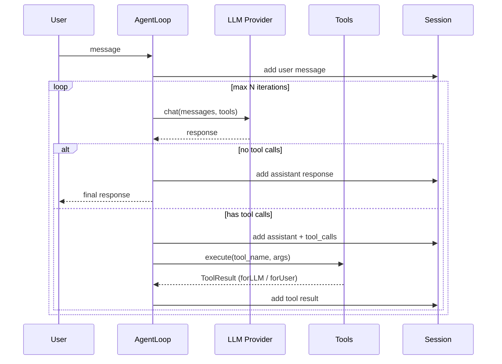
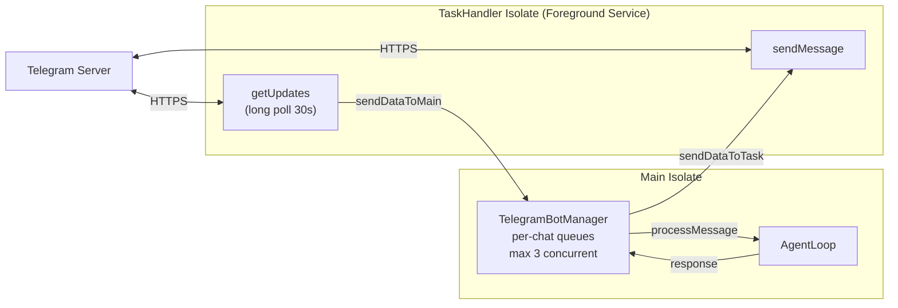

# DroidClaw Project README

## Overview

Write a complete `README.md` for DroidClaw covering:

1. **Origin**: port from PicoClaw (Go) to Flutter/Dart Android
2. **Architecture**: agentic loop, multi-provider LLM abstraction, tools
3. **Dual UI**: built-in Flutter chat **+ Telegram bot** as second interaction channel
4. **Telegram addition**: DroidClaw innovation — PicoClaw had a server-side Telegram channel (webhook), DroidClaw runs polling **directly on the Android phone** via a foreground service, with no server
5. **Why not WhatsApp**: webhook-only API, no long polling, requires a server
6. **Android constraints**: no server possible -> long polling solution
7. **Mermaid architecture diagrams** (at least 3)

## Problem Statement / Motivation

The project only had a boilerplate `README_flutter.md`. A proper README is needed to:

- Explain what DroidClaw is and where it comes from (port from PicoClaw Go)
- Document architecture decisions (agent loop, dual isolate Telegram, long polling)
- Highlight the **dual interface**: Flutter chat + Telegram bot (major addition)
- Explain why Telegram and not WhatsApp (concrete technical constraints)
- Provide visual architecture diagrams (Mermaid)

## Proposed Solution

A single `README.md` at the project root, structured as follows:

### Section 1: Header & Badges

- Project name, one-line description
- Tech stack badges (Flutter, Dart, Android)

### Section 2: What is DroidClaw?

- A personal AI assistant for Android
- Agent-based: LLM + tool calling in a loop
- Multi-provider: Anthropic, OpenRouter, OpenAI, Groq
- Two interfaces: built-in chat UI + Telegram bot

### Section 3: Origin — From PicoClaw to DroidClaw

- PicoClaw: ~16K-line Go CLI/gateway AI agent (github.com/sipeed/picoclaw)
- Goal: port the agent core to a pure Dart/Flutter Android app
- What was kept: agent loop, LLM providers, tools (web_search, web_fetch), sessions, skills, memory
- What was dropped: shell/exec, I2C/SPI, USB monitoring, HTTP server, Go messaging channels (Telegram Go, Discord, Slack, WhatsApp, DingTalk)
- What was added:
  - **Flutter chat UI** as the main interface (replaces Go channels)
  - **Telegram bot via Android foreground service** — a major addition that didn't exist in PicoClaw in this form. PicoClaw had a server-side Telegram channel (webhook), but DroidClaw innovates by running Telegram polling **directly on the Android phone** without an external server, using a foreground service with long polling. This is a fundamental architecture shift: from server webhook -> mobile long polling client.

### Section 4: Architecture

#### 4.1 High-Level Architecture Diagram (Mermaid)



#### 4.2 Agent Loop Diagram (Mermaid sequence)



#### 4.3 Telegram Dual-Isolate Architecture Diagram



### Section 5: Project Structure

Show the directory tree with one-line descriptions per folder:

```
lib/
├── core/           # Business logic (no Flutter imports)
│   ├── agent/      # Agent loop, context builder, memory
│   ├── config/     # App config, config storage
│   ├── providers/  # LLM abstraction (Anthropic, HTTP, factory)
│   ├── session/    # Conversation session persistence
│   ├── skills/     # Skill loader and installer
│   └── tools/      # Tool interface + implementations
├── features/       # UI screens and platform features
│   ├── chat/       # Main chat screen + components
│   ├── onboarding/ # First-launch setup
│   ├── settings/   # Provider config, skills, Telegram config
│   ├── telegram/   # Bot API, task handler, bot manager
│   └── voice/      # Voice input (STT via Groq)
├── providers/      # Riverpod state management
├── data/local/     # Storage service
└── shared/         # Constants
```

### Section 6: Dual Interface — Chat + Telegram

This section is central to the README. It must clearly explain that DroidClaw has **two ways to interact** with the AI assistant, and that the Telegram addition is a DroidClaw innovation.

#### Why Two Interfaces?

- **Flutter chat UI**: direct on-device interaction with Markdown rendering, real-time tool indicators, and session history
- **Telegram bot**: remote access from any device (PC, tablet, another phone), even when the Android phone is in a pocket or turned off. The user sends a message on Telegram, the Android phone processes it in the background and replies.
- Same AgentLoop processes both — different input/output channels
- Telegram uses separate session keys (`telegram_<chat_id>`) so conversations don't mix
- Other users (family, team) can also talk to the bot if the whitelist allows it

Explain that PicoClaw Go had messaging channels (Telegram, Discord, Slack, WhatsApp, DingTalk) but they ran on a **server**. DroidClaw reinvented the concept to work **entirely from an Android phone**, with no server at all, using a foreground service + long polling.

#### Why Not WhatsApp?

Three concrete reasons:

1. **No public API**: WhatsApp Business API requires Meta business verification, a hosted server, and webhook endpoints (HTTPS with public IP). Android devices behind NAT/4G can't receive webhooks.
2. **Long polling doesn't exist**: WhatsApp has no equivalent of Telegram's `getUpdates` long polling. It's webhook-only.
3. **Complexity vs. value**: WhatsApp Business Cloud API needs OAuth app registration, webhook validation, message templates for re-engagement, and a server to receive callbacks. This defeats the purpose of an on-device-only app.

Telegram won because: simple HTTP long polling (works from any NAT), no server needed, open Bot API, free, and widely used.

### Section 7: Android Constraints & Technical Choices

#### No Server on Android?

Android apps can't reliably run HTTP servers because:

- No fixed public IP (NAT, cellular networks, dynamic IPs)
- Android aggressively kills background processes
- Even foreground services have restrictions (Android 12+ limits, Android 15 `dataSync` 6-hour cap)

**Solution**: Use long polling (client-initiated HTTP requests) instead of webhooks (server-side). The phone asks Telegram "any new messages?" every 30 seconds — no inbound port, no server, works behind any NAT.

#### Why Long Polling?

```
Webhook model (impossible):      Long polling model (DroidClaw):
Telegram -> phone:8443           Phone -> Telegram API
(blocked by NAT/firewall)        (works from anywhere)
```

Long polling with `timeout=30s` holds the HTTP connection open. Telegram responds immediately if there's a message, or after 30s if nothing. This is efficient — no busy-waiting, no wasted bandwidth.

#### Foreground Service: `remoteMessaging` not `dataSync`

- `dataSync` has a **6-hour runtime limit per 24 hours** on Android 15+
- `remoteMessaging` has **no time limit** — designed for messaging apps
- The foreground service shows a persistent notification ("DroidClaw Bot - Active")
- The service survives app background/kill and resumes on reopen

### Section 8: Key Technical Patterns

#### Dual ToolResult (from Go codebase)

```dart
class ToolResult {
  final String forLLM;   // Context for the model (full data)
  final String forUser;  // Display in UI (formatted, truncated)
}
```

The LLM gets the raw data it needs for reasoning. The user sees a clean, formatted version.

#### Conversation Summarization

Triggered when: 20+ messages OR estimated tokens > 75% of maxTokens.
Keeps the last 4 messages intact, summarizes the rest via LLM, prepends as system context.
Prevents context window overflow in long conversations.

#### Sealed Event Stream

```dart
sealed class AgentEvent {}
class ThinkingEvent extends AgentEvent { ... }
class ToolCallEvent extends AgentEvent { ... }
class ResponseEvent extends AgentEvent { ... }
```

Both UI and Telegram consume the same `Stream<AgentEvent>`. The chat UI renders each event in real-time. Telegram only sends the final `ResponseEvent`.

### Section 9: Getting Started

```bash
# Prerequisites
flutter (3.38+), Android SDK (API 24+)

# Build
flutter pub get
flutter analyze
flutter build apk --release

# Install
adb install build/app/outputs/flutter-apk/app-release.apk
```

First launch: onboarding flow -> select LLM provider -> enter API key -> test -> start chatting.

For Telegram: Settings -> Telegram Bot -> enter @BotFather token -> test -> enable.

### Section 10: File Count & Stats

- **43 Dart files** across 5 layers
- **0 analysis issues** (flutter analyze clean)
- Pure Dart/Flutter — no native code, no Go backend
- Android: minSdkVersion 24, targetSdkVersion 34

## Acceptance Criteria

- [x] `README.md` exists at project root (replaces `README_flutter.md`)
- [x] Contains all 10 sections described above
- [x] At least 3 Mermaid diagrams (high-level arch, agent loop, Telegram isolates)
- [x] Explains origin from PicoClaw with what was kept/dropped/added
- [x] Explains why WhatsApp is not supported with concrete technical reasons
- [x] Explains Android server constraints and why long polling is the solution
- [x] Explains foreground service type choice (`remoteMessaging` vs `dataSync`)
- [x] Contains project directory structure
- [x] Contains getting started instructions

## Files to Create/Modify

| File | Change |
|---|---|
| `README.md` | Create — the full README |
| `README_flutter.md` | Delete — replaced by the new README |

## References

### Internal References
- Migration guide: `docs/picoclaw_to_flutter_guide.md`
- Telegram plan: `docs/plans/2026-02-16-feat-telegram-bot-channel-plan.md`
- Agent loop: `lib/core/agent/agent_loop.dart`
- Telegram task handler: `lib/features/telegram/telegram_task_handler.dart`
- Telegram bot manager: `lib/features/telegram/telegram_bot_manager.dart`
- Constants: `lib/shared/constants.dart`
