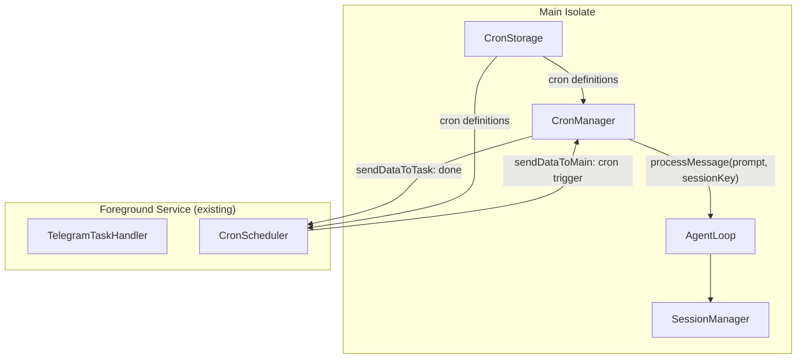

# Add scheduled prompts (cron) with simple configuration

## Overview

Add the ability to schedule recurring prompts that the AI agent executes automatically. Non-technical users can configure crons via a simple UI with preset intervals and time pickers. Each cron appears as an entry in conversation history, with individual executions accessible as sub-conversations.

## Problem Statement / Motivation

- DroidClaw runs 24/7 on an Android phone (foreground service already proven with Telegram)
- Users want automated tasks: daily news briefs, periodic checks, scheduled reminders, recurring analyses
- Currently the agent only responds to manual input — no way to trigger prompts on a schedule
- Must be configurable by non-technical users (no cron syntax)

## Proposed Solution

### Architecture Overview



Reuse the **existing `flutter_foreground_task` foreground service** — the same one that runs Telegram polling. The service already runs 24/7, survives app backgrounding, and has proven reliability. We add a `CronScheduler` check to its repeat loop.

### Data Model

```dart
/// lib/core/config/cron_config.dart
class CronDefinition {
  final String id;              // UUID
  final String name;            // "Daily news brief"
  final String prompt;          // "Search for today's top AI news and summarize"
  final CronSchedule schedule;  // Interval or specific times
  final bool enabled;
  final SessionStrategy sessionStrategy; // newEach, sameThread
  final DateTime? lastRun;
  final DateTime created;
}

enum SessionStrategy { newEach, sameThread }

class CronSchedule {
  final ScheduleType type;      // interval or timeOfDay
  final Duration? interval;     // For interval type: 15min, 30min, 1h, etc.
  final List<TimeOfDay>? times; // For timeOfDay type: [09:00, 18:00]
  final List<int>? daysOfWeek;  // 1=Mon..7=Sun, null = every day
}

enum ScheduleType { interval, timeOfDay }
```

### Session Strategy

Two options per cron, configured by the user:

| Strategy | Session Key | Behavior |
|---|---|---|
| **New each time** (default) | `cron_{cronId}_{timestamp}` | Fresh conversation per execution. Clean, isolated results. |
| **Same thread** | `cron_{cronId}` | Reuses the same session. Agent has memory of previous runs. Summarization kicks in automatically at 20+ messages. |

### History Integration

```
History Screen
├── Chat
│   ├── "What is Flutter?"          Today - 4 messages
│   └── "Help with API design"     Yesterday - 12 messages
├── Scheduled Prompts
│   ├── 📅 Daily news brief         Last run: Today 09:00
│   │    (tap to see all executions)
│   └── 📅 Server check             Last run: Today 14:00
│        (tap to see all executions)
└── Telegram
    └── Chat 12345                  Today - 6 messages
```

When user taps a cron in history:
- If **sameThread**: loads the single persistent session
- If **newEach**: shows a sub-list of all executions (sorted by date), each tappable to load that session

## Technical Approach

### Phase 1: Core (CronConfig + Storage + Scheduler)

#### `lib/core/config/cron_config.dart` (new)

Data model for cron definitions with JSON serialization.

#### `lib/core/config/config_storage.dart` (modify)

Add cron storage methods:
```dart
Future<List<CronDefinition>> getCronDefinitions() async {
  final json = _storage.getJson('cron_definitions');
  // parse and return
}
Future<void> saveCronDefinitions(List<CronDefinition> crons) async {
  await _storage.setJson('cron_definitions', crons.map((c) => c.toJson()).toList());
}
```

#### Foreground service integration

The existing `TelegramTaskHandler.onRepeatEvent()` fires every 1 second. We modify it to also check if any cron is due.

**Option A (simple)**: Add cron checking directly to the Telegram task handler.
**Option B (cleaner)**: Create a unified `BackgroundTaskHandler` that delegates to both `TelegramPoller` and `CronScheduler`.

Recommended: **Option A** for simplicity. The task handler already runs. Add a `_checkCrons()` call that:
1. Loads cron definitions from SharedPreferences
2. Compares `lastRun` + `interval` against `DateTime.now()`
3. For time-of-day crons: checks if current time matches and hasn't run today
4. If due: sends trigger to main isolate via `sendDataToMain({'type': 'cron_trigger', 'cron_id': id})`

The main isolate receives this, creates/loads the appropriate session, and calls `agentLoop.processMessage()`.

### Phase 2: UI (Config Screen)

#### `lib/features/settings/cron_config_screen.dart` (new)

List of configured crons with add/edit/delete. Each cron shows:
- Name, prompt preview, schedule, enabled toggle

#### `lib/features/settings/cron_edit_screen.dart` (new)

Edit form with:
- **Name**: TextField ("Daily news brief")
- **Prompt**: Multi-line TextField ("Search for today's top AI news...")
- **Schedule type**: Toggle between "Interval" and "Specific times"
  - **Interval**: Dropdown with presets: 15 min, 30 min, 1 hour, 2 hours, 6 hours, 12 hours, 24 hours
  - **Specific times**: Time picker(s) + optional day-of-week chips (Mon-Sun)
- **Session**: Radio — "New conversation each time" / "Continue in same thread"
- **Test** button: Run the prompt immediately
- **Save** button

### Phase 3: History Integration

#### `lib/features/chat/history_screen.dart` (modify)

Add "Scheduled Prompts" section between Chat and Telegram. Each cron shows:
- Name, last run date, execution count
- Tap behavior depends on session strategy

#### `lib/features/chat/cron_history_screen.dart` (new)

For `newEach` crons: sub-list of all executions (sessions matching `cron_{cronId}_*`), sorted newest first. Each tappable to load in chat.

### Phase 4: Notifications

When a cron completes, show a notification with the response summary (first 100 chars). Tap notification opens the conversation.

## Files to create/modify

| File | Change |
|---|---|
| `lib/core/config/cron_config.dart` | **New** — CronDefinition, CronSchedule, SessionStrategy models |
| `lib/core/config/config_storage.dart` | Add `getCronDefinitions()` / `saveCronDefinitions()` |
| `lib/features/telegram/telegram_task_handler.dart` | Add `_checkCrons()` in `onRepeatEvent()` |
| `lib/features/telegram/telegram_bot_manager.dart` | Add `handleCronTrigger(cronId)` method |
| `lib/features/settings/cron_config_screen.dart` | **New** — List of crons with CRUD |
| `lib/features/settings/cron_edit_screen.dart` | **New** — Create/edit cron form |
| `lib/features/settings/settings_screen.dart` | Add "Scheduled Prompts" entry in Tools section |
| `lib/features/chat/history_screen.dart` | Add "Scheduled Prompts" section |
| `lib/features/chat/cron_history_screen.dart` | **New** — Sub-list of cron executions |
| `lib/providers/app_providers.dart` | Add cron-related providers |
| `lib/app.dart` | Add routes: `/settings/crons`, `/settings/crons/edit`, `/cron-history` |
| `lib/shared/constants.dart` | Add `cronSessionPrefix = 'cron_'` |

## Detailed Design

### Cron checking logic (in task handler)

```dart
// Called every 60 seconds (not every 1s — use a counter)
void _checkCrons() {
  final now = DateTime.now();
  for (final cron in _cronDefinitions) {
    if (!cron.enabled) continue;
    if (_isDue(cron, now)) {
      FlutterForegroundTask.sendDataToMain({
        'type': 'cron_trigger',
        'cron_id': cron.id,
        'prompt': cron.prompt,
        'session_strategy': cron.sessionStrategy.name,
      });
      _updateLastRun(cron.id, now);
    }
  }
}

bool _isDue(CronDefinition cron, DateTime now) {
  switch (cron.schedule.type) {
    case ScheduleType.interval:
      if (cron.lastRun == null) return true;
      return now.difference(cron.lastRun!) >= cron.schedule.interval!;
    case ScheduleType.timeOfDay:
      // Check if current HH:mm matches any configured time
      // AND hasn't run today (or at this time today)
      for (final time in cron.schedule.times!) {
        if (now.hour == time.hour && now.minute == time.minute) {
          // Check day of week if configured
          if (cron.schedule.daysOfWeek != null &&
              !cron.schedule.daysOfWeek!.contains(now.weekday)) {
            continue;
          }
          // Check hasn't already run at this time today
          if (cron.lastRun != null &&
              cron.lastRun!.day == now.day &&
              cron.lastRun!.hour == time.hour) {
            continue;
          }
          return true;
        }
      }
      return false;
  }
}
```

### Cron execution (in bot manager / main isolate)

```dart
Future<void> handleCronTrigger(Map<String, dynamic> data) async {
  final cronId = data['cron_id'] as String;
  final prompt = data['prompt'] as String;
  final strategy = data['session_strategy'] as String;

  final sessionKey = strategy == 'sameThread'
      ? '${AppConstants.cronSessionPrefix}$cronId'
      : '${AppConstants.cronSessionPrefix}${cronId}_${DateTime.now().millisecondsSinceEpoch}';

  String? response;
  await for (final event in agentLoop.processMessage(prompt, sessionKey)) {
    if (event is ResponseEvent) response = event.content;
    if (event is ErrorEvent) response = 'Error: ${event.message}';
  }

  // Save session
  final session = sessionManager.get(sessionKey);
  if (session != null) await sessionManager.save(session);

  // Show notification with response preview
  // ...
}
```

### Schedule presets for UI

```dart
static const _intervalPresets = [
  ('15 min', Duration(minutes: 15)),
  ('30 min', Duration(minutes: 30)),
  ('1 hour', Duration(hours: 1)),
  ('2 hours', Duration(hours: 2)),
  ('6 hours', Duration(hours: 6)),
  ('12 hours', Duration(hours: 12)),
  ('Daily', Duration(hours: 24)),
];
```

For time-of-day: use Flutter's `showTimePicker()` to add times. Show chips for each configured time. Day-of-week: 7 toggle chips (Mon–Sun), all selected by default.

## Points to Watch

1. **Battery**: Cron checking adds minimal overhead (1 check per minute, O(n) where n = cron count). The foreground service already runs for Telegram. If Telegram is disabled and crons are enabled, the service should still start.

2. **Foreground service lifecycle**: Currently the foreground service only starts when Telegram is enabled. Need to also start it when any cron is enabled. The service should run if Telegram OR crons are enabled.

3. **Background isolate limitation**: The task handler runs in a separate isolate. It can't directly access Riverpod providers or AgentLoop. It sends triggers to the main isolate which has full access. This is the same pattern as Telegram.

4. **App killed state**: If the app is force-killed, the foreground service is also killed. On reopen, the service restarts. Crons that were missed will NOT retroactively fire (by design — they're best-effort periodic, not guaranteed scheduling).

5. **Multiple crons firing simultaneously**: Queue them and process sequentially (same as Telegram's per-chat queue pattern).

6. **30-second execution limit**: NOT a concern here because we use a foreground service, not WorkManager. The foreground service has no execution time limit with `remoteMessaging` type.

7. **SharedPreferences access in background isolate**: SharedPreferences works in background isolates after calling `DartPluginRegistrant`. The Telegram handler already does this successfully.

## Acceptance Criteria

- [ ] CronDefinition model with JSON serialization
- [ ] Cron definitions stored in SharedPreferences via ConfigStorage
- [ ] Cron list screen accessible from Settings > Scheduled Prompts
- [ ] Cron edit screen with: name, prompt, interval presets, time picker, day-of-week, session strategy
- [ ] Foreground service checks crons every minute and triggers due prompts
- [ ] Foreground service starts when crons are enabled (even if Telegram is off)
- [ ] Each cron execution creates/reuses session based on strategy
- [ ] History screen shows "Scheduled Prompts" section with cron entries
- [ ] Tapping a cron in history shows execution list (newEach) or loads session (sameThread)
- [ ] Test button runs cron prompt immediately
- [ ] Notification shown when cron completes
- [ ] `flutter analyze` passes

## References

### Internal References
- Telegram task handler (blueprint): `lib/features/telegram/telegram_task_handler.dart`
- Telegram bot manager (blueprint): `lib/features/telegram/telegram_bot_manager.dart`
- Telegram provider (service lifecycle): `lib/providers/telegram_provider.dart`
- Agent loop: `lib/core/agent/agent_loop.dart`
- Session manager: `lib/core/session/session_manager.dart`
- Config storage: `lib/core/config/config_storage.dart`
- History screen: `lib/features/chat/history_screen.dart`
- Settings screen: `lib/features/settings/settings_screen.dart`
- Constants: `lib/shared/constants.dart`
- AndroidManifest: `android/app/src/main/AndroidManifest.xml`

### External References
- flutter_foreground_task docs: https://pub.dev/packages/flutter_foreground_task
- Android foreground service types: https://developer.android.com/develop/background-work/services/foreground-services
