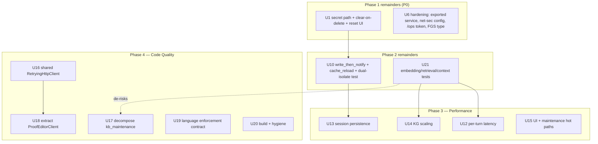
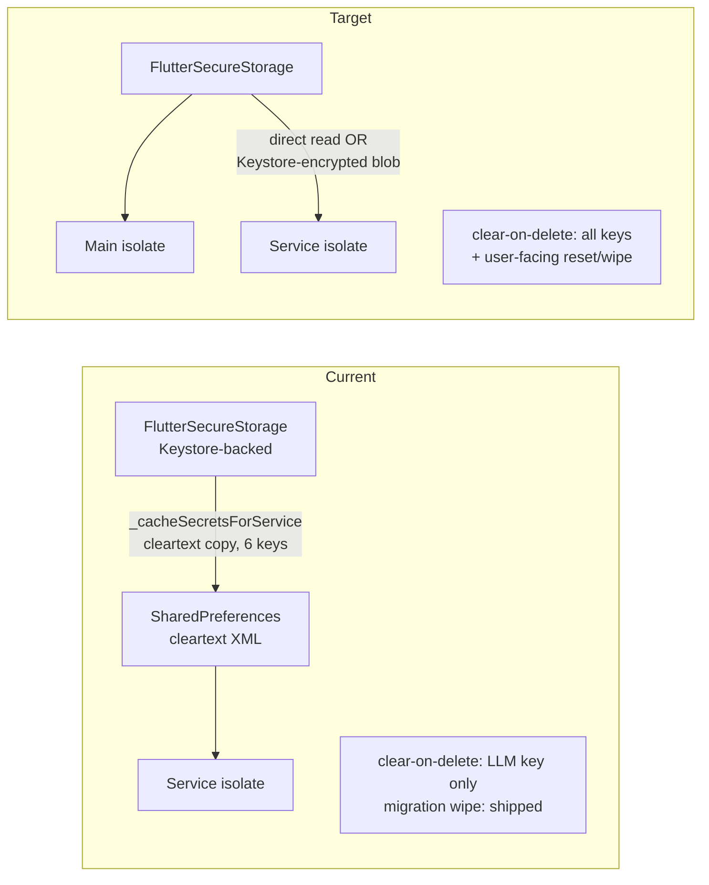
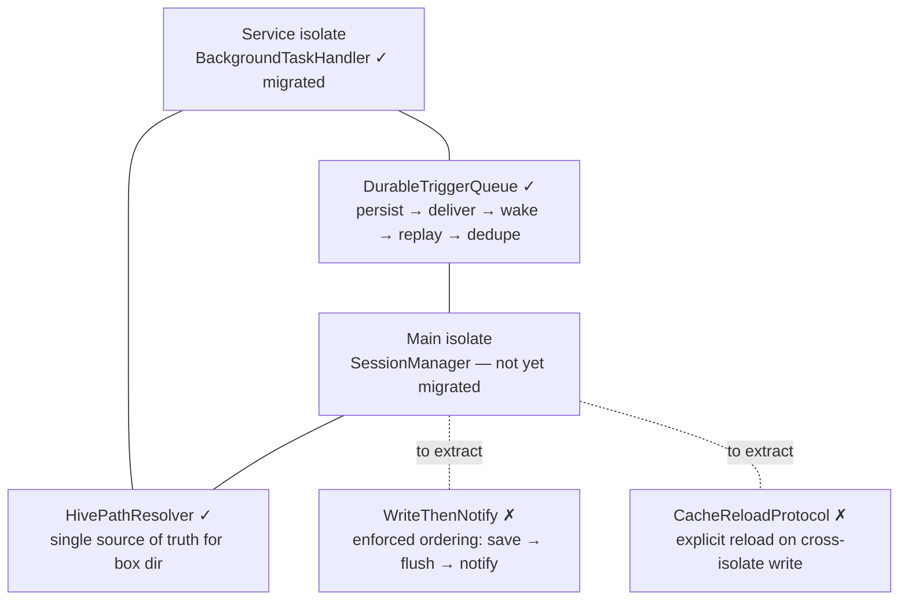

# refactor: DroidClaw project improvement roadmap

## Summary

A prioritized improvement roadmap for DroidClaw/ARaccoon, derived from a full-project audit across security & privacy, testing & reliability, performance, and code quality & architecture. **Refreshed 2026-06-10 against the delivered state**: Phase 1 (security) and Phase 2 (testing/reliability) are largely shipped (U1 floor, U2–U5, U6 partial, U7–U9, U10 partial, U11). This revision condenses the delivered units, refreshes the remaining ones against current code evidence, absorbs the untracked `todos/` debt registry, and adds one new unit (U21, test-coverage extension). The remaining work is: close the Phase 1 remainders (U1/U6), finish the persistence subsystem (U10), then execute Phase 3 (performance) and Phase 4 (code quality).

---

## Delivery Status (refreshed 2026-06-10)

Progress is derived from git history on `main` (audited at 1a86d2c); this table is a snapshot to orient the reader, not a progress tracker.

| Unit | State | Notes |
|------|-------|-------|
| U1 | **Partial** | Floor delivered (migration wipe + LLM-key clear-on-delete). Preferred path + 5 of 6 mirror clear-on-delete + user-facing reset missing. |
| U2–U5 | **Delivered** | Backup off, SSRF guards, Telegram fail-closed allowlist, trace redaction. |
| U6 | **Partial** | File-tool hardening delivered. 4 items open (see U6). |
| U7–U9 | **Delivered** | Test infra + fakes; agent/provider tests; KG DB tests. CI workflow added then deliberately removed — owner decision: no GitHub Actions; the gate is local (`flutter analyze --no-fatal-infos` + `flutter test --exclude-tags integration`). |
| U10 | **Partial** | `HivePathResolver` + `DurableTriggerQueue` extracted and wired; `write_then_notify` / `cache_reload` not extracted; `session_manager.dart` unmigrated. |
| U11 | **Delivered** | Service-isolate init failures surface to the UI. |
| U12–U20 | **Not started** | Bodies refreshed below against current code evidence. |
| U21 | **New** | Test-coverage extension (embedding providers, hybrid retrieval, context builder). |

---

## Problem Frame

### What DroidClaw is (the goal to protect)

DroidClaw/ARaccoon is a **personal AI assistant for Android where everything runs on-device** — agent loop, LLM API calls, tool execution, session management, and a knowledge-graph memory all live in the app with no project-operated server. It is a Flutter 3.x / Dart 3 / Riverpod 3.x app, ported from the Go project PicoClaw, exposing ~30 snake_case tools, a dual-isolate background runtime (Telegram long-polling + cron in a foreground-service isolate), multi-provider LLM/embedding abstractions, and a Drift/SQLite knowledge graph with FTS5 + vector retrieval.

The product's identity rests on two promises: **(a) it is private** — your data lives on your device — and **(b) it is autonomous and capable** — it acts on your behalf in the background through powerful tools. Every improvement below is judged against whether it strengthens or erodes those two promises. The privacy promise is the load-bearing one: the app necessarily transmits user input, retrieved personal facts, contacts, calendar, and location to whatever external LLM/search/routing endpoints the user configures, so "on-device" is about *control and at-rest safety*, not zero network.

### Why this revision, now

The original audit (2026-05-31) surfaced three systemic weaknesses; the June sprint addressed the first two substantially:

1. **Privacy posture: mostly closed, with precise remainders.** Backup is off, traces are redacted, SSRF guards and a fail-closed Telegram allowlist are in. But the service isolate still reads API keys from cleartext `SharedPreferences` mirrors (`lib/core/services/background_task_handler.dart:364-396`), clear-on-delete only covers the LLM key (5 of 6 mirrors linger after deletion), there is no user-facing reset/wipe action, and four U6 hardening items remain open.

2. **Test foundation: built, with known gaps.** 17 test files / ~4,000 LOC against ~25,600 hand-written lib LOC (~16%). The fakes exist and core flows (agent loop, providers, KG DB, persistence characterization, security units) are covered. Untested: embedding providers, `KnowledgeService.queryRelevant` hybrid retrieval, ingestion/resolution, context builder, Telegram beyond the allowlist, and ~25 of 28 tools.

3. **Performance hot paths: untouched.** Every turn still pays an unconditional extra LLM round-trip for KG query expansion plus an N+1 query storm; sessions are eagerly loaded and fsynced on every save; the cosine scan runs inline on the agent isolate with a silent 1000-entity cap; a dream run can issue up to ~5,000 relation queries in a loop.

Two new signals this revision absorbs: the **`todos/` debt registry** (6 pending code-review items, two of which overlap U13 directly) and **hygiene drift** (`flutter analyze` reports 6 infos against a documented "0 issues" baseline; 4 truly-empty catch blocks; `json_serializable` is a dead dependency).

---

## Requirements

### Security & Privacy

- R1. No secret is persisted in cleartext at rest. `FlutterSecureStorage` (Keystore-backed) is the only at-rest store for API keys; any service-isolate-accessible copy is either eliminated or Keystore-encrypted.
- R2. Deleting or rotating a key removes every cached copy (all six mirror keys, not just the LLM key), and a user-invokable reset path wipes all secrets, sessions, and KB.
- R3. Android backup excludes secrets, sessions, the knowledge graph, and LLM traces. *(Delivered — U2.)*
- R4. URL-fetching tools accept only `http`/`https` and reject hosts resolving to private, loopback, or link-local ranges, re-checked after each redirect. *(Delivered — U3; WebView sub-request limitation documented.)*
- R5. Exported native components either verify their callers or are not exported.
- R6. Autonomous execution gates communication and destructive tools, and Telegram requires a non-empty allowlist matched by stable numeric user ID. *(Delivered — U4.)*
- R7. LLM traces redact known-sensitive tool outputs and are excluded from backup. *(Delivered — U5.)*

### Testing & Reliability

- R8. The core flows — agent loop, LLM/embedding providers, KG pipeline, session management — have automated tests, run via the local gate (`flutter analyze --no-fatal-infos` + `flutter test --exclude-tags integration`). No CI by owner decision. *(Partially delivered — embedding providers and hybrid retrieval still uncovered; see U21.)*
- R9. Test infrastructure provides reusable fakes: a fake `LLMProvider`, an in-memory `KnowledgeGraphDB`, and a Hive test harness. *(Delivered — U7.)*
- R10. Cross-isolate persistence is consolidated into a single authoritative module (Hive-path resolver ✓, enforced save-then-notify ordering, explicit cache-reload API, durable idempotent trigger queue ✓), covered by regression tests including at least one true dual-isolate write-then-read scenario.
- R11. Currently silent failures surface as observable, diagnosable states. *(Delivered — U11 for KG pre-query and service init; 4 newly-found empty catch blocks remain — see U20.)*
- R12. The recurring failure modes from `docs/solutions/` are pinned by regression tests. *(Largely delivered via U8/U10 characterization tests.)*

### Performance

- R13. KG retrieval does not add an unconditional extra LLM round-trip per turn; query expansion is gated by config or folded into the main call.
- R14. Per-turn KG retrieval issues a bounded number of DB queries — neighbor, fact, entity, and decay hydration are batched, with no re-fetch of already-loaded neighbors.
- R15. Vector similarity work does not block the UI or service isolate, and semantic search does not silently drop the KB beyond a hardcoded cap.
- R16. Session persistence does not eagerly load all sessions into memory and does not fsync on every intermediate save — while preserving the crash-safety guarantees pinned by the characterization tests.
- R17. Maintenance/cleanup (dedup, snapshot, decay) scales past several thousand entities without unbounded LLM prompts, N+1 query loops, or full-isolate stalls.

### Code Quality & Architecture

- R18. HTTP transport (retry + exponential backoff on 429/5xx) is implemented once and shared across LLM providers, embedding providers, and HTTP tools; `AnthropicProvider` gains retry parity.
- R19. The two largest non-generated files — `kb_maintenance_service.dart` (1622 lines) and `proof_editor_tool.dart` (1135 lines) — are decomposed into focused collaborators with single responsibilities.
- R20. LLM JSON parsing (markdown-fence stripping + decode) and language-name/hint helpers are single-sourced rather than duplicated across 3–4 sites.
- R21. Agent language compliance is model-aware and language-aware in summarization, validated by regression tests against weak models with English-heavy history, and the three-layer enforcement mechanism is pinned so ContextBuilder/AgentLoop refactors cannot silently regress it.
- R22. The build is free of dead dependencies, `flutter analyze --no-fatal-infos` is back to 0 issues, no truly-empty catch blocks remain, documented framework versions match the actual toolchain, and magic thresholds live in `AppConstants`.

---

## Key Technical Decisions

- **No CI by owner decision.** The GitHub Actions workflow from U7 was deliberately removed. The quality gate is local: `flutter analyze --no-fatal-infos` + `flutter test --exclude-tags integration` before install. Plan units must not reintroduce CI files.
- **Close the Phase 1 remainders before starting Phase 3/4 refactors.** The open U1/U6 items are small, well-understood, and protect the product's defining promise; they should not linger behind performance work.
- **Eliminate the secret cache rather than expand `SharedPreferences` usage.** Unchanged from the original plan, still pending: (1) spike whether `FlutterSecureStorage` works in the foreground-service FlutterEngine (`service_agent_factory.dart` still asserts it doesn't); (2) failing that, Keystore-encrypt the cached blob — **budget this as the likely path**; (3) the floor (migration wipe) is already shipped, but clear-on-delete must extend to all six mirror keys regardless of which path lands.
- **Preserve the semantic-gap fix when optimizing KG retrieval.** `_expandQueryForKG` was added deliberately to fix a documented user-facing retrieval failure ("Où est-ce que j'habite?" → stored `address` fact). U12 folds the expansion into the main call or gates it — but the regression test for the semantic-gap case decides; the dual facts-FTS search must survive. (see origin: `docs/solutions/logic-errors/knowledge-graph-retrieval-fts5-tokenization-and-semantic-gap.md`)
- **Preserve crash-safety invariants when optimizing session persistence.** Flush-on-save and per-iteration saves were added deliberately against SIGKILL data loss; the U10 characterization tests pin them. U13 may re-tier the flush cadence only with an equivalent durability guarantee, proven by those same tests. (see origin: `docs/solutions/database-issues/session-data-loss-hive-flush-and-destructive-reads.md`)
- **Reframe U14: the dedup bottleneck is an N+1 loop, not naive O(n²).** Token-blocking with synonym expansion already bounds pairwise comparison; the audit found the real cost is one `getEntityRelationsWithNames` query per entity (up to 5,000 per dream run) plus the silent 1000-entity embedding cap and the inline cosine scan.
- **Move heavy CPU off the agent isolate; don't micro-optimize the scalar loop.** Unchanged: gate the `Isolate.run()` choice on a copy-cost benchmark; `sqlite-vec` (data stays in the DB) may be the better first step, gated on a split-per-abi build check.
- **Decompose by extracting collaborators, not rewriting behavior.** Unchanged for U16–U18 — and now de-risked: Phase 2 coverage exists, and `HttpProvider` already carries the canonical retry loop (shipped with U8), so U16 is an extraction, not an invention.
- **Keep raw-SQL Drift; defer the type-safe-query migration.** Unchanged.

---

## High-Level Technical Design

### Remaining-work dependency graph



(Hard edges solid. `U1r --> U10r`: both touch `background_service_provider.dart`; finishing U1's secret handling first avoids encoding the cleartext-cache pattern into the migrated module. `U21 --> U12/U14`: the hybrid-retrieval tests are the golden-baseline harness those rewrites verify against. U17 no longer blocks on U16 — its collaborators call the `LLMProvider` interface.)

### Secret handling: current vs. target (unchanged — target not yet reached)



### Dual-isolate persistence subsystem (U10 — 2 of 4 modules landed)



---

## Scope Boundaries

This roadmap is an **execution backbone**: each unit is independently landable. For a solo maintainer, treat it as a prioritized set to draw from rather than a committed sprint.

**Recommended draw order after this refresh:**
1. **U12** — the per-turn latency + API-token cost is paid on every single message today; U21's retrieval tests go in first or alongside as the golden baseline.
2. **U1 remainder + U6 remainder** — small, well-understood security closure.
3. **U10 remainder → U13** — finish the subsystem, then the session-persistence perf work that consumes its cache-reload API.
4. **U14, U15** — scaling and UI hot paths.
5. **Phase 4 (U16–U20)** — refactors, now de-risked by existing coverage.

**Cheap wins ready immediately:** U20's hygiene items (analyze back to 0, dead dep removal, empty catch blocks) and U15's eager-ListView fix are low-risk and independent.

**Process note:** the June sprint (U1–U11) produced zero `docs/solutions/` entries despite substantial fixes (SSRF guards, fail-closed allowlist, path-escape hardening, persistence extraction). After each phase of the remaining work, run a learnings-capture pass so the next audit can build on it.

### Deferred to Follow-Up Work

- **Migrating the raw-SQL Drift surface to type-safe queries** — large, low marginal safety once tests exist. Revisit after Phase 3.
- **`mergeEntities` step-extraction refactor** — extract into named private steps as a follow-up to U17 now that KG DB coverage exists.
- **`pick_image`/`ocr` downscaling and `web_scrape_js` WebView disposal review** — still needs its own focused inspection.
- **`tel:`/`sms:` confirmation UX in the foreground chat** — interactive-confirmation UX for the main isolate is a separate UX design task.
- **Network-tool unit tests beyond U16's seam** — U16 injects clients into `weather`/`geocode`/`web_search` etc.; deeper per-tool behavioral tests are follow-up once the seam exists.
- **`todos/005` exception-detail sanitization in logs** — adjacent to U5's redaction work; small, schedule opportunistically.

### Outside this product's identity

- **A project-operated backend or sync server.** The on-device model is the product.
- **Removing external API calls.** "On-device" means control and at-rest safety, not zero network.
- **Reintroducing CI.** Owner decision; the gate is local.

---

## Risks & Dependencies

- **Service-isolate secure storage may not work as hoped (U1).** Unchanged: the preferred option assumes `FlutterSecureStorage` works on the foreground-service FlutterEngine; the spike decides, and the Keystore-encrypted-blob fallback is the budgeted path.
- **U10 remainder is still a concurrency rewrite, but materially de-risked.** The characterization tests (`test/session_characterization_test.dart`) and two extracted modules landed without incident. Remaining risk concentrates in migrating `SessionManager` itself (`reload()` semantics) — the cache-reload extraction must preserve the exact close/reopen visibility behavior the tests pin. A true dual-isolate write-then-read test does not exist yet; until it does, cross-isolate regressions can only be caught in the field.
- **Session-persistence perf vs. durability (U13).** Flush layers exist on purpose. Re-tiering them without an equivalent guarantee re-opens a data-loss class that took three field incidents to close. The characterization tests are the contract.
- **Retrieval optimization vs. the semantic-gap fix (U12).** Folding/gating query expansion can silently re-open a documented user-facing failure; the semantic-gap regression test is the gate, not optional.
- **`sqlite-vec` adoption (U14) adds a native dependency** and APK size; must build for all split-per-abi targets. The off-isolate/`Isolate.run()` alternative needs a copy-cost benchmark first — at ~1K entities the 3 MB embedding copy may dominate.
- **Language-compliance regressions (U19) depend on model behavior.** Unchanged; the regression tests pin the *mechanism* (three-layer enforcement, per-user-message tag), validated against the weakest configured model. (see origin: `docs/solutions/runtime-errors/gemini-flash-ignores-system-prompt-language-instructions.md`)

---

## Implementation Units

### Delivered (June 2026 sprint — condensed; details in git history)

- U2. Disable Android backup — delivered (684aa78).
- U3. SSRF guards (`UrlGuard`, `lib/core/net/url_guard.dart`) — delivered (5cce3e3).
- U4. Telegram fail-closed numeric-ID allowlist — delivered (dc05275).
- U5. LLM trace redaction (`lib/core/config/trace_redactor.dart`) — delivered (7f967e1).
- U7. Test infrastructure + fakes — delivered (6f242b1); CI workflow subsequently removed by owner decision (7094b95).
- U8. Agent loop + provider tests, `HttpProvider` retry + client injection — delivered (f70c0bc, 5cdd4fc).
- U9. KG DB-layer tests against in-memory Drift — delivered (c493ab2).
- U11. Surface service-isolate init failures — delivered (1a86d2c).

---

### Phase 1 remainders — Security & Privacy (P0)

### U1. Finish secret handling: no cleartext mirrors, full clear-on-delete, user-facing reset

- Goal: Complete the original U1 beyond the shipped floor — stop the service isolate reading cleartext `SharedPreferences` mirrors, extend clear-on-delete to all six mirror keys, and add a user-invokable reset/wipe action.
- Requirements: R1, R2
- Dependencies: none. Must land before U10's migration of `background_service_provider.dart`.
- Current state (evidence): mirrors written by `_cacheSecretsForService` (`lib/providers/background_service_provider.dart:150-228`) and read at `lib/core/services/background_task_handler.dart:364-396`; one-time migration wipe shipped (`lib/main.dart:36-38`, `lib/core/config/config_storage.dart:139-144`); `deleteApiKey()` clears only `cachedApiKeyKey` (`config_storage.dart:37-39`) — Brave/ORS/SNCF/PRIM/embedding mirrors linger after deletion because `_cacheSecretsForService` skips empty keys and never removes; `wipeCachedSecrets()` exists (`config_storage.dart:128-132`) but has no user-facing caller.
- Files:
  - `lib/providers/background_service_provider.dart` (`_cacheSecretsForService`)
  - `lib/core/services/background_task_handler.dart` (secret read at init)
  - `lib/core/config/config_storage.dart` (delete paths for all key types; wire `wipeCachedSecrets` into a full reset)
  - `lib/core/agent/service_agent_factory.dart` (secure-storage availability assertion)
  - `lib/features/settings/settings_screen.dart` (reset/wipe action entry point)
  - `test/security/secret_handling_test.dart` (extend `secret_cache_migration_test.dart` coverage)
- Approach: (1) Spike: confirm whether `FlutterSecureStorage.read()` succeeds inside the foreground-service FlutterEngine — the in-code assertion in `service_agent_factory.dart` says no, but it predates the current `flutter_secure_storage` version and the platform-channels-work finding. If yes: service isolate reads keys directly; delete the secret writes from `_cacheSecretsForService` (keep non-secret cached values). If no: encrypt the cached blob with a Keystore-derived key. (2) Regardless of path: every key-delete call site clears its mirror (all six `cached*Key` constants); `_cacheSecretsForService` removes mirror entries for keys that are now empty instead of skipping them. (3) Add a "reset / wipe all data" settings action: secure storage, secret cache, sessions, KB, LLM traces, cron definitions, Telegram config.
- Patterns to follow: the shipped migration wipe (`runSecretCacheMigration`) as the model for cache clearing; existing secure-storage getters in `config_storage.dart`.
- Test scenarios:
  - Deleting each key type (LLM, Brave, ORS, SNCF, PRIM, embedding) removes both the secure-storage entry and its mirror.
  - Re-caching after a key became empty removes the stale mirror entry rather than leaving the previous value.
  - The reset/wipe action leaves no secret, session, or KB data readable afterward.
  - Service isolate still obtains a usable key after the chosen path (stub returns the rotated value).
- Verification: After rotating then deleting every key type, no cleartext key remains in `shared_prefs`; the service isolate still authenticates LLM calls; the reset action is reachable from settings and wipes everything.

### U6. Security hardening pass — remaining items

- Goal: Close the four hardening items left open after the file-tool work shipped.
- Requirements: R4, R5
- Dependencies: none
- Current state (evidence): `RadioPlaybackService` exported without caller verification (`android/app/src/main/AndroidManifest.xml:59-61`; `RadioPlaybackService.kt:65-67` returns the session to any controller); no `android/app/src/main/res/xml/network_security_config.xml`; ProofEditor `/ops` calls still pass `?token=` in URLs (`lib/core/tools/proof_editor_tool.dart:392-393, 449-450, 496-497, 564-565`) while `_bearerHeaders` exists for other calls; foreground-service type still `remoteMessaging|location` (`AndroidManifest.xml:56`).
- Files:
  - `android/app/src/main/AndroidManifest.xml` + `android/app/src/main/kotlin/.../RadioPlaybackService.kt` (verify caller in `onGetSession`, or drop `exported="true"` if media3 allows)
  - `android/app/src/main/res/xml/network_security_config.xml` (new; exclude user-installed CAs)
  - `lib/core/tools/proof_editor_tool.dart` (move `/ops` `?token=` to the `Authorization` header where the API supports it)
  - `lib/providers/background_service_provider.dart` (scope foreground-service type to active features)
- Approach: Bundle the four items in one manifest/native review pass. For the media session, prefer verifying `controllerInfo.packageName` against the app's own package (or known controllers) in `onGetSession`; check whether media3 notification routing requires `exported="true"` at all before dropping it.
- Patterns to follow: `_bearerHeaders` already in `proof_editor_tool.dart`; standard Android `networkSecurityConfig`.
- Test scenarios:
  - ProofEditor `/ops` operations authenticate via header — no token appears in any request URL (assert via mock client capture).
  - `RadioPlaybackService` rejects an unknown caller package (instrumentation or manual verification).
  - Test expectation for manifest/XML items: none — config changes; verify by build + manual review.
- Verification: No auth token in any URL; exported surface locked down; user-CA MITM no longer trusts app traffic; foreground-service type matches the features actually enabled.

---

### Phase 2 remainders — Testing & Reliability

### U10. Finish the dual-isolate persistence subsystem

- Goal: Extract the two missing modules (write-then-notify ordering, cache-reload protocol), migrate `SessionManager` onto the subsystem, and add the first true dual-isolate regression test.
- Requirements: R10, R12
- Dependencies: U1 (shared file: `background_service_provider.dart`)
- Current state (evidence): `lib/core/session/isolate_persistence/hive_path_resolver.dart` and `durable_trigger_queue.dart` exist and are wired into `background_task_handler.dart` and `background_service_provider.dart`; `SessionManager.reload()` is still inline (`lib/core/session/session_manager.dart:51-71`); write+notify ordering still lives ad hoc in `background_task_handler.dart`; characterization tests pin current behavior (`test/session_characterization_test.dart`).
- Files:
  - `lib/core/session/isolate_persistence/write_then_notify.dart`, `cache_reload.dart` (new)
  - `lib/core/session/session_manager.dart` (migrate `reload()`; consume the new modules)
  - `lib/core/services/background_task_handler.dart` (route notify-after-save through the module)
  - `test/session/isolate_persistence_test.dart` (extend; add the dual-isolate scenario)
- Approach: Extract the enforced save→flush→notify ordering and an explicit cache-reload API matching the exact close/reopen visibility semantics the characterization tests pin. Then add one true cross-isolate test: write from a second isolate (or simulated second Hive instance on the same path), reload in the first, assert visibility — the class of bug that today can only be caught in the field. Also assess `todos/001-pending-p2-compact-cross-isolate-corruption-risk.md` (Hive `compact()` while the other isolate holds the box) and either fix it inside the module or document the constraint.
- Execution note: Characterization-first, same as the delivered steps — run the existing tests unchanged against the migrated `SessionManager` before extending them.
- Patterns to follow: the two already-extracted modules; the incident fixes. (see origin: `docs/solutions/architecture/cron-sessions-hive-path-mismatch-between-isolates.md`)
- Test scenarios:
  - A notify is never emitted before the corresponding flush completes (ordering pinned).
  - Cross-isolate: a session written via a second Hive accessor on the same resolved path is visible after `reload()` in the first.
  - Existing characterization tests pass unchanged against the migrated `SessionManager`.
  - Compaction during cross-isolate access either is prevented or provably safe (per the todos/001 assessment).
- Verification: All four subsystem mechanisms live in `lib/core/session/isolate_persistence/`; `SessionManager` and `BackgroundTaskHandler` consume them; the dual-isolate scenario is green.

### U21. Test-coverage extension: embedding providers, hybrid retrieval, context builder

- Goal: Close the highest-value coverage gaps Phase 2 left open, providing the golden baseline U12/U14 verify against.
- Requirements: R8
- Dependencies: none (uses U7 fakes)
- Files:
  - `test/providers/embedding_providers_test.dart` (new — `BaseCloudEmbeddingProvider` retry, Gemini/OpenAI request-shape + parsing via injected mock client)
  - `test/knowledge/hybrid_retrieval_test.dart` (new — `KnowledgeService.queryRelevant` over the in-memory KG with a fake embedder: FTS + vector + activation + decay fusion, top-K golden baseline)
  - `test/agent/context_builder_test.dart` (new — system-prompt assembly: section ordering, language directive placement, KB-facts injection)
- Approach: Pure additive testing against existing seams — all three targets are dependency-injected already. The hybrid-retrieval golden test captures the pre-U12 top-K + scores for a fixed seeded KG; the context-builder test pins the prompt shape so U19 and Phase 4 refactors can't silently regress instruction placement (the documented recurring-bug class).
- Patterns to follow: `test/providers_test.dart` mock-client style; `test/support/in_memory_kg.dart`; the prompt-placement learnings. (see origin: `docs/solutions/logic-errors/llm-agent-locale-prompt-engineering.md`)
- Test scenarios:
  - `BaseCloudEmbeddingProvider`: 429 then 200 → one retry then success; 5xx ×N → exhausts and throws.
  - Gemini provider hits the native REST endpoint (not the OpenAI-compatible one) with correct dimensions; OpenAI provider parses its response shape.
  - `queryRelevant` on a seeded KG returns the expected top-K with facts included (semantic-gap case seeded: an `address` fact retrievable from a paraphrased query via the fake embedder).
  - Context builder: language directive is the last system-prompt section; KB facts present when supplied; ordering stable.
- Verification: The three new test files are green; the retrieval golden baseline exists and is referenced by U12/U14.

---

### Phase 3 — Performance

### U12. Cut per-turn agent-loop latency

- Goal: Remove the unconditional extra LLM round-trip and the N+1 query storm from every turn.
- Requirements: R13, R14
- Dependencies: U21 (golden baseline)
- Current state (evidence): `_expandQueryForKG` runs a full `provider.chat()` call on every user message when KG is enabled (`lib/core/agent/agent_loop.dart:97`, implementation `:278-320`); `queryRelevant` issues per-candidate `findNeighbors` loops (`lib/core/knowledge/services/knowledge_service.dart:130-147`), per-id `getEntityById` (`:177-178`), and per-result entity+facts+neighbors re-fetches (`:200-225`); `knowledge_graph_db.dart` has no batched `IN (...)` loaders.
- Files:
  - `lib/core/agent/agent_loop.dart` (`_expandQueryForKG`, per-turn KG call)
  - `lib/core/knowledge/services/knowledge_service.dart` (`queryRelevant`: batch neighbor/fact/entity/decay hydration; stop re-fetching loaded neighbors)
  - `lib/core/knowledge/database/knowledge_graph_db.dart` (new `getEntitiesByIds` / batched neighbor/fact loaders)
  - `test/knowledge/hybrid_retrieval_test.dart` (golden baseline from U21)
- Approach: **Prefer folding query expansion into the main call over gating it off** — the expansion exists to fix the documented semantic-gap bug; gating it off by default re-opens that bug for queries the vector path doesn't bridge. If config-gating is chosen instead, the default stays ON unless the semantic-gap regression test passes with it OFF. Replace the sequential query storm with batched `IN (...)` loads and reuse already-loaded neighbors during hydration.
- Patterns to follow: the existing `getAllActiveAliases` batch query.
- Test scenarios:
  - Covers the semantic-gap regression: the documented failing query still retrieves the stored address fact under the chosen expansion strategy.
  - No separate unconditional pre-turn LLM call (assert on fake-provider call count).
  - `queryRelevant` over a seeded KG issues a bounded query count (assert no per-candidate re-fetch).
  - Retrieval results unchanged vs. the U21 golden baseline for the seeded KG.
- Verification: A turn no longer makes a pre-query LLM call by default; DB round-trips per turn drop from dozens to a handful with identical results.

### U13. Session persistence: lazy load and flush cadence

- Goal: Stop eagerly loading all sessions at init and fsyncing on every intermediate save, without weakening crash-safety.
- Requirements: R16
- Dependencies: U10 (cache-reload API)
- Current state (evidence): eager full decode of every session at init (`lib/core/session/session_manager.dart:32-46`); `flush()` on every save and delete (`:85`, `:99`). Overlapping registered debt: `todos/002-pending-p2-batch-tool-result-saves.md` (batch tool-result saves in the agent loop) and `todos/004-pending-p3-remove-redundant-flush-layers.md` — both are absorbed by this unit; also fold in `todos/006-pending-p3-truncatehistory-all-toolcalls-edge-case.md` while in this code.
- Files:
  - `lib/core/session/session_manager.dart` (`init`, `save`, `reload`, `getAllSessions`)
  - `lib/core/agent/agent_loop.dart` (tool-batch save cadence, per todos/002)
- Approach: Load session metadata lazily rather than deserializing every full message history at startup; tier the flush cadence (flush on final response, app pause, and isolate-handoff points; batch intermediate tool-result saves) — only where the characterization tests prove the durability guarantee holds; make `reload()` use U10's cache-reload API instead of full close/reopen. Fix the `truncateHistory` all-toolcalls edge case while touching this code.
- Execution note: The flush layers were added against three field incidents of data loss; characterization tests are the contract. Any cadence change ships with a kill-simulation test proving equivalence.
- Patterns to follow: U10's cache-reload protocol; the lifecycle flush in `app.dart`. (see origin: `docs/solutions/database-issues/session-data-loss-hive-flush-and-destructive-reads.md`)
- Test scenarios:
  - Startup does not deserialize full histories for all sessions (assert lazy access).
  - Intermediate tool-batch saves do not each fsync; final response does (assert flush count).
  - Kill after final response retains the message; kill mid-iteration retains the last completed tool batch.
  - `truncateHistory` on a history that is all tool-calls does not produce an invalid message sequence.
- Verification: Startup and `reload()` cost no longer scale with total session count; per-turn write latency drops while the characterization suite stays green.

### U14. Knowledge-graph scaling: off-isolate similarity, the silent cap, and the dedup N+1

- Goal: Remove the inline cosine scan from the agent isolate, fix the silent 1000-entity cap, and eliminate the dream-run N+1 query loop.
- Requirements: R15, R17
- Dependencies: U21 (golden baseline)
- Current state (evidence): cosine scan inline on the agent isolate (`lib/core/knowledge/services/knowledge_service.dart:102-112`; no `Isolate.run`/`compute` anywhere in `lib/`); `getActiveEntityEmbeddings(limit: 1000)` cap (`knowledge_service.dart:102`, `knowledge_graph_db.dart:731`); `findCandidates` loads up to 5,000 entities and issues one `getEntityRelationsWithNames` query per entity in a loop (`lib/core/knowledge/services/kb_maintenance_service.dart:157-159`, `:220-230`) — token-blocking already bounds the pairwise comparison, so the target is the N+1, not a naive O(n²) rewrite.
- Files:
  - `lib/core/knowledge/services/knowledge_service.dart` (vector scan; the cap)
  - `lib/core/knowledge/services/kb_maintenance_service.dart` (`findCandidates` relation-loop batching)
  - `lib/core/knowledge/database/knowledge_graph_db.dart` (batch relation/fact loaders; optional vector index)
- Approach: Benchmark first: inline vs. `Isolate.run()` at 1K/5K entities on a mid-range device — the ~3 MB embedding copy per query may dominate at small scale. If copy cost dominates, go straight to `sqlite-vec` (data never leaves the DB), gated on a split-per-abi build check. Replace or raise the silent 1000 cap and surface when the KB exceeds searchable bounds. In `findCandidates`, batch the per-entity relation loads into one `IN (...)` query.
- Patterns to follow: the batch-query pattern from U12; existing token-blocking in `findCandidates`.
- Test scenarios:
  - Similarity over a seeded KG returns identical top-K whether run inline or off-isolate (golden, from U21).
  - With KB size > old cap, semantic search no longer silently drops entities (assert coverage or explicit signal).
  - `findCandidates` over N entities issues a constant number of relation queries (assert query count via instrumented DB).
- Verification: Vector work does not block the agent isolate (or runs in SQL); retrieval covers the full or explicitly-bounded KB; a full-KB dream run issues a handful of queries instead of thousands.

### U15. UI and maintenance hot paths

- Goal: Fix the eager session lists, bound the KB snapshot prompt, lighten hourly decay, and sweep `lib/features/` for hot-path allocation patterns.
- Requirements: R17
- Dependencies: none
- Current state (evidence): the per-build `print` loop is **already gone**; eager non-builder `ListView` with `.map()` remains for chat/telegram sessions (`lib/features/chat/history_screen.dart:100`) and cron groups (`:139`); `buildKBSnapshot` renders the entire KB unbounded (`lib/core/knowledge/services/kb_maintenance_service.dart:832-897`).
- Files:
  - `lib/features/chat/history_screen.dart` (`ListView.builder`; precompute sorted list / memoize counts)
  - `lib/core/knowledge/services/kb_maintenance_service.dart` (`buildKBSnapshot` chunking; `recalculateDecay`)
  - `lib/core/knowledge/database/knowledge_graph_db.dart` (decay-in-SQL or threshold-crossing-only)
  - `lib/features/` (one-time hot-path sweep)
- Approach: Switch the two eager lists to `ListView.builder` and memoize per-tile counts. Chunk `buildKBSnapshot` by entity range so cleanup prompts don't grow unbounded. Compute decay in SQL or only for threshold-crossing rows. Run the checklist sweep from the proof-editor review learning across `lib/features/`: no `RegExp()` construction or text transformation in `build()`, length-bound tool-result display. (see origin: `docs/solutions/security-issues/proof-editor-code-review-security-and-robustness-fixes.md`)
- Patterns to follow: standard `ListView.builder`; existing batched UPDATE in `batchDecay`; `late final` memoization per the learning.
- Test scenarios:
  - `buildKBSnapshot` over a large seeded KG produces chunked output (assert chunk count/size bound).
  - Decay recompute touches only threshold-crossing rows (assert update count).
  - Test expectation for the ListView/sweep items: none — UI-only changes; verify by smooth scroll at 100+ sessions.
- Verification: History scroll is smooth at 100+ sessions; cleanup prompts stay within context bounds at several thousand entities; the sweep checklist passes across `lib/features/`.

---

### Phase 4 — Code Quality & Architecture

### U16. Introduce a shared RetryingHttpClient

- Goal: Extract `HttpProvider`'s now-tested retry loop into one shared client; add retry to `AnthropicProvider` (has none) and to the bare-`http.get` tools.
- Requirements: R18
- Dependencies: none (provider tests exist via U8)
- Current state (evidence): `HttpProvider` has tested retry/backoff (`lib/core/providers/http_provider.dart:68-101`, shipped with U8); `AnthropicProvider` has client injection but **no retry** (`lib/core/providers/anthropic_provider.dart:70-96`); bare top-level `http.get` without injected client or retry in `lib/core/tools/weather_tool.dart:69`, `geocode_tool.dart:68`, `web_search_tool.dart:58` (and review `reverse_geocode`, `transit`).
- Files:
  - `lib/core/net/retrying_http_client.dart` (new — extract `HttpProvider`'s policy)
  - `lib/core/providers/http_provider.dart`, `anthropic_provider.dart` (migrate; Anthropic gains retry)
  - HTTP tools: `weather_tool.dart`, `geocode_tool.dart`, `reverse_geocode_tool.dart`, `transit_tool.dart`, `web_search_tool.dart`, `web_scrape_tool.dart`, `proof_editor_tool.dart`
  - `test/net/retrying_http_client_test.dart` (new)
- Approach: Extract the canonical policy from `HttpProvider` (it is now the tested reference, alongside `BaseCloudEmbeddingProvider`'s equivalent loop — exclude the embedding base from migration; mirror rather than re-route). Tool migration injects a client (also creating the test seam deferred-tool tests need). **`directions_tool.dart` stays excluded** — its retry is a domain-specific profile fallback, not a 429/5xx policy.
- Patterns to follow: `HttpProvider`'s retry loop and its U8 tests as the behavioral contract.
- Test scenarios:
  - 429 then 200 → one retry, success (assert attempt count + backoff).
  - 500 ×3 → exhausts retries, throws.
  - `AnthropicProvider` now retries on 429/5xx (was failing immediately).
  - A migrated tool surfaces a clean error after exhausting retries.
- Verification: One retry implementation; providers and HTTP tools share it; Anthropic retry parity confirmed by test.

### U17. Decompose `kb_maintenance_service.dart`

- Goal: Break the 1622-line god-object (single class + 9 model/sealed classes in one file) into focused collaborators.
- Requirements: R19, R20, R22
- Dependencies: U9 ✓ (delivered); U21 de-risks. Not U16 — collaborators call the `LLMProvider` interface, not raw HTTP.
- Files:
  - `lib/core/knowledge/services/dedup/candidate_generator.dart`, `llm_verifier.dart`, `cleanup_service.dart` (new)
  - `lib/core/knowledge/services/llm_json_parser.dart` (new — single fence-strip + decode)
  - `lib/core/knowledge/models/dedup_models.dart` (new — the model/sealed classes)
  - `lib/core/knowledge/services/kb_maintenance_service.dart` (slimmed orchestrator)
  - `lib/shared/constants.dart` (dedup thresholds → `AppConstants`)
  - `test/knowledge/llm_json_parser_test.dart`, `test/knowledge/candidate_generator_test.dart` (new)
- Approach: Extract candidate generation (de-duplicating the two copy-pasted candidate-construction blocks), LLM verification, cleanup proposal/execution, a shared `LlmJsonParser` (replacing the fence-strip parsers re-implemented here and in `entity_extractor.dart`), and a models file. Move magic thresholds to `AppConstants`. The existing `dream_dedup_test.dart` (88 cases) is the behavioral safety net — it must pass unchanged.
- Patterns to follow: the embedding provider's template-method split; `AppConstants` convention.
- Test scenarios:
  - `LlmJsonParser` strips ```json fences and decodes; returns empty on malformed input without throwing.
  - Candidate generation produces the same candidate set as the pre-refactor baseline for a seeded KG (golden).
  - `dream_dedup_test.dart` passes unchanged.
  - Thresholds resolve from `AppConstants` (no inline magic numbers remain in the dedup path).
- Verification: `kb_maintenance_service.dart` is materially smaller with single-responsibility collaborators; dedup behavior unchanged; one JSON parser remains.

### U18. Extract a ProofEditorClient

- Goal: Separate transport from tool dispatch in the 1135-line `proof_editor_tool.dart`.
- Requirements: R19
- Dependencies: U16 (shared client), U6 (header auth for /ops)
- Files:
  - `lib/core/tools/proof_editor/proof_editor_client.dart` (new — transport, auth headers, status handling, 409/conflict + `baseRevision` optimistic-concurrency handling moved intact)
  - `lib/core/tools/proof_editor_tool.dart` (thin dispatcher)
  - `lib/core/tools/proof_editor/proof_document_store.dart` (route remaining `print()` through `AppLogger`)
  - `test/proof_editor_tool_test.dart`, `test/proof_editor_integration_test.dart` (update to the client seam)
- Approach: Move the shared transport for the 14 operations into a `ProofEditorClient`. Non-obvious invariants that must move intact: 409 conflict handling on prepend *and* rewrite, optimistic concurrency via `/state` fetch + `baseRevision`/`baseToken`, sanitized error logging (status + slug only, never response bodies), 401/403/404 token purge. The 67-test suite pins these. (see origin: `docs/solutions/security-issues/proof-editor-code-review-security-and-robustness-fixes.md`)
- Patterns to follow: existing tool structure; `AppLogger`-everywhere convention.
- Test scenarios:
  - Existing proof-editor tests pass against the new client seam (behavior preserved).
  - Client surfaces 401/403/404 token purge as before; 409 conflict flow intact.
  - No `print()` remains in the proof-editor path.
- Verification: Tool file is a thin dispatcher; transport unit-testable in isolation; existing tests green.

### U19. Model-aware language enforcement contract

- Goal: Single-source the language helpers and pin the three-layer enforcement mechanism with regression tests.
- Requirements: R21, R20
- Dependencies: U21 (context-builder tests provide the prompt-shape harness)
- Current state (evidence): three implementations remain — `KnowledgeConfig.languageName` (`lib/core/config/app_config.dart:341-347`, defaults to English; the good one), `KbMaintenanceService._languageName` (`kb_maintenance_service.dart:1179-1187`, duplicate map with a **divergent default** — returns the raw code), and `AgentLoop._languageHint` (`agent_loop.dart:347`, separate locale→hint switch).
- Files:
  - `lib/core/agent/agent_loop.dart` (`_languageHint`; per-turn tag on the LLM copy; language-aware summarization)
  - `lib/core/agent/context_builder.dart` (instruction placement/strength)
  - `lib/core/config/app_config.dart` (`KnowledgeConfig.languageName` as the single source)
  - `lib/core/knowledge/services/kb_maintenance_service.dart` (remove `_languageName`)
  - `test/agent/language_compliance_test.dart` (new)
- Approach: Consolidate to `KnowledgeConfig.languageName` (resolving the divergent-default behavior explicitly), and codify the proven three-layer enforcement: system directive placed last + per-turn target-language tag appended to the last user message on the LLM copy only + language-aware summarization that doesn't re-inject wrong-language summaries. The critical layer is the message-adjacent tag — small models ignore distant system prompts once history dominates. Regression-test against a fake "weak model" that defaults to history language.
- Patterns to follow: the documented fixes. (see origin: `docs/solutions/runtime-errors/gemini-flash-ignores-system-prompt-language-instructions.md`, `docs/solutions/logic-errors/llm-agent-locale-prompt-engineering.md`)
- Test scenarios:
  - With a French locale and English-heavy history, the LLM copy carries a per-turn French tag while stored history is untouched.
  - Summarization preserves the configured language (no wrong-language summary re-injected).
  - Language name resolves from the single source; the divergent default is resolved and pinned.
- Verification: Three-layer mechanism pinned by tests; only one language-name source exists.

### U20. Build, hygiene, and silent-failure cleanup

- Goal: Remove dead dependencies, restore the 0-issues analyze baseline, and eliminate the remaining truly-empty catch blocks.
- Requirements: R22, R11
- Dependencies: none — ready immediately.
- Current state (evidence): `json_serializable` is dead weight (`pubspec.yaml:85-87` — no `json_annotation` dep, zero `@JsonSerializable` in `lib/`); **`build_runner` must stay** (required by `drift_dev` for `knowledge_graph_db.g.dart`) — this corrects the original plan's "drop build_runner" wording; `flutter analyze --no-fatal-infos` reports 6 infos (4× `avoid_print` in `proof_document_store.dart:98`, `proof_editor_tool.dart:158`, `:1109`, `knowledge_config_screen.dart:297`; `use_super_parameters` in `knowledge_graph_db.dart:18`; `prefer_is_empty` in `test/support/fake_llm_provider.dart:19`); 4 truly-empty catch blocks (`knowledge_graph_db.dart:583`, `:692`, `background_service_provider.dart:301`, `knowledge_entity_detail_screen.dart:85`); `flutter pub get` reports 1 discontinued package; `todos/003-pending-p2-fix-ref-ondispose-async-pattern.md` is absorbed here.
- Files:
  - `pubspec.yaml` (remove `json_serializable`; review the discontinued package)
  - the 6 analyze-info sites; the 4 empty catch blocks (log via `AppLogger` or comment why ignoring is correct)
  - the `ref.onDispose` async pattern site (per todos/003)
  - `analysis_options.yaml` (consider enforcing `avoid_print` in `lib/core`)
- Approach: Mechanical hygiene pass. For each empty catch, decide: log it, narrow it, or document why swallowing is correct — no silent `catch (_) {}` remains unexplained.
- Patterns to follow: existing `analysis_options.yaml`; `AppLogger` convention.
- Test scenarios: Test expectation: none — build/config/hygiene changes. Verify `flutter pub get` + `flutter analyze --no-fatal-infos` (0 issues) + `flutter test --exclude-tags integration` all pass.
- Verification: Analyze clean at 0; no dead deps; no unexplained empty catch; todos/003 closed.

---

## Sources / Research

- **Delta audit (2026-06-10)**: per-unit code verification against `main` at 1a86d2c — `background_task_handler.dart:364-396` (cleartext mirrors), `config_storage.dart:37-39,128-144` (partial clear-on-delete), `AndroidManifest.xml:56,59-61` (U6 remainders), `lib/core/session/isolate_persistence/` (2 of 4 modules), `agent_loop.dart:97,278-320` (per-turn expansion call), `knowledge_service.dart:102-225` (N+1 + cap + inline cosine), `kb_maintenance_service.dart:157-230,832-897` (dedup N+1, unbounded snapshot), `anthropic_provider.dart:70-96` (no retry), `pubspec.yaml:85-87` (dead dep).
- **Test coverage snapshot**: 17 test files / ~4,043 LOC vs ~25,634 hand-written lib LOC (~16%); gaps: embedding providers, hybrid retrieval, context builder, Telegram, 25 of 28 tools, UI.
- **Untracked debt registry**: `todos/001`–`006` — absorbed into U10 (001), U13 (002, 004, 006), U20 (003), deferred (005).
- **Recurring-pattern learnings (structural signal, unchanged since 2026-03)**: `docs/solutions/architecture/cron-sessions-hive-path-mismatch-between-isolates.md`, `docs/solutions/runtime-errors/cron-triggers-lost-when-main-isolate-dead.md`, `docs/solutions/database-issues/session-data-loss-hive-flush-and-destructive-reads.md`, `docs/solutions/runtime-errors/gemini-flash-ignores-system-prompt-language-instructions.md`, `docs/solutions/logic-errors/llm-agent-locale-prompt-engineering.md`, `docs/solutions/security-issues/proof-editor-code-review-security-and-robustness-fixes.md`, `docs/solutions/logic-errors/knowledge-graph-retrieval-fts5-tokenization-and-semantic-gap.md`.
- **Process gap**: the June sprint produced zero `docs/solutions/` entries; learnings-capture is now a per-phase step (see Scope Boundaries).
