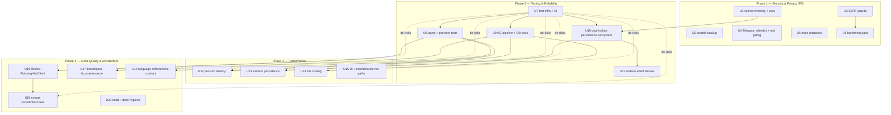
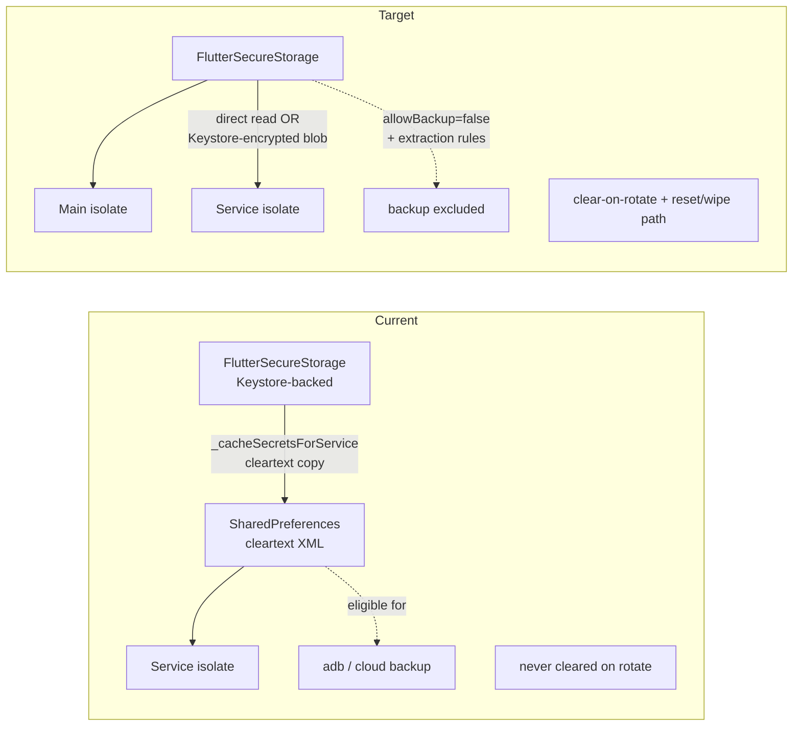
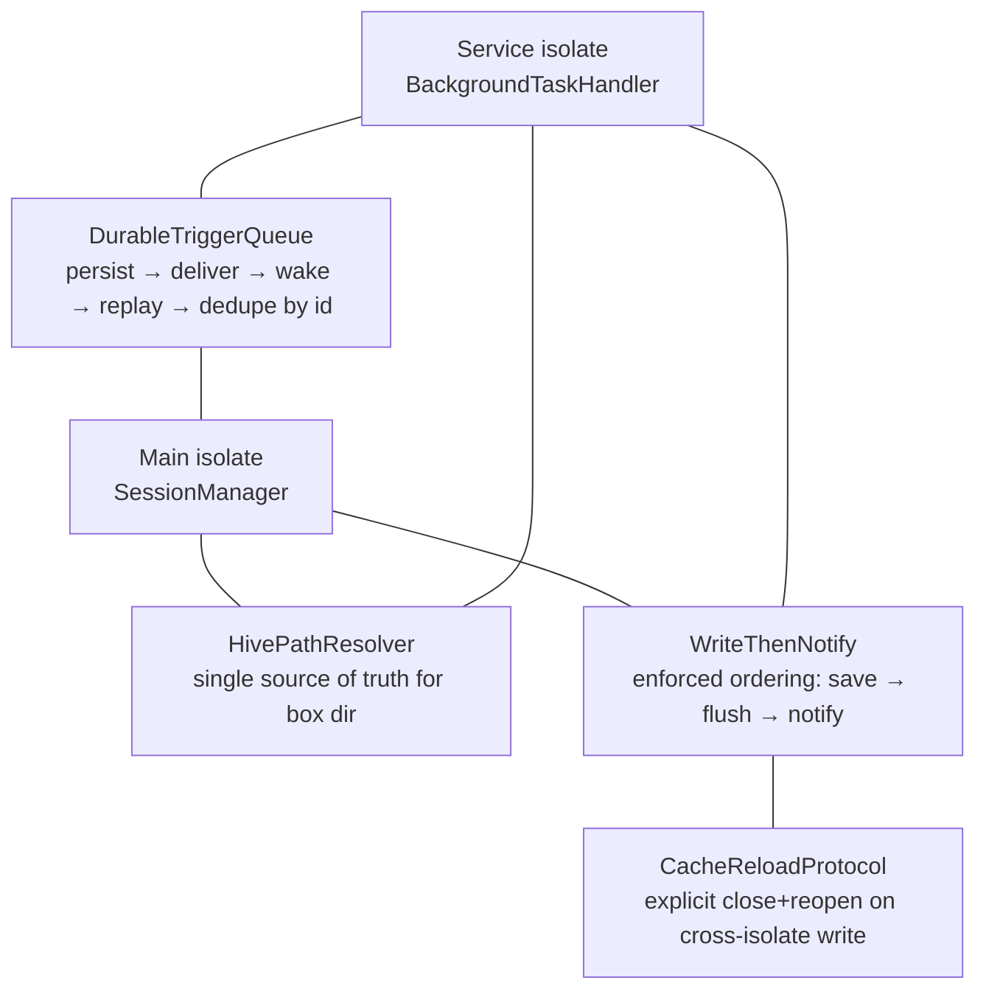

# refactor: DroidClaw project improvement roadmap

## Summary

A prioritized, four-phase improvement roadmap for DroidClaw/ARaccoon, derived from a full-project audit across security & privacy, testing & reliability, performance, and code quality & architecture. Phase 1 closes privacy/security gaps that directly contradict the product's on-device promise; Phase 2 builds the test/CI foundation the codebase currently lacks; Phase 3 removes per-turn latency and scaling cliffs in the agent loop and knowledge graph; Phase 4 pays down structural debt in the largest files and shared abstractions.

---

## Problem Frame

### What DroidClaw is (the goal to protect)

DroidClaw/ARaccoon is a **personal AI assistant for Android where everything runs on-device** — agent loop, LLM API calls, tool execution, session management, and a knowledge-graph memory all live in the app with no project-operated server. It is a Flutter 3.x / Dart 3 / Riverpod 3.x app, ported from the Go project PicoClaw, exposing 34 snake_case tools, a dual-isolate background runtime (Telegram long-polling + cron in a foreground-service isolate), multi-provider LLM/embedding abstractions, and a Drift/SQLite knowledge graph with FTS5 + vector retrieval.

The product's identity rests on two promises: **(a) it is private** — your data lives on your device — and **(b) it is autonomous and capable** — it acts on your behalf in the background through powerful tools. Every improvement below is judged against whether it strengthens or erodes those two promises. The privacy promise is the load-bearing one: the app necessarily transmits user input, retrieved personal facts, contacts, calendar, and location to whatever external LLM/search/routing endpoints the user configures, so "on-device" is about *control and at-rest safety*, not zero network. That distinction is exactly where the most urgent gaps sit.

### Why this work, now

The project has matured rapidly (60+ feature/fix plans, 34 tools, a full knowledge-graph subsystem) but the audit surfaces three systemic weaknesses that compound as the app grows:

1. **The privacy promise is partially undermined by the implementation.** API keys are mirrored from `FlutterSecureStorage` into cleartext `SharedPreferences` for the service isolate and never cleared; Android backup is left at its insecure default, making keys, full conversation history, and the personal knowledge graph eligible for `adb`/cloud extraction; LLM traces persist PII unredacted; and several LLM-controlled tools have no guardrails against SSRF or model-driven communication actions.

2. **There is almost no automated test coverage** — ~2.9K test LOC against 43.8K LOC of `lib/`, with the agent loop, all LLM providers, 31 of 34 tools, the knowledge-graph pipeline, session management, and the entire dual-isolate runtime untested, and no CI. The recurring-bug record in `docs/solutions/` (four separate dual-isolate persistence incidents, three language-compliance incidents) shows these gaps are being discovered in the field, not in tests.

3. **Core hot paths run on the agent isolate with super-linear cost.** KG retrieval adds an unconditional extra LLM round-trip plus 50–150 sequential SQLite queries and an O(n) cosine scan to *every* turn; the dedup/dream path is O(n²) over embeddings; session save fsyncs the full session on every message. These are tolerable today and become jank/ANR/correctness cliffs as the KB and history grow.

Underneath all three sits a structural theme the learnings make explicit: **cross-isolate persistence is implemented as per-feature glue rather than a subsystem**, which is why the same three-bug shape (Hive path mismatch, notify-before-save race, stale cache) keeps recurring.

---

## Requirements

### Security & Privacy

- R1. No secret is persisted in cleartext at rest. `FlutterSecureStorage` (Keystore-backed) is the only at-rest store for API keys; any service-isolate-accessible copy is either eliminated or Keystore-encrypted.
- R2. Deleting or rotating a key removes every cached copy, and a user-invokable reset path wipes all secrets, sessions, and KB.
- R3. Android backup excludes secrets, sessions, the knowledge graph, and LLM traces (via `allowBackup=false` and/or data-extraction rules).
- R4. URL-fetching tools (`web_scrape`, `web_scrape_js`, ProofEditor URL import) accept only `http`/`https` and reject hosts resolving to private, loopback, or link-local ranges, re-checked after each redirect.
- R5. Exported native components either verify their callers or are not exported.
- R6. Autonomous execution (service isolate / Telegram) gates communication and destructive tools, and Telegram requires a non-empty allowlist matched by stable numeric user ID, not username.
- R7. LLM traces redact known-sensitive tool outputs (contacts, calendar, location, KB facts, tokens) and are excluded from backup.

### Testing & Reliability

- R8. The core flows — agent loop, LLM/embedding providers, KG pipeline, session management — have automated tests, and CI runs `flutter analyze` + the test suite on every push and PR.
- R9. Test infrastructure provides reusable fakes: a fake `LLMProvider`, an in-memory `KnowledgeGraphDB`, and a Hive test harness.
- R10. Cross-isolate persistence is consolidated into a single authoritative module (Hive-path resolver, enforced save-then-notify ordering, explicit cache-reload API, durable idempotent trigger queue), covered by regression tests.
- R11. Currently silent failures — KG pre-query failure and service-isolate init failure (missing secrets/config) — surface as observable, diagnosable states rather than no-ops.
- R12. The recurring failure modes from `docs/solutions/` are pinned by regression tests: Hive flush-on-write, non-mutating message reads, summarization not emptying a session, mid-iteration save, and cross-isolate read-after-write.

### Performance

- R13. KG retrieval does not add an unconditional extra LLM round-trip per turn; query expansion is gated by config or folded into the main call.
- R14. Per-turn KG retrieval issues a bounded number of DB queries — neighbor, fact, entity, and decay hydration are batched, with no re-fetch of already-loaded neighbors.
- R15. Vector similarity work does not block the UI or service isolate, and semantic search does not silently drop the KB beyond a hardcoded cap.
- R16. Session persistence does not eagerly load all sessions into memory and does not fsync on every intermediate save.
- R17. Maintenance/cleanup (dedup, snapshot, decay) scales past several thousand entities without unbounded LLM prompts, O(n²) scans on a foreground path, or full-isolate stalls.

### Code Quality & Architecture

- R18. HTTP transport (retry + exponential backoff on 429/5xx) is implemented once and shared across LLM providers, embedding providers, and HTTP tools; all providers have consistent retry behavior.
- R19. The two largest non-generated files — `kb_maintenance_service.dart` (1622 lines) and `proof_editor_tool.dart` (1135 lines) — are decomposed into focused collaborators with single responsibilities.
- R20. LLM JSON parsing (markdown-fence stripping + decode) and language-name/hint helpers are single-sourced rather than duplicated across 3–4 sites.
- R21. Agent language compliance is model-aware and language-aware in summarization, validated by regression tests against weak models (e.g. Gemini Flash) with English-heavy history.
- R22. The build is free of dead dependencies, documented framework versions match the actual toolchain, and magic thresholds live in `AppConstants`.

---

## Key Technical Decisions

- **Security leads the sequence.** Phase 1 ships first because the gaps directly contradict the product's defining promise and several are exploitable by prompt injection through content the agent is *told* to read. Rationale: a privacy-marketed assistant that mirrors keys in cleartext and ships personal data to cloud backup has a credibility-level defect, not a polish-level one.
- **Test infrastructure before broad test-writing.** Phase 2 builds fakes + CI (U7) before writing the bulk of tests, because the audit confirmed the core classes are dependency-injected and testable — the blocker is missing fakes (LLMProvider, in-memory Drift, Hive), not architecture. Fakes unlock every subsequent test unit cheaply.
- **Treat dual-isolate persistence as one subsystem.** The four recurring incidents in `docs/solutions/` share a root cause: each feature re-implements isolate sync. U10 consolidates this into a single module rather than patching the next instance. (see origin: `docs/solutions/architecture/cron-sessions-hive-path-mismatch-between-isolates.md`)
- **Move heavy CPU off the agent isolate; don't micro-optimize the scalar loop.** For vector similarity (U14) the leverage is `Isolate.run()` and an ANN/`sqlite-vec` index, not hand-vectorizing the 768-dim cosine. Rationale: the scalar loop is fine at 1K entities; the real defects are *where it runs* (UI isolate) and the *silent 1000-entity cap* that breaks correctness at scale.
- **Eliminate the secret cache rather than expand `SharedPreferences` usage.** Preferred order: (1) use `FlutterSecureStorage` directly in the service isolate — **unverified**: the `enable-location-tools-in-service-isolate` learning disproves the "plain Dart isolate" assumption *generally* (platform channels work, shown via `SharedPreferences`), but Keystore-backed secure storage on the secondary FlutterEngine is untested, and `service_agent_factory.dart:47` currently asserts `FlutterSecureStorage` is unavailable there. U1 must confirm with a spike before committing; (2) failing that, encrypt the cached blob with a Keystore key — **budget this as the likely path, not the exception**; (3) at minimum, clear-on-rotate + a one-time migration wipe + `allowBackup=false`.
- **Decompose by extracting collaborators, not rewriting behavior.** U16/U17/U18 extract a `RetryingHttpClient`, an `LlmJsonParser`, model files, and a `ProofEditorClient` while preserving observable behavior, so the absent test coverage isn't a blocker to refactoring (tests land in Phase 2 first where the refactor is risky).
- **Keep raw-SQL Drift; defer the type-safe-query migration.** The all-`customSelect` style means zero compile-time SQL safety, but migrating 795+ lines to Drift's query builder is high-effort and low marginal safety once tests exist. Decision: add tests around the SQL now; defer the migration to follow-up work.

---

## High-Level Technical Design

### Phase sequencing and dependencies

Phases are ordered by urgency and by what unblocks what. Phase 2's test infrastructure (U7) is a prerequisite for safely executing the Phase 3/4 refactors; the dual-isolate consolidation (U10) feeds both reliability and the Phase 1 secret-handling change.



(Hard edges shown solid; `U7 -. de-risks .->` are soft — Phase 2's test infra reduces refactor risk without strictly blocking. Note `U1 --> U10`: both units modify `background_service_provider.dart`, so U10's migration of that file must follow U1's secret-handling change to avoid encoding the cleartext-cache pattern into the new module. U17 does **not** depend on U16 — its collaborators call the `LLMProvider` interface, not raw HTTP.)

### Secret handling: current vs. target



### Proposed dual-isolate persistence subsystem (U10)



---

## Scope Boundaries

This roadmap is an **execution backbone**: each unit is independently landable, and the phases are ordered but a later phase does not strictly block starting an unrelated earlier-phase unit. The deliverable is the prioritized set of units, not a single PR. For a solo maintainer, treat it as a set to draw from rather than a committed sprint.

**Minimum credible privacy posture (if attention runs short):** U1's floor (clear-on-rotate + one-time migration wipe) + U2 (`allowBackup=false`, ~1 line) + U5 (trace redaction) close the bulk of the at-rest exposure for near-zero effort and do **not** depend on U1's uncertain secure-storage spike. Ship those three first within Phase 1; the spike-heavy and native-code items (U1's preferred path, U6) can follow.

**Cheap, low-risk wins worth pulling ahead of full Phase 2 coverage:** U15's per-build `print`-loop deletion (a visible hitch, behavior-narrowing) and U12's query-expansion fold-in (a recurring per-turn latency *and* API-token cost the owner pays today) are low-risk enough to land without waiting on the full test build-out — provided U12's semantic-gap regression test (see U12) goes in with it.

### Deferred to Follow-Up Work

- **Migrating the raw-SQL Drift surface to type-safe queries** — large, low marginal safety once tests exist (see KTDs). Revisit after Phase 2.
- **`mergeEntities` step-extraction refactor** — the 265-line transactional method is correct but unreadable; extract into named private steps as a follow-up to U9 once it has test coverage, rather than risking it before tests land.
- **`pick_image`/`ocr` downscaling and `web_scrape_js` WebView disposal review** — flagged by the performance audit but not read in this pass; needs its own focused inspection before planning a fix.
- **`tel:`/`sms:` confirmation UX in the foreground chat** — U4 gates these in autonomous contexts; the interactive-confirmation UX for the main isolate is a separate UX design task.

### Outside this product's identity

- **A project-operated backend or sync server.** The on-device model is the product; nothing here introduces a server. Cross-device sync, if ever wanted, is a different product conversation.
- **Removing external API calls.** "On-device" means control and at-rest safety, not zero network; the LLM/search/routing calls are inherent to the product.

---

## Risks & Dependencies

- **Service-isolate secure storage may not work as hoped (U1).** The plan's preferred option assumes `FlutterSecureStorage` works on the foreground-service FlutterEngine. If it does not, the fallback (Keystore-encrypted blob) adds scope. Mitigation: U1 begins with a spike to confirm, and the clear-on-rotate + `allowBackup=false` floor is valuable regardless of which option lands.
- **U10 is a high-risk rewrite of the most fragile subsystem.** Consolidating four historically-separate, field-discovered isolate bugs into one new abstraction risks silently dropping a hard-won fix (exact flush-then-notify ordering, Hive-path derivation) and reintroducing a cross-isolate bug that only manifests when the main isolate is dead — the hardest class to catch in CI. The `DurableTriggerQueue` also adds genuinely net-new persist→deliver→wake→replay→dedupe semantics, not just consolidation. Mitigation: characterization-tests-against-existing-glue-first (U10 Execution note), incremental landing of the four mechanisms, and the integrity validation against cron definitions.
- **Refactoring without tests (Phase 3/4 ordering).** Decomposing `kb_maintenance_service` and `proof_editor_tool` before their tests exist is risky. Mitigation: Phase 2 lands first for the modules a given refactor touches; U16–U18 are sequenced after the relevant Phase 2 coverage.
- **`sqlite-vec` adoption (U14) adds a native dependency** and APK size; it must build for all split-per-abi targets (arm64-v8a, armeabi-v7a, x86_64). Mitigation: the off-isolate `Isolate.run()` fix is independently valuable and lower-risk; treat the ANN index as the second step, gated on a build check.
- **Language-compliance regressions (U19) depend on model behavior** that changes across provider/model updates. Mitigation: the regression tests pin the *mechanism* (per-turn language tag on the copy, language-aware summarization), and the suite runs against the weakest configured model. (see origin: `docs/solutions/runtime-errors/gemini-flash-ignores-system-prompt-language-instructions.md`)
- **Verify the active branch's KB/dedup work hasn't moved the retrieval fixes.** The current branch is `feat/dream-kb-dedup` touching `knowledge_graph_db.dart` and KB services; confirm the FTS5 tokenization/facts-search fixes are still present before building on them. (see origin: `docs/solutions/logic-errors/knowledge-graph-retrieval-fts5-tokenization-and-semantic-gap.md`)

---

## Implementation Units

### Phase 1 — Security & Privacy (P0)

### U1. Eliminate plaintext secret mirroring and add a secret-wipe path

- Goal: Stop persisting API keys in cleartext `SharedPreferences`, and ensure key rotation/deletion and a reset action remove all secret copies.
- Requirements: R1, R2
- Dependencies: none (informed by U10's path/cache work but does not block on it)
- Files:
  - `lib/providers/background_service_provider.dart` (`_cacheSecretsForService`)
  - `lib/core/services/background_task_handler.dart` (secret read at init)
  - `lib/core/config/config_storage.dart` (key getters/setters; add delete + wipe)
  - `lib/shared/constants.dart` (`cached*Key` constants)
  - `lib/features/settings/provider_config_screen.dart`, `lib/features/onboarding/` onboarding screen (rotation/delete call sites)
  - `test/security/secret_handling_test.dart` (new)
- Approach: Begin with a short spike confirming whether `FlutterSecureStorage` reads succeed inside the foreground-service FlutterEngine — the pass criterion is a `read()` from inside `BackgroundTaskHandler` returning a value written by the main isolate, using the configured `flutter_secure_storage` 10.x `AndroidOptions`. (Note the existing in-code assertion at `service_agent_factory.dart:47` that secure storage is unavailable there — the spike either disproves it for the current library version or it stands.) Preferred: service isolate reads keys directly from secure storage, deleting `_cacheSecretsForService`'s secret writes entirely (keep only non-secret cached values like locale/workspace). Fallback: encrypt the cached blob with a Keystore-derived key. Floor regardless: a **one-time migration** (guarded by a versioned flag, run on first launch after the update, before the service isolate starts) that `prefs.remove()`s every `cached*ApiKey` constant — closing the window where pre-update cleartext keys persist for users who never rotate; on key delete/rotate, clear every `cached*ApiKey` entry; add a "reset / wipe all data" action that clears secure storage, the secret cache, sessions, KB, LLM traces, cron definitions, and Telegram config.
- Patterns to follow: the existing secure-storage getters in `config_storage.dart`; the `cachedKbLanguageKey` removal already done in `_cacheSecretsForService` is the model for clear-on-change.
- Test scenarios:
  - On first launch after the update (migration flag absent), every `cached*ApiKey` prefs entry is removed regardless of whether the user rotates a key.
  - Rotating a provider key clears the previously cached value (assert no stale key remains in the prefs-backed cache).
  - Deleting a key removes both the secure-storage entry and any cache entry.
  - The reset/wipe action leaves no secret, session, or KB data readable afterward.
  - Service isolate can still obtain a usable key after the change (fake/secure-storage stub returns the rotated value).
- Verification: After rotating then deleting each key type, no cleartext key is present in the app's `shared_prefs`; the service isolate still authenticates LLM calls.

### U2. Disable Android backup and add data-extraction rules

- Goal: Prevent secrets, sessions, KB, and traces from being captured by `adb backup` or cloud auto-backup.
- Requirements: R3
- Dependencies: none
- Files:
  - `android/app/src/main/AndroidManifest.xml` (`<application>`)
  - `android/app/src/main/res/xml/data_extraction_rules.xml` (new), `backup_rules.xml` (new) as needed
- Approach: Set `android:allowBackup="false"` (simplest, strongest). If selective backup is desired later, instead wire `android:dataExtractionRules` + `android:fullBackupContent` excluding `shared_prefs` secrets, the Hive box dir, the SQLite KB, and the trace `.jsonl` files. Note this only stops *future* capture — keys in cloud backups taken by pre-update versions remain; pair with U1's migration and surface a one-time in-app advisory to rotate keys.
- Patterns to follow: standard Android manifest backup configuration.
- Test scenarios: Test expectation: none — manifest/config change. Verify manually that `adb backup` produces no app data (or only the explicitly allowed subset).
- Verification: `adb backup com.droidclaw.app` yields an empty/secret-free archive; build still installs and runs.

### U3. SSRF guards on URL-fetching tools

- Goal: Block LLM-/content-driven requests to private, loopback, and link-local hosts and non-web schemes across the URL-fetching surface.
- Requirements: R4
- Dependencies: none
- Files:
  - `lib/core/tools/web_scrape_tool.dart` (manual redirect re-resolution)
  - `lib/core/tools/web_scrape_js_tool.dart` (WebView load)
  - `lib/core/tools/proof_editor_tool.dart` (`_importFromUrl`)
  - `lib/core/net/url_guard.dart` (new shared validator)
  - `test/security/url_guard_test.dart` (new)
- Approach: Add a shared `UrlGuard` that enforces an `http`/`https` scheme allowlist and rejects hostnames resolving to private (RFC1918), loopback, link-local (169.254/fe80), and ULA ranges. Apply before the initial fetch and re-apply after each manual redirect in `web_scrape`; apply before WebView load in `web_scrape_js`; apply in ProofEditor URL import. Close the **DNS-rebinding TOCTOU window**: a pre-fetch resolve followed by the HTTP client's own independent resolve at connect time is exploitable — either pin the validated IP into the connection (custom `HttpClient`/`Socket.connect` that re-checks the resolved address before connecting) or explicitly document the residual risk as accepted. `web_scrape_js`'s WebView can also issue sub-requests (XHR/iframe) that bypass the pre-load guard — note this as a known WebView limitation pending the deferred disposal/sandbox review.
- Patterns to follow: the existing host validation already done on ProofEditor slug/host import; centralize it.
- Test scenarios:
  - Reject `http://169.254.169.254/...`, `http://127.0.0.1`, `http://192.168.1.1`, `file:///...`, `javascript:` — each returns a tool error, no fetch.
  - Allow a normal public `https://` URL.
  - A public URL that 302-redirects to `http://10.0.0.1` is blocked at the redirect re-check.
  - DNS-resolves-to-private hostname is rejected (resolve-then-check, not string match).
  - DNS-rebinding: mock resolver returns a public IP on the first call and a private IP on the second — the connection is blocked (validates the TOCTOU mitigation, or is explicitly skipped if residual risk is accepted).
- Verification: All URL-fetching tools refuse private/loopback/link-local targets including via redirect; public fetches still succeed.

### U4. Harden Telegram allowlist and gate communication/destructive tools in autonomous contexts

- Goal: Close the open-by-default Telegram surface and prevent unattended model-driven `tel:`/`sms:`/`mailto:` and other sensitive actions.
- Requirements: R6
- Dependencies: none
- Files:
  - `lib/features/telegram/telegram_bot_manager.dart` (allowlist gate + ID matching)
  - `lib/features/settings/telegram_config_screen.dart` (require non-empty allowlist; collect user IDs)
  - `lib/core/agent/service_agent_factory.dart` (tool gating in service isolate)
  - `lib/core/tools/open_app_tool.dart` (confirmation/gating hook)
  - `test/security/telegram_allowlist_test.dart` (new)
- Approach: Require a non-empty allowlist before the bot can be enabled, and match incoming messages by numeric Telegram user ID rather than the spoofable username. In the autonomous (service-isolate) agent configuration, gate communication/destructive tools (`open_app` for `tel`/`sms`, and review others like `contacts.get_all`) behind an explicit allow flag rather than running them unattended.
- Patterns to follow: the existing `_allowedUsers` gate in `telegram_bot_manager.dart`; the tool-exclusion pattern in `service_agent_factory.dart`.
- Test scenarios:
  - Empty allowlist → bot refuses to enable (config validation fails).
  - Message from a non-allowlisted user ID is dropped; allowlisted ID is processed.
  - Username change by an allowlisted user does not bypass ID matching.
  - In the service-isolate config, a model request to `open_app` with a `tel:`/`sms:` URL is gated (rejected or queued for confirmation), while interactive-isolate behavior is unchanged.
- Verification: Telegram cannot be enabled without an ID-based allowlist; autonomous runs cannot silently place calls/SMS.

### U5. Redact and protect LLM traces

- Goal: Stop persisting unredacted PII (and any token echoes) in LLM trace files.
- Requirements: R7
- Dependencies: none (pairs with U2 for backup exclusion)
- Files:
  - `lib/core/config/llm_trace.dart` (preview/response capture)
  - `lib/core/services/llm_trace_logger.dart` (write path)
  - `lib/core/agent/agent_loop.dart:356-362` (trace emission)
  - `test/security/llm_trace_redaction_test.dart` (new)
- Approach: Redact known-sensitive content before it enters the trace. Critically, the trace captures the **full `messages` list and a `systemPromptPreview`** (`agent_loop.dart:184-186, 356-363`), not just the current tool output — so redaction must cover: (a) tool-role message `preview`s in `messages[]` (prior contacts/calendar/location results re-sent each iteration), (b) `systemPromptPreview` (KB facts are injected into the system prompt), and (c) the current tool outputs, plus any `token=`/bearer-looking substrings. Keep status/slug/tool-name metadata. Decide whether redaction applies retroactively to existing `.jsonl` files (one-time scrub) or new-writes only. Ensure trace files are covered by U2's backup exclusion.
- Patterns to follow: the ProofEditor "never log response bodies; log status + slug only" rule. (see origin: `docs/solutions/security-issues/proof-editor-code-review-security-and-robustness-fixes.md`)
- Test scenarios:
  - A `contacts.get_all` result is redacted in the persisted trace (no phone/email present).
  - A trace whose session history already contains a prior tool result with contact data has that PII absent from the `messages[].preview` array.
  - A `systemPromptPreview` containing injected KB facts is redacted.
  - A response containing a `token=...`/bearer-shaped string is redacted.
  - Non-sensitive content (e.g., a weather summary) is preserved for debuggability.
- Verification: Trace `.jsonl` files contain no contact/calendar/location PII or token strings after a session exercising those tools.

### U6. Security hardening pass

- Goal: Close the remaining medium/high hardening items as one coherent change.
- Requirements: R4, R5
- Dependencies: U3 (shares `UrlGuard`)
- Files:
  - `android/app/src/main/AndroidManifest.xml` + `RadioPlaybackService.kt` (exported MediaSessionService: verify caller package/signature in `onConnect`, or drop `exported="true"` if not required)
  - `lib/core/tools/file_tool.dart` (`_resolvePath`: use `p.isWithin(canonicalWorkspace, canonicalResolved)` instead of `startsWith`; add a write-size cap)
  - `lib/core/tools/proof_editor_tool.dart` (move `/ops` `?token=` to the `Authorization` header where the API supports it)
  - `lib/providers/background_service_provider.dart` (scope foreground-service type to active features)
  - `android/app/src/main/res/xml/network_security_config.xml` (new; exclude user-installed CAs, optional pinning)
- Approach: Bundle the H1/M1/M2/M4/M5 hardening items. Each is small; grouping keeps the manifest/native review in one pass.
- Patterns to follow: `package:path`'s `isWithin`; Android `networkSecurityConfig`.
- Test scenarios:
  - File tool: a sibling-prefix path (`workspace_evil`) is rejected; an in-workspace path is allowed; an oversized write is refused.
  - ProofEditor mutating ops authenticate via header (no token in URL).
  - Manifest: `RadioPlaybackService` either non-exported or rejects unknown caller packages (verify via instrumentation or review).
- Verification: File tool refuses prefix-sibling escapes; no auth token appears in any request URL; exported surface is locked down; user-CA MITM no longer trusts app traffic.

---

### Phase 2 — Testing & Reliability

### U7. Test infrastructure and CI

- Goal: Provide the fakes and CI pipeline that make all subsequent testing cheap and continuous.
- Requirements: R8, R9
- Dependencies: none (prerequisite for U8–U10)
- Files:
  - `test/support/fake_llm_provider.dart` (new — scripted `LLMProvider` responses incl. tool calls in both Anthropic + OpenAI shapes)
  - `test/support/in_memory_kg.dart` (new — in-memory Drift `KnowledgeGraphDB`)
  - `test/support/hive_test_harness.dart` (new — temp-dir Hive setup/teardown)
  - `test/support/provider_container.dart` (new — Riverpod `ProviderContainer` override helpers)
  - `.github/workflows/ci.yml` (new)
- Approach: Build the three fakes the audit identified as the only real blockers (LLMProvider, in-memory Drift, Hive). Add a GitHub Actions workflow running `flutter pub get`, `flutter analyze` (must be 0 issues), and `flutter test` on push/PR.
- Patterns to follow: `proof_editor_tool_test.dart` already uses `http.testing.MockClient` — mirror that style; Drift's in-memory `NativeDatabase.memory()`.
- Test scenarios:
  - The fake `LLMProvider` returns a scripted tool-call then a final response, consumed by a trivial AgentLoop test (smoke).
  - The in-memory KG harness creates schema and round-trips an entity + fact.
  - CI workflow runs analyze + test and fails on a deliberately broken test (verified once).
- Verification: `flutter test` runs green locally and in CI; the three fakes are importable and used by at least one test each.

### U8. Agent loop and provider tests

- Goal: Cover the core request→LLM→tool→response loop and both provider formats, including retry.
- Requirements: R8, R12
- Dependencies: U7
- Files:
  - `lib/core/agent/agent_loop.dart` (under test)
  - `lib/core/providers/http_provider.dart`, `anthropic_provider.dart` (under test)
  - `test/agent/agent_loop_test.dart`, `test/providers/http_provider_test.dart`, `test/providers/anthropic_provider_test.dart` (new)
- Approach: Drive AgentLoop with the fake LLMProvider + fake tools; assert the AgentEvent stream (Thinking/ToolCall/ToolResult/Response/Error), mid-iteration save after tool batches, max-iteration ErrorEvent, and summarization-not-emptying. Test provider tool-call parsing for both content-block (Anthropic) and `tool_calls` (OpenAI) shapes and exponential backoff on 429/5xx via `MockClient`.
- Patterns to follow: `ToolCall.fromJson` dual-format parsing; the `MockClient` retry test style.
- Test scenarios:
  - Happy path: user message → tool call event → tool result persisted → final response event.
  - Error path: provider throws 500 repeatedly → retries then emits ErrorEvent.
  - Covers the recurring bug: summarization with a tail lacking standalone user/assistant text does not empty the session.
  - Mid-iteration save: a kill simulated between two tool calls retains the first tool's result.
  - Anthropic provider has retry parity with HttpProvider (was missing).
- Verification: Core loop and both providers have green tests covering happy path, error/retry, and the summarization/mid-save regressions.

### U9. Knowledge-graph pipeline and DB tests

- Goal: Cover ingestion, entity resolution, merge, and FTS5/retrieval correctness.
- Requirements: R8
- Dependencies: U7
- Files:
  - `lib/core/knowledge/services/ingestion_pipeline.dart`, `entity_extractor.dart`, `entity_resolver.dart`, `knowledge_service.dart`, `knowledge_graph_db.dart` (under test)
  - `test/knowledge/ingestion_test.dart`, `test/knowledge/retrieval_test.dart`, `test/knowledge/merge_test.dart` (new)
- Approach: Using the in-memory KG, test extraction→resolution→bi-temporal storage→embedding (with a fake embedder), FTS5 tokenization against the Unicode split fix, that `searchFacts` is actually exercised by `queryRelevant` (the dead-code regression), and `mergeEntities` alias/fact/property transfer.
- Patterns to follow: `dream_dedup_test.dart` for similarity; in-memory Drift.
- Test scenarios:
  - Covers the retrieval regression: a stored fact (e.g., an address) is returned by `queryRelevant`, not just entities.
  - FTS5 tokenization: hyphen/apostrophe terms match (Unicode `\p{L}\p{N}` split), multilingual stopwords removed.
  - Ingestion: a unique-constraint collision on relation insert is handled without aborting the transaction.
  - `mergeEntities`: aliases, facts, and properties from the merged entity survive and the merged id is gone.
- Verification: KG pipeline and merge have green tests; the FTS5-tokenization and facts-search regressions are pinned.

### U10. Consolidate dual-isolate persistence into a subsystem

- Goal: Replace per-feature isolate-sync glue with one authoritative module and pin its behavior with tests.
- Requirements: R10, R12
- Dependencies: U7. **U1 must land first** — both units modify `background_service_provider.dart`; if U10 migrates it before U1, the new module encodes the cleartext-cache pattern U1 is removing. (Alternatively, scope U10's `background_service_provider.dart` changes to non-secret cached values only.)
- Files:
  - `lib/core/session/isolate_persistence/hive_path_resolver.dart`, `write_then_notify.dart`, `cache_reload.dart`, `durable_trigger_queue.dart` (new)
  - `lib/core/session/session_manager.dart`, `lib/core/services/background_task_handler.dart` (`_addPendingTrigger`/`_removePendingTrigger`), `lib/providers/background_service_provider.dart` (`_reloadAfterCronCompletion`, `_processPendingCronTriggers`) (migrate onto the module)
  - `test/session/isolate_persistence_test.dart` (new)
- Approach: Extract a single Hive-path resolver (kills the double-nesting bug), an enforced save→flush→notify ordering, an explicit cache-reload API (the surface `U13` consumes for incremental re-reads), and consolidate the **already-existing** pending-trigger queue (`_addPendingTrigger`/`_removePendingTrigger` keyed off `AppConstants.cronPendingTriggersKey`, deduped today by `cron_id`) into a durable idempotent queue. State explicitly whether the new dedupe-by-id semantics **replace or extend** the current dedupe-by-cron_id guarantee, and pin the intended guarantee in the regression test. **Integrity / defense-in-depth:** because the queue payload lives in app-readable `SharedPreferences` and its `prompt` is executed directly by the autonomous agent, validate each trigger's `cron_id` against the persisted cron definitions and take the prompt from the definition — not from the queue payload — so the queue is not an arbitrary-prompt-injection surface for root/adb tampering.
- Execution note: This is the highest-risk unit — a concurrency/lifecycle rewrite of the subsystem with the worst field record. Write the four historical-incident regression tests as **characterization tests against the existing glue first** (green), then re-run them unchanged against the new subsystem to prove behavior preservation. Consider landing the four mechanisms incrementally (path resolver → ordering → cache-reload → queue) rather than as one PR.
- Patterns to follow: the fixes documented in the four recurring incident docs. (see origin: `docs/solutions/runtime-errors/cron-triggers-lost-when-main-isolate-dead.md`, `docs/solutions/architecture/cron-sessions-hive-path-mismatch-between-isolates.md`)
- Test scenarios:
  - Covers the recurring bug: path resolver returns a single non-double-nested box dir; a write by one isolate is visible to the other after the explicit reload.
  - Save-then-notify ordering: a notify is never emitted before the corresponding flush completes.
  - Durable queue: a trigger enqueued while "main isolate dead" is replayed on next startup exactly once (dedupe by id).
  - `lastRun` is only advanced after successful execution, not before.
- Verification: All four historical incident scenarios have green regression tests; cron/session features route through the single module.

### U11. Surface currently silent failures

- Goal: Make swallowed exceptions in KG pre-query and service-isolate init observable.
- Requirements: R11
- Dependencies: U10
- Files:
  - `lib/core/agent/agent_loop.dart:110-112, 316-319` (KG pre-query / expansion failures)
  - `lib/core/services/background_task_handler.dart:362-392` (init early-return on missing secrets/config)
  - `lib/providers/background_service_provider.dart:224-228` (caching warning)
  - `test/agent/silent_failure_test.dart` (new)
- Approach: Where KG retrieval fails, log via `AppLogger` and optionally surface a degraded-context signal rather than silently returning empty. Where the service isolate can't init (missing key/provider/workspace), emit a diagnosable status to the main isolate so the UI can show "service running but not configured" instead of a false-healthy state.
- Patterns to follow: existing `AppLogger` usage; the AgentEvent ErrorEvent path.
- Test scenarios:
  - KG pre-query throwing leaves a logged, observable signal (not a silent empty result).
  - Service init with a missing key produces a surfaced "not configured" status rather than a silent no-op.
- Verification: A misconfigured service isolate is diagnosable from the UI/logs; KG failures are no longer invisible.

---

### Phase 3 — Performance

### U12. Cut per-turn agent-loop latency

- Goal: Remove the unconditional extra LLM round-trip and the N+1 query storm from every turn.
- Requirements: R13, R14
- Dependencies: U7 (de-risks), U8/U9 (coverage for touched paths)
- Files:
  - `lib/core/agent/agent_loop.dart` (`_expandQueryForKG`, per-turn KG call)
  - `lib/core/knowledge/services/knowledge_service.dart` (`queryRelevant`: batch neighbor/fact/entity/decay hydration; stop re-fetching neighbors)
  - `lib/core/knowledge/database/knowledge_graph_db.dart` (batched `WHERE ... IN (...)` neighbor/entity/fact loaders)
  - `test/knowledge/retrieval_golden_test.dart` (new — captures the pre-refactor top-K + scores baseline)
- Approach: **Prefer folding query expansion into the main call over gating it off** — `_expandQueryForKG` was added deliberately to fix a documented semantic-gap retrieval bug (lexical FTS5 cannot bridge "où est-ce que j'habite?" → stored `address` fact; see origin learning). Gating it *off by default* re-opens that bug for any query the vector path doesn't also bridge (and U14 still caps/threshold-filters the vector path). Folding preserves the semantic bridge while removing the separate round-trip. If config-gating is chosen instead, the default must stay ON unless the regression test below passes with it OFF. In `queryRelevant`, replace the ~50–150 sequential queries with batched `IN (...)` loads and reuse neighbors already loaded rather than re-querying during hydration.
- Patterns to follow: the existing `getAllActiveAliases` batch query proves the batch pattern.
- Test scenarios:
  - Covers the semantic-gap regression: the documented failing query (e.g., "où est-ce que j'habite") still retrieves the stored address fact under the chosen expansion strategy.
  - The query-expansion round-trip is no longer a separate unconditional pre-turn LLM call (assert on fake provider call count for the folded/gated path).
  - `queryRelevant` over a seeded KG issues a bounded query count (assert no per-candidate neighbor re-fetch).
  - Retrieval results are unchanged vs. the captured pre-refactor baseline for a fixed seeded KG (golden test) — baseline captured *before* the hydration rewrite, with expansion in its final-decided configuration.
- Verification: A turn no longer makes a pre-query LLM call by default; DB round-trips per turn drop from dozens to a handful with identical results.

### U13. Session persistence: lazy load and flush cadence

- Goal: Stop eagerly loading all sessions and fsyncing on every intermediate save.
- Requirements: R16
- Dependencies: U7, U10
- Files:
  - `lib/core/session/session_manager.dart` (`init`, `save`, `reload`, `getAllSessions`)
- Approach: Load session metadata/list lazily rather than deserializing every full message history at startup; flush only on final response and on app pause (not after every tool batch); make `reload()` re-read changed keys instead of closing/reopening the whole box.
- Patterns to follow: U10's cache-reload protocol; the lifecycle flush already added in `app.dart`.
- Test scenarios:
  - Startup does not deserialize full histories for all sessions (assert lazy access).
  - Intermediate tool-batch saves do not each fsync; final response does (assert flush count).
  - Crash-safety preserved: a kill after final response retains the message (interacts with U8's mid-save test).
- Verification: Startup and `reload()` cost no longer scale with total session count; per-turn write latency drops while crash-safety guarantees hold.

### U14. Knowledge-graph scaling: off-isolate similarity and the silent cap

- Goal: Remove the O(n) cosine scan from the agent isolate, fix the silent 1000-entity cap, and bound the O(n²) dedup pass.
- Requirements: R15, R17
- Dependencies: U7, U9
- Files:
  - `lib/core/knowledge/services/knowledge_service.dart` (vector scan; the `getActiveEntityEmbeddings(limit: 1000)` cap)
  - `lib/core/knowledge/algorithms/memory_clusterer.dart` (cosine)
  - `lib/core/knowledge/services/kb_maintenance_service.dart` (`findCandidates` O(n²) + N+1)
  - `lib/core/knowledge/database/knowledge_graph_db.dart` (batch relation/fact loaders; optional vector index)
- Approach: Get the cosine scan off the agent isolate **or push it into the DB** — but gate the `Isolate.run()` choice on a benchmark first. The embeddings are already materialized in the agent isolate (~1000 × 768 × 4 ≈ 3 MB), so `Isolate.run()` must deep-copy that set per query; at the 1K scale where the scalar loop is "fine," copy overhead may dominate and make per-turn latency *worse*. Measure inline vs. `Isolate.run()` at 1K/5K entities on a mid-range device; if copy cost dominates, skip `Isolate.run()` and go straight to `sqlite-vec` (data never leaves the DB, no cross-isolate copy). Replace or raise the silent 1000 cap (and surface when the KB exceeds searchable bounds); in `findCandidates`, batch the per-entity relation/fact loads into two queries and cap the O(n²) embedding compare (token-block or LSH bucketing). Evaluate `sqlite-vec` as a (possibly primary) step gated on a split-per-abi build check.
- Patterns to follow: `Isolate.run`; the batch-query pattern; existing token-blocking in `findCandidates`.
- Test scenarios:
  - Similarity scan over a seeded KG returns identical top-K whether run inline or off-isolate (golden).
  - With KB size > old cap, semantic search no longer silently drops entities (assert coverage or explicit signal).
  - `findCandidates` over N entities issues a constant number of relation/fact queries (not N+1) and does not perform a full N² compare on a full scan.
- Verification: Vector work does not block the agent isolate; retrieval covers the full (or explicitly-bounded) KB; a full-KB dedup no longer stalls the isolate for seconds.

### U15. UI and maintenance hot paths

- Goal: Remove the per-build hitch in history, bound the KB snapshot prompt, and lighten hourly decay.
- Requirements: R17
- Dependencies: U7
- Files:
  - `lib/features/chat/history_screen.dart` (remove per-session `print` loop; `ListView.builder`; precompute sorted list / memoize counts)
  - `lib/core/knowledge/services/kb_maintenance_service.dart` (`buildKBSnapshot` chunking; `recalculateDecay`)
  - `lib/core/knowledge/database/knowledge_graph_db.dart` (decay-in-SQL or threshold-crossing-only)
- Approach: Delete the debug `print` loop running for every session on every build, switch eager `ListView(children:[...])` to `ListView.builder`, and memoize per-tile counts. Chunk `buildKBSnapshot` by entity range so cleanup prompts don't grow unbounded. Compute decay in SQL or only for rows whose temperature could cross a threshold.
- Patterns to follow: standard Flutter `ListView.builder`; existing batched UPDATE in `batchDecay`.
- Test scenarios:
  - History screen builds without invoking the per-session print path (assert log silence / builder usage).
  - `buildKBSnapshot` over a large KG produces chunked output rather than one unbounded string (assert chunk count/size bound).
  - Decay recompute touches only threshold-crossing rows for a seeded KG (assert update count).
- Verification: History scroll is smooth at 100+ sessions and logcat is quiet; cleanup prompts stay within context bounds at several thousand entities; hourly decay cost is bounded.

---

### Phase 4 — Code Quality & Architecture

### U16. Introduce a shared RetryingHttpClient

- Goal: Standardize 429/5xx retry across providers and HTTP tools, and remove the genuine duplicate implementations. (Note: the work is mostly *adding* retry to tools that have none — `weather`, `geocode`, `web_search` make bare `http.get` — with a secondary dedup of the 2–3 real duplicate loops; it is not primarily a dedup exercise.)
- Requirements: R18
- Dependencies: U7, U8 (provider tests)
- Files:
  - `lib/core/net/retrying_http_client.dart` (new — max retries + exponential backoff on 429/5xx)
  - `lib/core/providers/http_provider.dart`, `anthropic_provider.dart` (migrate; fix Anthropic's missing retry)
  - HTTP tools: `weather_tool.dart`, `geocode_tool.dart`, `reverse_geocode_tool.dart`, `transit_tool.dart`, `web_search_tool.dart`, `web_scrape_tool.dart`, `proof_editor_tool.dart`
  - `test/net/retrying_http_client_test.dart` (new)
- Approach: Extract one client with the canonical retry policy and migrate consumers onto it. **`BaseCloudEmbeddingProvider` already implements this exact policy and satisfies R18** — exclude `embedding_provider.dart` from migration (have the new client mirror/extract its loop rather than forcing a breaking change and an extra delegation hop). Adds retry to `AnthropicProvider`, which has none. **`directions_tool.dart` is excluded** — its retry is a domain-specific 400-on-maintenance profile fallback, not a 429/5xx policy; leave it tool-local unless the shared client is designed to accommodate custom retry triggers.
- Patterns to follow: `BaseCloudEmbeddingProvider`'s retry as the canonical policy (extract from it; do not re-route it through a second abstraction).
- Test scenarios:
  - 429 then 200 → one retry, success (assert attempt count + backoff).
  - 500 ×3 → exhausts retries, throws.
  - Anthropic provider now retries on 429/5xx (was failing immediately).
  - A migrated HTTP tool surfaces a clean error after exhausting retries.
- Verification: One retry implementation; all providers and HTTP tools share it; Anthropic retry parity confirmed by test.

### U17. Decompose `kb_maintenance_service.dart`

- Goal: Break the 1622-line god-object into focused collaborators.
- Requirements: R19, R20, R22
- Dependencies: U7, U9 (KG coverage). (Not U16 — the extracted collaborators call the `LLMProvider` interface, not raw HTTP, so the shared HTTP client is irrelevant here; removing this dependency unblocks U17 as soon as Phase 2 lands.)
- Files:
  - `lib/core/knowledge/services/dedup/candidate_generator.dart`, `llm_verifier.dart`, `cleanup_service.dart` (new)
  - `lib/core/knowledge/services/llm_json_parser.dart` (new — single fence-strip + decode)
  - `lib/core/knowledge/models/dedup_models.dart` (new — the six data classes)
  - `lib/core/knowledge/services/kb_maintenance_service.dart` (slimmed orchestrator)
  - `lib/shared/constants.dart` (dedup thresholds → `AppConstants`)
  - `test/knowledge/llm_json_parser_test.dart`, `test/knowledge/candidate_generator_test.dart` (new)
- Approach: Extract candidate generation (de-duplicating the two copy-pasted candidate-construction blocks), LLM verification (entity + fact), cleanup proposal/execution, a shared `LlmJsonParser` (replacing the four re-implemented fence-strip parsers, including the one in `entity_extractor.dart`), and a models file. Move scattered magic thresholds to `AppConstants`.
- Patterns to follow: the embedding provider's template-method split; `AppConstants` convention.
- Test scenarios:
  - `LlmJsonParser` strips ```json fences and decodes; returns empty list on malformed input without throwing.
  - Candidate generation produces the same candidate set as the pre-refactor baseline for a seeded KG (golden).
  - Thresholds resolve from `AppConstants` (no inline magic numbers remain in the dedup path).
- Verification: `kb_maintenance_service.dart` is materially smaller with single-responsibility collaborators; dedup behavior is unchanged by golden test; one JSON parser remains.

### U18. Extract a ProofEditorClient

- Goal: Separate transport from tool dispatch in the 1135-line `proof_editor_tool.dart`.
- Requirements: R19
- Dependencies: U7, U16 (shared client)
- Files:
  - `lib/core/tools/proof_editor/proof_editor_client.dart` (new — HTTP/transport, auth headers, status handling)
  - `lib/core/tools/proof_editor_tool.dart` (thin dispatcher over the client)
  - `lib/core/tools/proof_editor/proof_document_store.dart` (logging via `AppLogger`)
  - `test/proof_editor_tool_test.dart`, `test/proof_editor_integration_test.dart` (update to client seam)
- Approach: Move the 14 operations' shared transport (client factory, retry via U16, status branching, header auth from U6) into a `ProofEditorClient`; leave the tool as a dispatcher. Route the remaining `print()` calls through `AppLogger`.
- Patterns to follow: the existing tool structure; `AppLogger`-everywhere convention.
- Test scenarios:
  - Existing proof-editor tests pass against the new client seam (behavior preserved).
  - Client surfaces 401/403/404 token purge as before.
  - No `print()` remains in the proof-editor path.
- Verification: Tool file is a thin dispatcher; transport is unit-testable in isolation; existing tests green.

### U19. Model-aware language enforcement contract

- Goal: Make agent language compliance robust across model tiers and language-aware in summarization, with regression tests.
- Requirements: R21, R20
- Dependencies: U7, U8
- Files:
  - `lib/core/agent/agent_loop.dart` (`_languageHint`, per-turn tag on the LLM copy; language-aware summarization)
  - `lib/core/agent/context_builder.dart` (instruction placement/strength)
  - `lib/core/config/app_config.dart` (`KnowledgeConfig.languageName` as the single source)
  - `lib/core/knowledge/services/kb_maintenance_service.dart` (remove private `_languageName`)
  - `test/agent/language_compliance_test.dart` (new)
- Approach: Consolidate the three language-name/hint encodings to one source, and codify the proven three-layer enforcement (system directive placement + per-turn target-language tag appended to the last user message on the LLM copy only + language-aware summarization that doesn't re-inject wrong-language summaries). Regression-test against a fake "weak model" that defaults to history language.
- Patterns to follow: the documented fixes. (see origin: `docs/solutions/runtime-errors/gemini-flash-ignores-system-prompt-language-instructions.md`, `docs/solutions/logic-errors/llm-agent-locale-prompt-engineering.md`)
- Test scenarios:
  - With a French locale and English-heavy history, the LLM copy carries a per-turn French tag while stored history is untouched.
  - Summarization preserves the configured language (no wrong-language summary re-injected).
  - Language name resolves from the single `KnowledgeConfig.languageName` map (no private copies remain).
- Verification: Language tag/summarization mechanism is pinned by tests; only one language-name source exists.

### U20. Build and documentation hygiene

- Goal: Remove dead dependencies and align documented versions with reality.
- Requirements: R22
- Dependencies: none
- Files:
  - `pubspec.yaml` (remove `build_runner`, `json_serializable`; keep `drift_dev`)
  - `CLAUDE.md` (Flutter/Dart version sync), `pubspec.yaml` SDK constraint
  - `analysis_options.yaml` (consider enforcing `avoid_print` in `lib/core`)
- Approach: Drop the two dead codegen dev-deps (CLAUDE.md already states "no code generation"; only Drift generates), correct the documented Flutter 3.38/Dart constraint to match the actual toolchain, and optionally tighten lint to flag stray `print()` in core.
- Patterns to follow: existing `analysis_options.yaml`.
- Test scenarios: Test expectation: none — build/config change. Verify `flutter pub get` + `flutter analyze` (0 issues) + `flutter test` still pass after dependency removal.
- Verification: `flutter pub get` resolves without the dead deps; analyze is clean; documented versions match `flutter --version`.

---

## Sources / Research

- Architecture & code-quality findings: `lib/core/knowledge/services/kb_maintenance_service.dart` (god-object), `lib/core/tools/proof_editor_tool.dart` (fat tool), `lib/core/knowledge/database/knowledge_graph_db.dart` (`mergeEntities`), `lib/core/providers/http_provider.dart` vs `anthropic_provider.dart` (retry asymmetry), `pubspec.yaml` (dead dev-deps).
- Testing/reliability: 5 test files in `test/` vs 43.8K LOC `lib/`; no `.github/workflows`; DI via Riverpod confirms testability; silent catches in `agent_loop.dart:110-112,316-319`, `background_task_handler.dart:362-392`.
- Security/privacy: `lib/providers/background_service_provider.dart` (`_cacheSecretsForService`), `android/app/src/main/AndroidManifest.xml` (no `allowBackup=false`, exported `RadioPlaybackService`), `lib/core/tools/web_scrape_tool.dart` / `web_scrape_js_tool.dart` (SSRF), `lib/core/config/llm_trace.dart` (PII traces).
- Performance: `lib/core/knowledge/services/knowledge_service.dart` (`queryRelevant` O(n) + N+1 + pre-query LLM call), `kb_maintenance_service.dart` (`findCandidates` O(n²)), `lib/core/session/session_manager.dart` (eager load + per-save fsync), `lib/features/chat/history_screen.dart` (per-build print loop), `schema.drift` (no vector index).
- Recurring-pattern learnings (structural signal): `docs/solutions/architecture/cron-sessions-hive-path-mismatch-between-isolates.md`, `docs/solutions/runtime-errors/cron-triggers-lost-when-main-isolate-dead.md`, `docs/solutions/database-issues/session-data-loss-hive-flush-and-destructive-reads.md`, `docs/solutions/runtime-errors/gemini-flash-ignores-system-prompt-language-instructions.md`, `docs/solutions/security-issues/proof-editor-code-review-security-and-robustness-fixes.md`.
