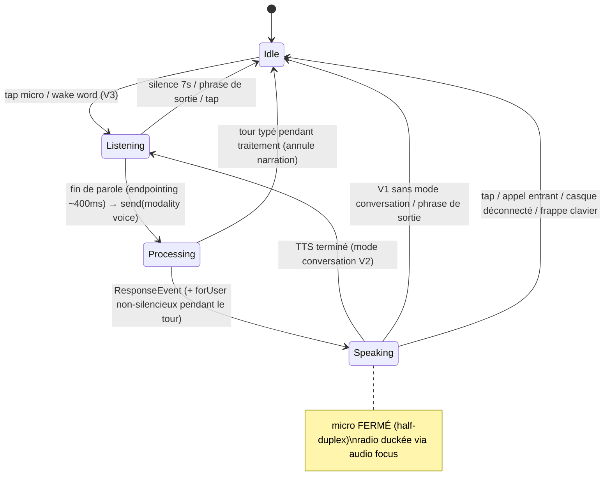
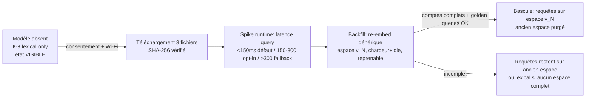
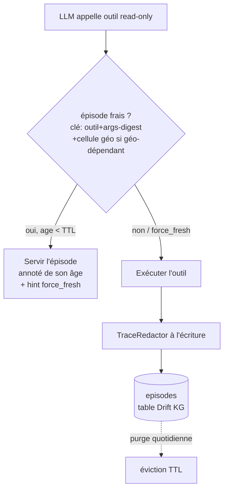

# feat: Mémoire v2 + Interface vocale

## Summary

Deux trajectoires en sept unités livrables séparément. **Mémoire v2** : embeddings locaux EmbeddingGemma derrière le seam `EmbeddingProvider` existant (la mémoire sémantique fonctionne sans clé cloud et hors ligne), mémoire épisodique des résultats d'outils avec TTL et interception, et migration des sessions Hive → SQLite/WAL qui retire la classe de bugs dual-isolate dominante. **Interface vocale** : narration TTS des tours initiés à la voix, mode conversation avec tour de parole, et wake word sherpa_onnx (gated sur spike). Deux spikes décident des points incertains : latence d'inférence ONNX (seuils 150/300 ms) et FGS microphone + batterie.

---

## Problem Frame

L'idéation (origin) a identifié les deux plus grands écarts entre la promesse produit ("privé + autonome, tout on-device") et l'expérience réelle : (1) la mémoire sémantique exige une clé API cloud et meurt hors ligne, l'agent re-exécute des outils qu'il a lancés une heure avant, et les sessions vivent sur le sous-système le plus accidenté du repo (6 incidents documentés sur le partage Hive cross-isolate) ; (2) la voix est un bouton-poussoir yeux-sur-écran — inutilisable dans les contextes canoniques d'un assistant (cuisine, voiture, marche).

**Correction de la recherche** : CLAUDE.md décrivait la voix comme "STT via Groq Whisper" — c'est périmé. Le STT actuel est déjà `speech_to_text` (SpeechRecognizer Android on-device) dans `lib/features/chat/chat_screen.dart`, qui remplit le champ texte ; l'utilisateur appuie encore sur Envoyer. Le delta réel de V2 est le turn-taking, pas le moteur.

---

## Requirements

### Interface vocale

- R1. Un tour initié à la voix produit une réponse parlée : narration des `ToolResult.forUser` non-silencieux et du `ResponseEvent`. Les tours typés, Telegram et cron ne déclenchent **jamais** de narration.
- R2. La narration s'interrompt proprement : tap écran → stop ; perte d'audio-focus (appel) → stop sans reprise auto mi-phrase ; déconnexion casque (`AUDIO_BECOMING_NOISY`) → stop ; frappe clavier → stop et le tour typé n'est pas parlé.
- R3. La langue TTS vient de `AppConfig.resolvedLocale` ; voix indisponible pour la locale → fallback dégradé annoncé ; moteur TTS absent → état visible (pattern U11, pas d'échec silencieux).
- R4. Mode conversation : après la réponse parlée, ré-écoute automatique (~7 s) ; silence → fermeture silencieuse ; phrases de sortie lexicales ("merci", "stop", "c'est tout") → fin immédiate ; les callbacks STT d'une session annulée sont ignorés (jeton de génération).
- R5. (Gated spike) Un mot-clé parlé réveille l'assistant quand l'app est en arrière-plan avec le service mic démarré depuis le premier plan ; arbitrage micro : jamais pendant une session STT, une narration TTS, la radio ou un appel ; le wake word est indisponible après reboot tant que l'app n'a pas été ouverte (contrainte Android 14+ assumée).

### Embeddings locaux

- R6. Un `LocalEmbeddingProvider` (EmbeddingGemma 308M ONNX) rend la recherche sémantique du KG fonctionnelle sans clé API d'embedding, dans les deux isolates, hors ligne une fois le modèle téléchargé.
- R7. Téléchargement du modèle : consentement explicite, Wi-Fi par défaut, progression visible, reprenable, SHA-256 vérifié pour chaque fichier (model + onnx_data + tokenizer.json) ; un échec transitoire ne supprime jamais un modèle fonctionnel déjà en place ; l'état "modèle absent/en téléchargement" est visible (jamais le silence actuel du `hasEmbedder == null`).
- R8. Provenance des embeddings : chaque vecteur stocké porte modèle + dimensions ; une requête ne compare jamais deux espaces d'embedding différents ; le re-embed est un job générique versionné (chargeur + idle), reprenable ; la bascule ne se fait qu'après backfill complet, validée par un jeu de requêtes golden.

### Mémoire épisodique

- R9. Les résultats d'outils **read-only** sont persistés en épisodes redactés (TraceRedactor à l'écriture) avec TTL par classe de volatilité ; à l'invocation d'un outil dont un épisode frais existe (clé = outil + digest d'arguments + contexte localisation pour les outils géo-dépendants), le résultat caché est servi annoté de son âge, avec échappatoire `force_fresh` ; les outils à effet de bord ne sont jamais cachés.
- R10. Le texte compressé par la summarization de session est routé par `IngestionPipeline.extractAndStore()` au lieu d'être jeté.
- R11. Les épisodes sont effaçables : étape DataWiper dédiée, éviction TTL dans la purge quotidienne existante.

### Migration sessions → SQLite

- R12. Les sessions vivent dans une base Drift/SQLite WAL distincte (`sessions.db`), accessible par les deux FlutterEngines via deux connexions indépendantes (pattern KG prouvé en prod) ; l'API publique de `SessionManager` est préservée — `getOrCreate` synchrone avec identité (`identical()`), cadence de durabilité à niveaux, jamais-écraser-l'historique-persisté, throw-on-failed-wipe.
- R13. La migration Hive→SQLite est one-shot, idempotente, race-safe entre isolates (gardée par transaction SQLite exclusive — l'isolate de service peut démarrer en premier via `autoRunOnBoot`), avec sauvegarde des fichiers Hive avant toute écriture, vérification (comptes + spot-check) avant bascule du flag, et rétention des fichiers Hive pendant 2-3 releases ; l'isolate de service suspend ses écritures de session tant que le flag n'est pas levé (les triggers cron passent par la DurableTriggerQueue, conservée).
- R14. Les trois fichiers de tests session (`test/session_characterization_test.dart`, `test/session/isolate_persistence_test.dart`, `test/session/lazy_load_and_flush_policy_test.dart`) servent de spec d'acceptation : chaque comportement pinné est soit préservé contre SQLite, soit consciemment retiré et listé (le retrait légitime : la machinerie reload/réhydratation, rendue inutile par WAL).

---

## Key Technical Decisions

- **sherpa_onnx KWS pour le wake word** (décision utilisateur). microWakeWord, nommé dans l'idéation, n'a aucun portage Flutter — l'intégrer exigerait de porter le préprocessing DSP d'ESPHome. sherpa_onnx offre un KeywordSpotter open-vocabulary avec API Dart officielle en FFI (fonctionne dans l'isolate de service) et ouvre l'upgrade STT streaming offline de V2 avec la même dépendance. Porcupine rejeté (licence 3 utilisateurs/mois + vérification en ligne, friction avec l'identité privée).
- **V2 garde `speech_to_text` avec boucle de relance**. Le SpeechRecognizer Android ne supporte pas la dictée continue (timeout d'endpointing propriétaire) ; le pattern documenté est listen → done → re-listen. L'upgrade sherpa_onnx streaming est différé (la dépendance arrive avec V3 ; on jugera sur pièce).
- **Half-duplex en V1/V2 — pas de barge-in**. Le barge-in exige l'écho-cancellation (AEC) dont la qualité varie par appareil et qui interagit mal avec le STT. Micro fermé pendant la narration + bouton "toucher pour interrompre" visible. Barge-in/AEC différé.
- **flutter_onnxruntime + variante int8 (`model_quantized`, 309 Mo) par défaut au spike**, q4f16 (175 Mo) testée en alternative — la discussion HF #15 signale que les exports q4 ciblent transformers.js et peuvent ne pas charger sur ORT mobile. Tokenizer : `dart_sentencepiece_tokenizer` (pur Dart, charge `tokenizer.json` HF) avec test de parité token-ids contre des fixtures générées par `AutoTokenizer` Python. Chargement par chemin de fichier obligatoire (poids externes `.onnx_data` auto-résolus seulement dans le même répertoire).
- **256-dim MRL + colonne de provenance**. Le passage cloud-768 → local-256 est un changement de **modèle**, pas une troncature : les espaces ne se mélangent pas. Schéma : `embedding_model` + `embedding_dim` par ligne (ou version unique) ; la requête filtre sur l'espace actif ; le backfill est un job générique "re-embed tout ce qui n'est pas dans l'espace N" — réutilisable pour tout futur changement de modèle. Pas de bascule mi-backfill ; revalidation des seuils `HybridScorer` (distribution cosine différente à 256 dim).
- **Téléchargement via `background_downloader`** (WorkManager, reprise par ranges sur le CDN HF, persistance des tâches) en groupe de 3 fichiers + SHA-256 streamé (`package:crypto`) contre hashes épinglés en constantes. Logging statut+identifiant seulement (jamais les corps — hygiène ProofEditor).
- **Épisodes : interception d'abord, injection pré-planification différée**. L'interception (vérification de fraîcheur au moment où le LLM appelle l'outil) économise latence et quota sans toucher aux prompts, et ne peut pas ancrer le modèle sur du périmé. L'injection en contexte viendra en phase 2 avec le weeding.
- **TTL par volatilité, l'âge exposé au modèle**. TTL = frontière d'éviction ; le résultat servi du cache est toujours annoté de son âge pour que le LLM juge ("météo d'il y a 40 min"). Les outils géo-dépendants (`weather`, `get_transit`, `get_directions`) sont clé-és par cellule de localisation en plus du digest d'arguments — sinon "quelle météo ?" après un trajet en train répond pour la ville de départ.
- **`sessions.db` séparée — ne pas étendre le schéma KG**. Deux schémas Drift dans un fichier n'est pas supporté (un seul `user_version` par fichier) ; une base distincte garde l'historique de migrations du KG intact et conserve le contrat DataWiper par-fichier. Deux connexions `NativeDatabase` WAL indépendantes (`busy_timeout` 5000 sur chacune) plutôt que `drift_flutter shareAcrossIsolates` : le pattern double-connexion est déjà prouvé en prod sur le KG entre les deux FlutterEngines, sans le risque de port périmé d'IsolateNameServer ni les problèmes documentés de spawn d'isolates depuis un engine d'arrière-plan. Conséquence assumée : les stream queries Drift ne se synchronisent pas entre connexions — la visibilité cross-isolate continue de passer par les signaux `sendDataToMain` + compteur Riverpod existants.
- **Propriété de la migration : le premier arrivé, gardé par SQLite**. Le flag SharedPreferences n'est pas atomique entre engines ; la garde de vérité est dans la base — la migration s'exécute dans une transaction exclusive avec un marqueur en table ; le concurrent perdant attend (`busy_timeout`) puis relit l'état. Idempotente par construction (re-exécution = no-op).
- **`durable_trigger_queue.dart` est conservée** — elle est basée sur SharedPreferences (pas Hive) et résout la perte de triggers quand l'isolate principal est mort ; M5 ne supprime que `cache_reload.dart` et `hive_path_resolver.dart` (remplacé par un résolveur de chemin DB single-source équivalent).
- **Service wake word séparé, démarré du premier plan uniquement**. Android 14+ interdit le démarrage en arrière-plan d'un FGS de type `microphone` ; le service existant boot-start (`autoRunOnBoot`). Ajouter le type au service existant casserait son boot-start. Donc : second FGS dédié au micro, démarré uniquement depuis l'UI, mort après reboot jusqu'à ouverture de l'app — limitation documentée et affichée.
- **Exécution posture** : characterization-first pour U6 (les trois fichiers de tests = contrat), spike-first pour U2 et U7.

---

## High-Level Technical Design

### Pipeline vocal et mode conversation (U1 + U5)

La modalité est un attribut **par tour** : `ChatNotifier.sendMessage` gagne un paramètre de provenance ; le narrateur (`VoiceNarrator`, troisième consommateur du `Stream<AgentEvent>`, isolate principal uniquement) ne parle que les tours `voice`. Telegram/cron/typed inchangés.

### Cycle de vie des embeddings (U2 + U3)

Schéma : `entities.embedding_model TEXT`, `embedding_dim INTEGER` (migration KG v4). `_scanEmbeddings` filtre sur l'espace actif — jamais de cosine inter-espaces.

### Interception épisodique (U4)

### Machine d'états de la migration sessions (U6)

```mermaid
stateDiagram-v2
    [*] --> HiveActive
    HiveActive --> Migrating: premier isolate démarré post-update\n(transaction SQLite exclusive, marqueur en table)
    Migrating --> Verifying: copie transactionnelle all-or-nothing terminée
    Migrating --> HiveActive: kill mi-migration → rollback transactionnel,\nre-exécution au prochain démarrage
    Verifying --> SqliteActive: comptes + spot-check OK → flag levé\nfichiers Hive renommés .backup (conservés 2-3 releases)
    Verifying --> HiveActive: vérification échoue → Hive reste la vérité
    SqliteActive --> [*]
    note right of Migrating: l'isolate de service suspend\nses écritures session ;\ntriggers via DurableTriggerQueue
```

---

## Scope Boundaries

Sept unités indépendamment livrables, dans l'ordre U1 → U2 → U3 → U4 → U5 → U6 → U7. Les deux spikes (dans U2 et U7) sont des portes : un échec replie l'unité sur son fallback documenté sans bloquer le reste.

### Deferred to Follow-Up Work

- **Injection épisodique pré-planification** (en contexte avant le plan du LLM) — après l'interception et avec le weeding.
- **Upgrade STT streaming sherpa_onnx** pour V2 — jugé une fois la dépendance V3 en place.
- **Barge-in / écho-cancellation** — half-duplex d'abord ; l'AEC varie trop par appareil.
- **FTS5 sur l'historique de messages** (`messages_fts`) — la migration U6 le rend trivial à ajouter, mais hors périmètre.
- **Notes vocales Telegram et réponses parlées Telegram** — explicitement hors V1/V2 (la narration est gated sur la modalité du tour, ne pas élargir).
- **Cluster confiance-mémoire** (provenance Admiralty, weeding MUSTIE, codex utilisateur, belief review) — phase 2 de Mémoire v2, après U4+U6.
- **Mise à jour automatique du modèle d'embeddings** — la détection de nouvelle révision réutilise le job de re-embed versionné (R8) ; déclenchement manuel d'abord.
- **Suppression effective des fichiers Hive `.backup`** — release N+2/N+3.

### Outside this product's identity

- Pas de serveur opéré par le projet ; pas de retrait des APIs LLM cloud ; pas de CI (gate locale).

---

## Risks & Dependencies

- **Chargement ONNX des variantes quantisées (U2)** : la discussion HF #15 documente des échecs de chargement q4 sur ORT mobile. Mitigation : le spike teste int8 d'abord (le plus compatible), q4f16 ensuite ; l'export uint8 d'electroglyph en troisième option ; échec total → le provider local devient fallback hors-ligne et le cloud reste le défaut (l'architecture est identique).
- **Parité du tokenizer pur-Dart (U2)** : `dart_sentencepiece_tokenizer` est jeune. Mitigation : test de parité token-ids contre fixtures `AutoTokenizer` committées ; divergence → encoder les textes de test en goldens et figer la version du package.
- **Plugins dans l'engine de service (U2, U7)** : flutter_tts et flutter_onnxruntime devraient fonctionner dans le FlutterEngine du service (plugins enregistrés, Context suffit) mais ce n'est documenté nulle part. Mitigation : probe de capacité au démarrage du service (pattern institutionnel `secure-storage-capability-probe`), fallback = embeddings/ narration côté principal uniquement.
- **Course de migration entre engines (U6)** : `autoRunOnBoot` fait démarrer le service avant l'app. Mitigation par construction : garde transactionnelle SQLite (pas de flag-only), quiescence des écritures session côté service, kill-tests dans la spec d'acceptation.
- **Régression de qualité de récupération à 256 dim (U3)** : distribution cosine différente, seuils `HybridScorer` calibrés implicitement sur Gemini. Mitigation : jeu de requêtes golden (dont le cas semantic-gap "Où est-ce que j'habite ?") comparé avant/après ; re-calibration des seuils dans l'unité, pas après coup.
- **Indicateur micro permanent (U7)** : le point vert Android s'affiche en continu avec le wake word actif ; certains OEM tuent les FGS micro longue durée. Mitigation : opt-in explicite avec explication, duty-cycle au spike, et documentation de la limitation OEM.
- **Croissance de la table episodes (U4)** : seuil de re-benchmark à ~10K entités documenté (sqlite-vec en successeur pré-scoped). Mitigation : TTL agressifs sur le raw, summaries compacts, comptage exposé dans l'écran KB.

---

## Implementation Units

### U1. Narration vocale des tours initiés à la voix (V1)

- Goal: Un tour lancé à la voix reçoit une réponse parlée ; tous les autres canaux restent muets.
- Requirements: R1, R2, R3
- Dependencies: aucune
- Files:
  - `lib/providers/chat_provider.dart` (paramètre de modalité sur `sendMessage`)
  - `lib/features/chat/chat_screen.dart` (le flux STT existant marque le tour `voice` et auto-envoie au résultat final — aujourd'hui il remplit seulement le champ)
  - `lib/core/services/voice_narrator.dart` (nouveau — consommateur d'événements : file TTS, `awaitSpeakCompletion`, gestion audio-focus/`AUDIO_BECOMING_NOISY`, stop sur interruption)
  - `lib/core/tools/speak_tool.dart` (dédoublonnage : pendant un tour voice, un appel `speak` du LLM ne double pas la narration)
  - `lib/features/chat/input_bar.dart` (frappe → stop narration)
  - `lib/l10n/app_*.arb` (états/erreurs TTS, 5 locales)
  - `test/services/voice_narrator_test.dart` (nouveau)
- Approach: `VoiceNarrator` s'abonne au même `await for` que le chat (dans `ChatNotifier.sendMessage`, gated sur la modalité du tour) ; parle les `ToolResult.forUser` non-silencieux et le `ResponseEvent` ; texte nettoyé (markdown/URLs retirés) ; langue = `config.resolvedLocale` avec `isLanguageAvailable` et fallback annoncé ; queue mode ADD + `awaitSpeakCompletion(true)`. Matrice d'interruption de R2 implémentée via audio-focus listener + lifecycle. La radio (`RadioPlaybackService`, `handleAudioFocus=true`) sera automatiquement duckée/pausée par la demande de focus TTS — choisir duck transient.
- Patterns to follow: les consommateurs d'événements existants (`chat_provider`, `telegram_bot_manager`) ; convention AppLogger ; pattern U11 pour surfacer l'absence de moteur TTS.
- Test scenarios:
  - Tour modalité voice → narrator reçoit ResponseEvent et parle (fake TTS seam : assert des appels speak, contenu nettoyé).
  - Tour typé / Telegram / cron → zéro appel TTS (assert sur les trois canaux).
  - `ToolResult.silent()` et `forLLM`-only ne sont jamais parlés ; `forUser` non-silencieux l'est.
  - Frappe clavier pendant narration → stop appelé, le tour typé n'est pas parlé.
  - Locale fr → `setLanguage` reçoit fr ; locale sans voix → fallback + état surfacé (pas de silence).
  - Appel `speak` du LLM pendant un tour voice → une seule narration (pas de doublon).
- Verification: en usage réel, une question posée au micro est répondue à voix haute ; une question tapée ne l'est jamais ; un tap coupe la voix instantanément.

### U2. Spike ONNX + LocalEmbeddingProvider + téléchargement du modèle (M1a)

- Goal: La recherche sémantique fonctionne sans clé cloud : provider local derrière le seam existant, modèle téléchargé proprement.
- Requirements: R6, R7
- Dependencies: aucune
- Files:
  - `tool/spike_embeddinggemma.dart` (nouveau — spike : chargement int8 vs q4f16, latence par requête, parité tokenizer)
  - `lib/core/providers/local_embedding_provider.dart` (nouveau)
  - `lib/core/providers/embedding_provider_factory.dart` (branche `'local'` ; `apiKey` devient optionnel)
  - `lib/core/services/model_download_manager.dart` (nouveau — background_downloader, groupe de 3 fichiers, SHA-256 streamé, états absent/téléchargement/prêt/échec)
  - `lib/core/config/app_config.dart` (`EmbeddingConfig.provider = 'local'`, dimensions 256)
  - `lib/features/settings/embedding_config_screen.dart` (option locale + UI téléchargement/progression/suppression)
  - `lib/shared/constants.dart` (URLs HF épinglées, hashes SHA-256, seuils de latence 150/300 ms)
  - `pubspec.yaml` (`flutter_onnxruntime`, `dart_sentencepiece_tokenizer`, `background_downloader`, `crypto`)
  - `test/providers/local_embedding_provider_test.dart`, `test/services/model_download_manager_test.dart` (nouveaux) ; `test/integration/model_download_live_test.dart` (tagged integration)
- Approach: **Spike d'abord** sur l'appareil réel : charger `model_quantized` (int8, 309 Mo) via `createSession(path)` (poids externes dans le même répertoire), mesurer la latence d'une requête courte avec les préfixes de prompt EmbeddingGemma (`task: search result | query:`), vérifier la parité token-ids contre fixtures Python committées. Verdict : <150 ms → local devient le défaut onboarding ; 150-300 ms → local opt-in ; >300 ms → local = fallback hors-ligne. Le provider implémente `EmbeddingProvider` directement (pas la base cloud), expose `providerId`/`outputDimensions` (256 via MRL), session ONNX chargée paresseusement et partagée. Téléchargement : consentement explicite, Wi-Fi par défaut (override possible), `allowPause` + reprise, jamais de purge d'un modèle fonctionnel sur échec ambigu (leçon ProofEditor-404).
- Execution note: spike-first — la porte de latence décide du défaut avant tout câblage onboarding.
- Patterns to follow: le seam `EmbeddingProviderFactory` ; `fake_embedding_provider.dart` pour les tests aval ; hygiène de log statut+identifiant.
- Test scenarios:
  - Parité tokenizer : N phrases (fr/en, accents, emojis) → token-ids identiques aux fixtures `AutoTokenizer`.
  - Provider : `embed()` retourne 256 dims normalisées ; même texte → même vecteur (déterminisme) ; modèle absent → erreur typée claire (pas de crash).
  - Download manager : hash invalide → fichier rejeté + état échec + l'ancien modèle intact ; interruption → reprise ; les 3 fichiers requis avant l'état "prêt".
  - Factory : `'local'` sans apiKey → provider créé ; config cloud inchangée.
  - (integration tag) Téléchargement live HF + checksums réels.
- Verification: sur l'appareil : modèle téléchargé depuis Réglages, `knowledge_search` fonctionne en mode avion, verdict de latence consigné dans le plan/commit.

### U3. Provenance des embeddings + re-embed backfill + garde de requête (M1b)

- Goal: Aucun mélange d'espaces d'embedding, jamais ; bascule sûre cloud-768 → local-256 validée par golden queries.
- Requirements: R8
- Dependencies: U2
- Files:
  - `lib/core/knowledge/database/schema.drift` + `knowledge_graph_db.dart` (migration v4 : `embedding_model`, `embedding_dim` sur les 3 tables porteuses de BLOBs ; loaders filtrés par espace)
  - `lib/core/knowledge/services/embedding_backfill_service.dart` (nouveau — job générique "re-embed vers l'espace cible", reprenable, batché)
  - `lib/core/services/background_task_handler.dart` (fenêtre chargeur+idle via le tick compteur existant + `battery_plus` déjà en dépendance)
  - `lib/core/knowledge/services/knowledge_service.dart` (`_scanEmbeddings` filtre l'espace actif ; signal "backfill incomplet → ancien espace sert")
  - `lib/core/knowledge/services/ingestion_pipeline.dart` (écrit modèle+dim avec chaque vecteur)
  - `lib/shared/constants.dart` (seuils HybridScorer recalibrés si nécessaire)
  - `test/knowledge/embedding_versioning_test.dart`, `test/knowledge/backfill_test.dart` (nouveaux)
- Approach: Migration de schéma KG v3→v4 (les lignes existantes reçoivent le modèle/dim de la config courante — meilleure hypothèse documentée). Espace actif = (modèle, dim) de la config ; le scan paginé ne charge que les lignes de l'espace actif ; tant que le backfill vers le nouvel espace est incomplet, les requêtes restent sur l'ancien espace complet (jamais un espace partiel). Le backfill tourne par lots dans la fenêtre chargeur+idle, side-by-side (nouveau vecteur remplace l'ancien ligne à ligne avec ses colonnes de provenance), reprenable par requête "WHERE embedding_model != cible". Golden queries (20+ requêtes réalistes dont le cas semantic-gap) exécutées sur les deux espaces avant bascule ; recall@5 comparé ; seuils HybridScorer revérifiés à 256 dim.
- Patterns to follow: le pattern de migration `onUpgrade` existant (v<3 FTS5) ; `getActiveEntityEmbeddingsPage` pour le scan ; `test/knowledge/hybrid_retrieval_test.dart` comme harnais golden.
- Test scenarios:
  - Lignes 768-cloud + 256-local en base → le scan ne charge QUE l'espace actif (assert zéro cosine inter-espaces, via interceptor de requêtes).
  - Backfill interrompu (kill simulé) → reprise sans re-traiter les lignes faites ; comptage final = total.
  - Bascule refusée tant que count(espace cible) < count(actives) ; golden queries assertées sur les deux espaces.
  - Migration v4 : base v3 existante → upgrade sans perte, lignes annotées.
  - Le cas semantic-gap ("Où est-ce que j'habite ?") passe sur l'espace 256-local avec le vrai pipeline (fake embedder paramétré 256).
- Verification: après bascule sur l'appareil : recherche sémantique sans clé cloud, qualité golden ≥ baseline, aucun avertissement de dimension dans les logs.

### U4. Mémoire épisodique — interception, TTL, summarization→ingestion (M2)

- Goal: L'agent ne re-paye plus les outils qu'il vient d'exécuter, et la conversation compressée devient de la connaissance au lieu d'être jetée.
- Requirements: R9, R10, R11
- Dependencies: U2 (soft — l'embedding des épisodes est optionnel ; l'unité fonctionne sans)
- Files:
  - `lib/core/knowledge/database/schema.drift` + `knowledge_graph_db.dart` (table `episodes` : tool, args_digest, context_key, result_redacted, ts, session_key, ttl_class — même migration v4 que U3 ou v5 si séquencé après)
  - `lib/core/agent/agent_loop.dart` (champ `arguments` additif sur `ToolResultEvent` ; interception avant exécution d'outil ; `episodeSink` injecté en option — les deux sites de construction)
  - `lib/core/knowledge/services/episode_store.dart` (nouveau — écriture redactée, lookup fraîcheur, classification des outils)
  - `lib/core/agent/service_agent_factory.dart` + `lib/providers/app_providers.dart` (injection du sink dans les deux isolates)
  - `lib/core/config/trace_redactor.dart` (réutilisé à l'écriture des épisodes)
  - `lib/shared/constants.dart` (table TTL par volatilité ; allowlist read-only ; liste géo-dépendante)
  - `lib/core/services/data_wiper.dart` (étape episodes) ; purge quotidienne existante (`_runKgPurge`) → éviction TTL
  - `test/knowledge/episode_store_test.dart`, `test/agent/episodic_interception_test.dart` (nouveaux)
- Approach: **Classification des outils (artefact du plan)** — cachables read-only : `weather` (1h, géo-clé), `get_transit`/`get_directions` (30min, géo-clé), `get_location` (5min), `geocode`/`get_address` (30j), `web_search` (12h), `web_scrape`/`web_scrape_js` (24h), `device_info` (7j), `get_datetime` jamais (trivial), `contacts`/`calendar` (lecture : 24h/15min, **summaries only** — bodies jamais persistés), `kb_query`/`knowledge_search` jamais (déjà la mémoire) ; tous les outils à effet de bord (`message`, `speak`, `open_app`, `set_alarm`, `notifications` write, `clipboard` write, `volume_control`, `radio`, `proof_editor`, `dream`, `knowledge_store`, `qr_generate`, `pick_image`, `ocr`, `subagent`) jamais. Clé = (tool, sha256(args canonicalisés), cellule géo ~1 km pour les géo-dépendants). Hit frais → le résultat stocké est servi comme tool result annoté "(cached, age: Xmin — call with force_fresh=true if staleness matters)" ; le paramètre `force_fresh` est ajouté aux schémas des outils cachables. Summarization : le texte compressé part vers `IngestionPipeline.extractAndStore()` (appel déjà payé ailleurs ; fire-and-forget loggé). Dédup à l'écriture : hit même clé → refresh de l'épisode existant.
- Patterns to follow: le tee façon `knowledgeService` optionnel dans AgentLoop ; TraceRedactor + sa `sensitiveTools` ; `_runKgPurge` pour l'éviction ; AppConstants pour les TTL.
- Test scenarios:
  - Deux appels `weather` identiques à 10 min d'écart → 1 seule exécution réelle, le second servi du cache avec annotation d'âge (fake provider call count).
  - `force_fresh: true` → exécution réelle malgré un épisode frais.
  - Outil géo-dépendant + déplacement simulé (cellule différente) → cache MISS.
  - Outil à effet de bord (`set_alarm`) → jamais d'épisode, jamais d'interception.
  - Résultat `contacts` → épisode sans téléphone/email (TraceRedactor appliqué, assert sur le contenu stocké).
  - TTL expiré → purge quotidienne évince ; DataWiper → table vide.
  - Summarization d'une session 20+ messages → `extractAndStore` reçoit le texte compressé (fake pipeline).
  - Épisodes écrits depuis le tour cron (service isolate) visibles côté principal (les deux connexions WAL).
- Verification: en usage réel, demander deux fois la météo en 30 min ne déclenche qu'un appel API ; "Erase all data" ne laisse aucun épisode ; le KB browser montre des entités issues d'une vieille conversation résumée.

### U5. Mode conversation vocale — turn-taking (V2)

- Goal: Une conversation mains-libres complète : parler, écouter la réponse, reparler — sans toucher l'écran.
- Requirements: R4
- Dependencies: U1
- Files:
  - `lib/features/chat/voice_conversation_controller.dart` (nouveau — machine d'états Idle/Listening/Processing/Speaking, jeton de génération, fenêtre de ré-écoute 7 s, phrases de sortie par locale)
  - `lib/features/chat/chat_screen.dart` (mode conversation : UI d'état, bouton interrompre, entrée/sortie du mode)
  - `lib/providers/chat_provider.dart` (auto-envoi au résultat STT final en mode conversation)
  - `lib/l10n/app_*.arb` (phrases de sortie localisées, états UI)
  - `test/features/voice_conversation_controller_test.dart` (nouveau)
- Approach: Boucle `speech_to_text` listen → done → re-listen (la dictée continue n'existe pas nativement) ; endpointing `pauseFor` ~3 s / `listenFor` borné ; micro strictement fermé pendant la narration (half-duplex) ; après `awaitSpeakCompletion`, ré-écoute automatique 7 s puis fermeture silencieuse (pattern Alexa Follow-Up) ; sortie lexicale immédiate ("stop", "merci", "c'est tout" — par locale) ; **jeton de génération** sur chaque session STT : tout callback d'une session annulée/précédente est ignoré (leçon InputBar-RangeError, la boucle multiplie les callbacks tardifs) ; pas de reprompt audible sur premier silence ; STT garbage → une clarification max puis fallback visuel.
- Patterns to follow: la gestion STT existante de `chat_screen.dart` ; la machine d'états du HTD ; i18n 5 locales.
- Test scenarios:
  - Cycle complet simulé : résultat STT final → auto-envoi modalité voice → narration → ré-écoute → second tour.
  - Callback STT d'une génération annulée → ignoré (aucune mutation d'état/contrôleur).
  - Silence dans la fenêtre de 7 s → retour Idle sans son ; phrase de sortie → Idle immédiat.
  - Frappe clavier en mode conversation → mode quitté proprement, narration stoppée.
  - `pauseFor`/timeout du recognizer pendant que l'agent traite → pas de double session STT (l'état Processing ne ré-écoute pas).
- Verification: sur l'appareil, en cuisine : trois échanges enchaînés sans toucher l'écran, sortie par "merci".

### U6. Migration sessions → SQLite (M5)

- Goal: Sortir les sessions de Hive — la classe de bugs cross-isolate disparaît par construction, la couche de contournement est supprimée.
- Requirements: R12, R13, R14
- Dependencies: aucune dure (séquencée après U4 pour limiter le churn simultané sur les deux bases)
- Files:
  - `lib/core/session/database/sessions_db.dart` + `sessions_schema.drift` (nouveaux — tables `sessions`, `messages`, `session_meta`, `migration_state` ; WAL + busy_timeout dans `beforeOpen` des DEUX connexions)
  - `lib/core/session/database/sessions_db_path.dart` (nouveau — résolveur de chemin single-source, successeur de `hive_path_resolver`)
  - `lib/core/session/session_manager.dart` (réécriture interne, API publique préservée ; `getOrCreate` sync sur cache mémoire ; `reload()` devient un no-op documenté ou un refresh léger de métadonnées)
  - `lib/core/session/hive_to_sqlite_migrator.dart` (nouveau — transaction exclusive, marqueur en table, backup-rename, vérification comptes+spot-check)
  - `lib/core/services/background_task_handler.dart` (gate des écritures session sur l'état de migration ; triggers via DurableTriggerQueue inchangée)
  - Suppression : `lib/core/session/isolate_persistence/cache_reload.dart`, `hive_path_resolver.dart` (PAS `durable_trigger_queue.dart`)
  - `lib/core/services/data_wiper.dart` (étape sessions → fichiers sessions.db + backups Hive)
  - Tests : les trois fichiers d'acceptation portés + `test/session/migration_test.dart` (nouveau)
- Approach: **Characterization-first** : porter les trois fichiers de tests contre la nouvelle implémentation AVANT de migrer les données ; chaque test qui ne peut pas passer est listé dans le commit comme retrait conscient (légitimes : sémantique close/reopen de `reload`, réhydratation, compteur `flushCount` remplacé par une assertion de durabilité équivalente). Durabilité : WAL + `synchronous=NORMAL` ; la cadence à niveaux devient : commit transactionnel par save (toujours durable au sens WAL), checkpoint passif périodique ; `VACUUM` banni (héritier de l'interdiction compact()). Migration : au premier `init()` post-update, dans une transaction exclusive sur sessions.db — re-lecture de l'état dans la transaction (le perdant de la course voit `done` et saute) ; copie all-or-nothing de toutes les sessions Hive ; vérification : comptes identiques + N sessions spot-check (messages/dernier contenu) ; puis flag `done` en table + rename des fichiers Hive en `.backup`. Le service isolate, s'il démarre premier, exécute la même migration (code partagé) ; pendant `in_progress` vu par l'autre isolate : lectures sur Hive, écritures session différées (file en mémoire courte) ou trigger requeué.
- Execution note: characterization-first strict — les trois fichiers de tests sont le contrat ; tout écart est un choix explicite, pas un effet de bord.
- Patterns to follow: la double connexion WAL du KG (`knowledge_graph_db.dart` beforeOpen + `service_agent_factory` step 4c) ; le pattern de vérification de DataWiper ; `getMessages()` copie-only (immutabilité des lectures).
- Test scenarios:
  - Les trois fichiers d'acceptation passent (ou retraits listés) : identité `getOrCreate`, jamais-écraser-persisté, throw-on-failed-wipe, durabilité par niveau.
  - Migration : boîte Hive seedée → migration → comptes/contenus identiques en SQLite, fichiers Hive renommés `.backup`.
  - Kill mi-migration (transaction interrompue) → au redémarrage : état non-`done`, re-exécution propre, aucune perte, aucun doublon.
  - Course simulée : deux migrators concurrents sur le même fichier → un seul effectue la copie, l'autre voit `done`.
  - Écriture cross-isolate : session écrite par une seconde connexion → visible par la première sans reload (lecture directe).
  - Vérification échouée (corruption simulée) → flag non levé, Hive reste la vérité, erreur surfacée.
  - DataWiper → sessions.db + backups Hive supprimés, échec rapporté si impossible.
- Verification: après update sur l'appareil : historique intact, cron nocturne visible dans l'app au matin SANS le mécanisme de reload, `lib/core/session/isolate_persistence/` réduit à `durable_trigger_queue.dart`.

### U7. Wake word sherpa_onnx (V3 — gated)

- Goal: "Hey Claw" réveille l'assistant mains-libres, dans les limites assumées d'Android.
- Requirements: R5
- Dependencies: U5 ; **gated sur spike S2**
- Files:
  - `tool/spike_wake_word.dart` + notes de spike (S2 : KWS sherpa_onnx — latence de détection, faux réveils, conso batterie sur 24 h, démarrage FGS micro)
  - `android/app/src/main/AndroidManifest.xml` (`FOREGROUND_SERVICE_MICROPHONE` ; déclaration du second service type `microphone`)
  - `lib/core/services/wake_word_service.dart` (nouveau — FGS dédié démarré du premier plan uniquement ; stream PCM → KeywordSpotter ; arbitrage micro)
  - `lib/features/settings/voice_config_screen.dart` (nouveau — opt-in wake word, choix du mot-clé en texte libre, explication indicateur micro + limitation post-reboot)
  - `lib/providers/background_service_provider.dart` (comptabilité `stopServiceIfIdle` : le wake word est un consommateur)
  - `pubspec.yaml` (`sherpa_onnx` — modèle KWS téléchargé via le ModelDownloadManager de U2)
  - `test/services/wake_word_arbitration_test.dart` (nouveau)
- Approach: **Spike S2 d'abord** : (a) un FGS type `microphone` démarré depuis l'UI continue-t-il la capture une fois l'app en arrière-plan sur l'appareil cible ; (b) KeywordSpotter : taux de détection/faux réveils sur le mot choisi, RAM/CPU, batterie sur 24 h en duty-cycle. Verdict consigné ; échec batterie (> ~3 %/jour) → mode "wake word seulement écran allumé" ou abandon documenté. Service séparé (le service principal boot-start, un FGS micro ne peut pas) ; détection → `FlutterForegroundTask.launchApp` + entrée en mode conversation (U5). Arbitrage micro : le listener se suspend pendant les sessions STT, la narration TTS, la lecture radio et les appels (telephony/audio-focus callbacks) ; jamais de bouton "stop" notification (leçon UI documentée) ; FFI sherpa fonctionne dans n'importe quel isolate — pas de probe plugin nécessaire pour le KWS lui-même.
- Execution note: spike-first ; l'unité entière est annulable sans impact sur U1-U6.
- Patterns to follow: `RadioPlaybackService` comme second service déclaré ; le pattern capability/limitation surfacée (U11) ; ModelDownloadManager (U2) pour le modèle KWS.
- Test scenarios:
  - Arbitrage : événement "session STT active" → listener suspendu ; fin → repris (machine d'états testée avec fakes).
  - Appel entrant simulé (perte d'audio-focus) → listener suspendu, pas de réveil pendant l'appel.
  - `stopServiceIfIdle` avec wake word actif → le service mic n'est pas tué ; wake word désactivé + aucun autre consommateur → arrêt.
  - Détection → l'intent de réveil porte la modalité voice et ouvre le mode conversation.
  - Test expectation: la capture micro réelle et la batterie sont du ressort du spike S2 (non-testable en unit), consigné.
- Verification: app en arrière-plan, "Hey Claw, quelle heure est-il ?" → réponse parlée ; après reboot, l'écran de réglages affiche "wake word inactif jusqu'à ouverture de l'app".

---

## Sources / Research

- **Repo** (vérifié sur main) : seam embeddings `lib/core/providers/embedding_provider_factory.dart` ; STT réel dans `lib/features/chat/chat_screen.dart` (speech_to_text 7.x, pas Groq — CLAUDE.md à corriger) ; double connexion WAL prouvée `knowledge_graph_db.dart` beforeOpen + `service_agent_factory.dart` ; `ToolResultEvent` sans arguments (champ additif requis) ; TraceRedactor appliqué uniquement au trace logger ; aucune fenêtre chargeur/idle existante (tick compteur de `background_task_handler` + battery_plus déjà en dépendance) ; `durable_trigger_queue.dart` = SharedPreferences, hors périmètre Hive.
- **Learnings** (docs/solutions/) : contrat de durabilité à niveaux + interdiction compact (session-data-loss…, hive-reload-race…) ; chemin single-source (cron-sessions-path…) ; probe de capacité (secure-storage-capability-probe…) ; jeton de génération STT (inputbar-rangeerror…) ; règle benchmark-avant-isolate (benchmark-before-offloading…) ; trois couches de langue → TTS sur `resolvedLocale` (gemini-flash…, llm-agent-locale…) ; hygiène 404/checksum (proof-editor-api-drift…).
- **Externe** (recherche 2026-06-12) : flutter_onnxruntime 1.8.0 (ORT 1.22, poids externes via chemin fichier) ; onnx-community/embeddinggemma-300m-ONNX (int8 309 Mo / q4f16 175 Mo, discussion #15 sur les échecs q4) ; dart_sentencepiece_tokenizer 1.3.1 (tokenizer.json HF, pur Dart) ; speech_to_text 7.4 (pas de dictée continue, boucle de relance) ; sherpa_onnx 1.13 (KWS open-vocabulary, FFI) ; FGS microphone Android 14+ (pas de démarrage arrière-plan, pas de timeout 6 h) ; Drift isolates (double connexion WAL sanctionnée, deux schémas par fichier non supportés, stream queries non synchronisées) ; background_downloader 9.5 (reprise, pas de checksum intégré) ; UX vocale (fenêtre 7 s Alexa, half-duplex v1, parler les erreurs).
